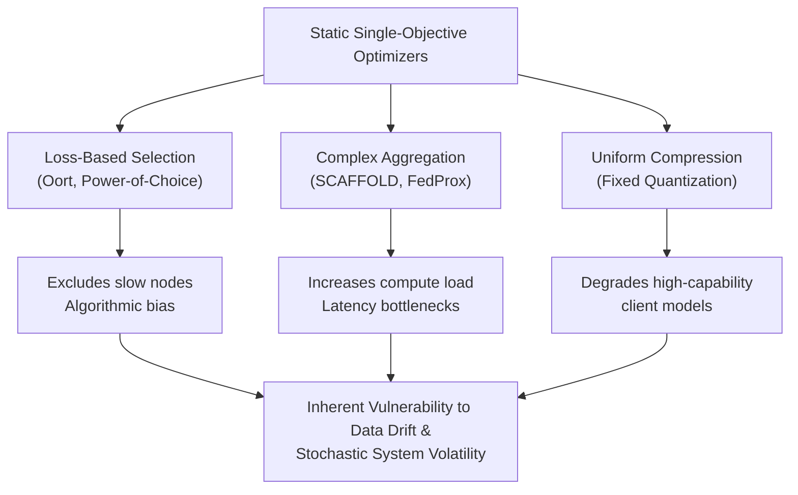
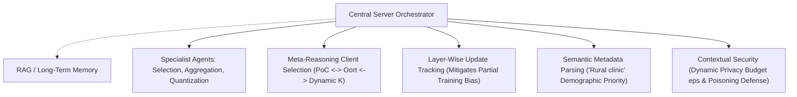
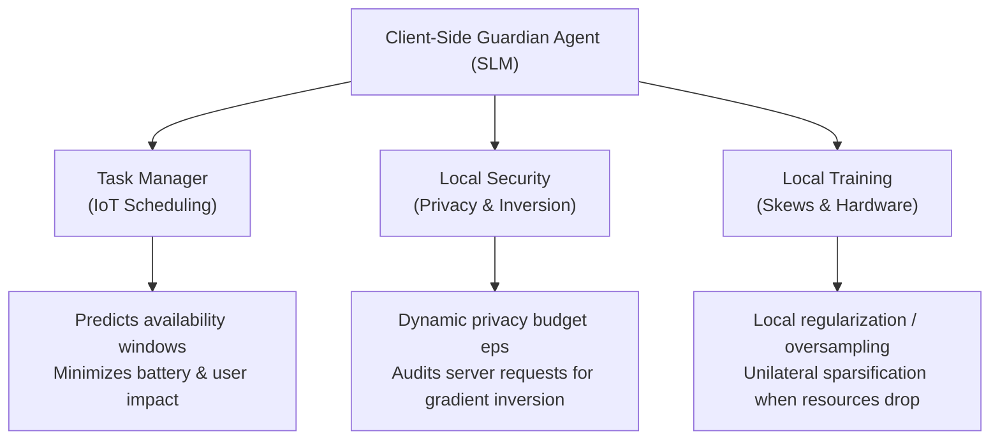
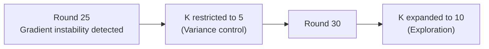

# Agentic Federated Learning: The Future of Distributed Training Orchestration

## **Module 1: The Static FL Bottleneck & The Agentic-FL Paradigm Shift**

### 1. Systemic Failures of Single-Objective FL Optimizers

Standard Federated Learning (FL) collaboratively trains a shared global model $\theta$ across $N$ distributed edge clients while keeping raw data localized. However, real-world edge deployments suffer from severe stochastic system heterogeneity (volatile CPU, memory, and bandwidth) and data heterogeneity (non-IID distributions).

Traditional FL research addresses these bottlenecks via isolated, single-objective heuristics:

- **Client Selection**: Methods like Oort or Power-of-Choice (PoC) optimize selection using scalar metrics like local loss or dataset size.
- **Aggregation & Personalization**: SCAFFOLD or Ditto adjust gradient updates or personalize local heads to mitigate client drift.
- **Resource Compression**: Quantization, pruning, or Parameter-Efficient Fine-Tuning (PEFT) reduce weight precision to lessen communication payloads.

The authors demonstrate that single-purpose optimizers create negative system side-effects. For instance, complex server aggregation schemes increase local client compute latency. Similarly, selecting clients solely based on loss or compute capacity introduces **systemic and algorithmic bias**, allowing high-capability devices to dominate global model updates while excluding resource-constrained edge nodes. Furthermore, because client resource availability and local data distributions drift non-stationarily over time, static rule-based routines become ineffective.

### 2. The Agentic-FL Architecture

To resolve these interconnected trade-offs, the paper proposes **Agentic-FL**, a paradigm shift where Language Model-based Agents (LM-Agents) act as autonomous orchestrators across the central server and edge clients.

LM-Agents combine four structural components:

1. **Profile**: Sets agent objectives, operational constraints, and tool execution permissions.
2. **Memory**: Maintains short-term interaction logs and long-term historical experience.
3. **Planning**: Decomposes complex goals using structured reasoning frameworks like Chain-of-Thought (CoT), Tree-of-Thought (ToT), Graph-of-Thought (GoT), or Proof-of-Thought (PoT).
4. **Action**: Interacts with the FL environment using external tools, APIs, and computational functions.

---

## **Module 2: Server-Side Orchestration — Dynamic Selection, Layer Reweighting, & Semantic Debiasing**

### 1. Dynamic Synchronization & Partial Training Reweighting

Synchronous FL protocols are limited by stragglers, whereas asynchronous protocols introduce model staleness. Server-side LM-Agents leverage long-term memory to analyze connectivity patterns; upon identifying that a device exhibits high latency only during specific hours, the agent dynamically adjusts round timeouts rather than prematurely dropping the client.

In partial training frameworks (where submodels are built based on neuron importance), devices capable of training full architectures dominate global learning, causing severe hardware bias. A server-side orchestrator agent uses long-term memory to track parameter and layer update frequencies across rounds. Upon detecting that specific submodel sections are underrepresented due to prevalent weak devices, the agent's reasoning component intervenes by assigning higher aggregation weights to rare updates or prioritizing selection of clients capable of training neglected layers.

### 2. Meta-Reasoning Selection & Individualized Payload Compression

Rather than relying on a static selection heuristic, the server agent executes meta-reasoning over multiple algorithms:

- When detecting high hardware homogeneity alongside severe data skew, the agent selects Power-of-Choice.
- When loss efficiency is critical under bandwidth constraints, it transitions to Oort.
- The agent dynamically scales the selection cardinality $K$ per round to prevent communication bottlenecks.

For payload compression, instead of applying uniform quantization that degrades capable client updates, the orchestrator uses inference tools to negotiate precision per device. It applies aggressive sparsification or quantization strictly to devices facing severe battery or bandwidth constraints.

### 3. Semantic Debiasing & Contextual Security

Traditional selection mechanisms rely on scalar loss metrics, creating algorithmic bias. LM-Agents integrate qualitative semantic analysis over client metadata—interpreting contextual descriptions like _"sensor located in a rural clinic"_—to prioritize underrepresented demographics, capturing nuances that raw scalar loss metrics miss.

In security management, the server agent acts as an adaptive guardian:

- **Dynamic Differential Privacy ($\epsilon$)**: Adjusts injected noise levels based on detected sample sensitivity per round, balancing protection against utility loss.
- **Byzantine Poisoning Defense**: Uses contextual reasoning to distinguish statistical non-IID data drift from active model poisoning attacks, overcoming rigid parameter-distance thresholds that discard legitimate edge updates.

---

## **Module 3: Client-Side Guardianship — SLM Task Management, Local Security, & Adaptive Sparsification**

With the proliferation of Small Language Models (SLMs) running locally on edge devices, client-side agents execute autonomous local governance across three domains:

1. **Task Manager**: Monitors stochastic CPU and memory volatility in IoT edge environments. Rather than relying on static priority queues, the agent analyzes historical usage patterns to predict idle availability windows, scheduling FL training outside user-interaction periods to optimize battery life.
2. **Local Security**: Overcomes passive cryptographic protocols by dynamically managing the local privacy budget $\epsilon$, injecting noise proportionally based on sample sensitivity. It continuously audits incoming server requests for anomaly patterns to block gradient inversion attacks.
3. **Local Training Orchestrator**: Adapts local hyperparameters in real time. Under severe data skew, the agent applies local regularization or oversampling. If local hardware resources drop mid-training, it unilaterally applies sparsification or quantization to transmit a degraded update rather than dropping out of the round entirely.

---

## **Module 4: Game-Theoretic Mechanism Design & Decentralized Knowledge Marketplaces**

### 1. Formalization via Mechanism Design

In decentralized edge environments, self-interested clients may underreport available resources to save battery or overstate data quality to bias global parameters toward their local tasks. To align incentives, Agentic-FL formalizes client-server interactions using **Mechanism Design**:

Each client $i$ possesses a true private state vector $\theta_i = (b_i, c_i, q_i, bw_i)$ representing battery level, compute cost, data quality, and bandwidth. The client submits a reported type $\hat{\theta}\_i$ to the server agent, which may be untruthful ($\hat{\theta}\_i \neq \theta_i$).

The server agent acts as the mechanism designer, defining an allocation weight rule $w_i(\hat{\theta}\_i)$ (selection probability) and an audit penalty function $\Pi$. The strategic client's utility function is:

$$U_i(\hat{\theta}_i \mid \theta_i) = v_i \cdot w_i(\hat{\theta}_i) - C(\theta_i) - \Pi(\text{audit}(\hat{\theta}_i))$$

where $v_i$ is the value assigned to influencing the global model and $C(\theta_i)$ is the true local execution cost. Instead of relying on rigid numerical formulas, the orchestrator agent uses semantic reasoning over behavioral logs to infer reported types $\hat{\theta}\_i$, audit contributions, and adjust audit penalties $\Pi$ dynamically at runtime.

### 2. Decentralized Knowledge Marketplaces

The authors project a shift from server-driven optimization to **client-initiated peer-to-peer marketplaces**. Client-side agents continuously monitor local model performance; when local accuracy drops below a threshold, the client agent autonomously requests a federation round (e.g., _"requesting a night-vision model update"_). Peer-to-peer federations are formed dynamically via incentive negotiation rather than central server commands.

---

## **Module 5: Empirical Benchmarks ($K$-Agent & ToolAgent) & Open System Gaps**

### 1. Proof-of-Concept 1: $K$-Agent Dynamic Selection

The authors evaluated a proof-of-concept system called **$K$-Agent** built using Flower, LangGraph, and Ollama over 25 clients and 50 communication rounds under a severe Dirichlet non-IID data distribution ($\alpha = 0.1$) on MNIST and CIFAR-10.

- **Dynamic Variance Control**: At Round 25 (a non-stationary inflection point), $K$-Agent detected imminent gradient instability. The agent dynamically restricted client selection to $K=5$ as a variance control mechanism, stabilizing global updates before expanding selection ($K=10$) at Round 30 for broader parameter space exploration.
- **Auditability**: Reasoning logs decode the causal logic behind selection choices, making heuristic decisions transparent to developers.

### 2. Proof-of-Concept 2: Raw LLM vs. ToolAgent Scalability

A secondary benchmark on MNIST compared a **Raw LLM** (passing all client descriptions directly into the context window) against a **ToolAgent** (a ReAct agent equipped with 5 metadata filtering tools) across $N \in \{5, 10, 25, 50\}$ clients:

| Clients ($N$) | Approach               | Prompt Tokens                                       | Total Cost ($)                | Accuracy (%)         |
| :---------------- | :--------------------- | :--------------------------------------------------- | :------------------------------ | :-------------------- |
| **5**             | Raw LLM   ToolAgent | $1{,}336 \pm 15$   $6{,}193 \pm 1{,}963$       | **$0.000308**   $0.000804 | 76.6%   79.2%     |
| **25**            | Raw LLM   ToolAgent | $5{,}035 \pm 73$   $0.000908 \pm 0.000041$ | **$0.000908**   $0.001080 | 63.7%   **88.2%** |
| **50**            | Raw LLM   ToolAgent | $9{,}652 \pm 145$   $7{,}185 \pm 2{,}343$      | $0.001593   **$0.000961** | 72.8%   **79.7%** |

- **Context Window Bottleneck**: Raw LLM prompt token growth scales linearly ($O(N)$), causing context congestion and reducing accuracy to 72.8% at $N=50$.
- **ToolAgent Efficiency**: ToolAgent token consumption scales much slower at high client counts ($N=50$), achieving higher accuracy (79.7%) at lower monetary cost ($0.000961 vs. $0.001593) by querying metadata selectively.

### 3. Open System Gaps & Research Roadmap

The authors identify five critical open challenges in Agentic-FL:

1. **Hallucination Risks**: Miscalculated selection or inappropriate local hyperparameter generation can cause unintentional model poisoning, requiring strict guardrails and structured outputs.
2. **Context Window & Scalability**: Scaling to thousands of clients requires RAG metadata clustering, hierarchical multi-agent teams, and deterministic pre-filtering.
3. **Adversarial Security**: Vulnerabilities include prompt injection, jailbreaking, backdoors, memory poisoning, and cooperative multi-agent attacks.
4. **Edge Compute Overhead**: Running SLMs on edge devices introduces token generation costs, battery drain, and inference latency.
5. **Lack of Convergence Guarantees**: Unlike classical optimization algorithms with formal convergence proofs, LLM-driven decision-making lacks formal mathematical bounds.

---

## **Strategic Bridge to Your Dissertation**

Jarczewski et al. provide an architectural foundation for your dissertation research on **fair federated learning with agent-based dynamic enforcement**:

- **Addressing the Unconstrained LLM Gap**: Agentic-FL relies primarily on prompt heuristics for decision-making and lacks formal convergence or fairness guarantees. Your dissertation can bridge this gap by deploying **runtime agents equipped with tool-gated mathematical bounds** (e.g., tracking non-Markovian Equal Opportunity Difference trajectories).
- **Closed-Loop Runtime Control**: You can adopt Jarczewski et al.'s two-tier architecture—combining a **Server-Side Governor Agent** with **Client-Side Guardian Agents**—to dynamically tune fairness budgets ($\beta$) and filtering thresholds ($M\%$) as non-stationary client data drifts over time, eliminating the need for full model retraining or offline code re-synthesis.
