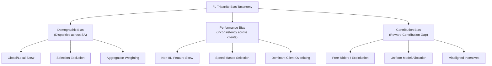
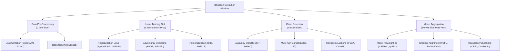
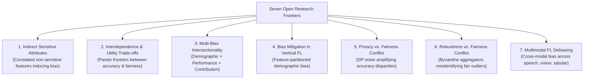

# Bias in Federated Learning: A Comprehensive Survey

Here is a structured, end-to-end walk-through of **"Bias in Federated Learning: A Comprehensive Survey"** (Benarba & Bouchenak, _ACM Computing Surveys_, 2025).

This 5-part walk-through tracks the paper from foundational definitions to systemic causes, mathematical metrics, mitigation taxonomies, and open research frontiers.

---

## **Chunk 1: Architectural Foundations & The Tripartite Bias Taxonomy**

### 1. Federated Learning Protocols & Structural Taxonomies

Federated Learning (FL) enables $N$ clients ($C_1, \dots, C_N$) with private local datasets ($D_1, \dots, D_N$) to collaboratively train a global model $\theta$ without centralizing raw data. The learning process operates via successive communication rounds orchestrated by a central server or decentralized topology:

- **Client-Server FL**: The server broadcasts $\theta$, clients execute local empirical risk minimization to produce updates $\theta_i$, and the server aggregates them via parameter-weighted routines such as $\text{FedAvg}$:
  $$\theta = \sum_{i=1}^k \frac{|D_i|}{\sum_{j=1}^k |D_j|} \theta_i$$
- **Decentralized FL**: Replaces the central aggregator with peer-to-peer communication, utilizing cyclic transfers, random transfers, or blockchain-backed ledgers.
- **Data Partitioning Topologies**:
  - _Horizontal FL (HFL)_: Clients share identical feature spaces $X$ but differ in sample space (e.g., separate hospitals collecting identical diagnostic features across different patient cohorts).
  - _Vertical FL (VFL)_: Clients share sample entities $X$ but hold disjoint feature sets (e.g., a commercial bank and an e-commerce platform collaborating on financial risk models).

### 2. The Formal Tripartite Bias Taxonomy

Benarba and Bouchenak establish that unfairness in FL is not a singular phenomenon, but manifests across **three distinct mathematical dimensions**:

1.  **Demographic Bias**: Disparities in model predictions across demographic groups defined by protected sensitive attributes $SA = \{S_1, \dots, S_{sa}\}$ (e.g., gender, race, age). Given performance metric $Perf(\cdot)$ on privileged group $D_{S_j=v_1^j}$ and unprivileged group $D_{S_j=v_2^j}$, demographic bias occurs when:
    $$\exists S_j \in SA, \quad \left| Perf(\theta, D_{S_j=v_1^j}) - Perf(\theta, D_{S_j=v_2^j}) \right| > \epsilon$$
2.  **Performance-Related Bias**: Inconsistencies in predictive quality experienced across participating client nodes. Independent of contribution levels, performance bias emerges when predictive quality varies beyond tolerance $\epsilon$:
    $$\exists i, j, \quad \left| Perf(\theta_i, D_i) - Perf(\theta_j, D_j) \right| > \epsilon$$
3.  **Contribution-Related Bias**: Misalignment between a client's true contributed utility $L(C_i)$ (data volume, feature quality, gradient improvement) and the quality/benefit of the model it receives:
    $$\exists i, j, \quad Perf(\theta_i, D_i) - Perf(\theta_j, D_j) < \epsilon \cdot \left| L(C_i) - L(C_j) \right|$$

---

## **Chunk 2: Causes & Mathematical Evaluation Metrics**

### 1. Systemic Root Causes Across Bias Dimensions

- **Data Imbalance & Non-IID Skew**:
  - _Global Imbalance_: The union dataset $\bigcup D_i$ contains skewed group distributions.
  - _Local Imbalance_: Individual clients hold skewed distributions; even if the global union is balanced, standard aggregation over-indexes on biased local models.
- **Client Selection Policies**: Selecting clients based on network latency, compute capacity, or battery state (e.g., $\text{FedCS}$) systematically excludes slow edge devices. This neutralizes demographic diversity and deprives low-capability clients of model accuracy.
- **Aggregation Weighting Strategies**: Weighting updates strictly by dataset size $|D_i|$ lets data-rich clients dominate the parameter trajectory, suppressing minority distributions and misaligning contributions.
- **Bias Propagation**: Biased updates from a small subset of clients pollute the global parameters, spreading demographic bias even to clients whose local datasets are unbiased.
- **Single Attribute Side-Effects**: Mitigating bias for one sensitive attribute (e.g., gender) using reweighting can amplify bias across unconsidered sensitive attributes (e.g., race or age).

### 2. Mathematical Evaluation Metrics

| Demographic Metrics | Performance Metrics | Contribution Metrics |
| :--- | :--- | :--- |
| SPD (Demographic Parity) | Client Accuracy Variance | Shapley Values (SV) |
| DI (Disparate Impact) | Worst-Case Accuracy (AFL) | Marginal Loss/Gain |
| AOD (Average Odds Diff) | Precision/Recall/F1 Var | Reputation Scores |
| EOD (Equal Opportunity Diff) | | Pearson Coeff (PCC) |
| DiscI (F1 Disparity) | | |

- **Demographic Bias Metrics**:
  - _Statistical Parity Difference (SPD)_: $\text{SPD} = Pr(\hat{Y}=1 \mid S_j=v_1^j) - Pr(\hat{Y}=1 \mid S_j=v_2^j)$.
  - _Disparate Impact (DI)_: $\text{DI} = \frac{Pr(\hat{Y}=1 \mid S_j=v_1^j)}{Pr(\hat{Y}=1 \mid S_j=v_2^j)}$ (regulatory standard: $4/5^{\text{th}}$ or $80\%$ rule).
  - _Average Odds Difference (AOD)_: $\frac{1}{2} [(\text{FPR}_{v_1} - \text{FPR}_{v_2}) + (\text{TPR}_{v_1} - \text{TPR}_{v_2})]$.
  - _Equal Opportunity Difference (EOD)_: $\text{EOD} = Pr(\hat{Y}=1 \mid S_j=v_1^j, Y=1) - Pr(\hat{Y}=1 \mid S_j=v_2^j, Y=1)$.
  - _Discrimination Index (DiscI)_: $\text{DiscI} = F1_{v_2} - F1_{v_1}$.
- **Performance Metrics**: Evaluates performance variance ($\sigma^2$), worst-case error ($\max L_i$), or classification metric spread across client nodes.
- **Contribution Metrics**:
  - _Shapley Value (SV)_: Game-theoretic evaluation of marginal utility across subsets $k \subseteq N \setminus \{i\}$:
    $$\phi_i = \sum_{k \subseteq N \setminus \{i\}} \frac{|k|!(N - |k| - 1)!}{N!} \left[ U(\theta_{k \cup \{i\}}) - U(\theta_k) \right]$$
  - _Pearson Correlation Coefficient (PCC)_: Measures the linear correlation between estimated client contribution values $\phi_i$ and local model performance/rewards.

---

## **Chunk 3: Real-World Use Cases & Industrial Impact**

The survey highlights how unmitigated FL bias manifests across critical real-world deployments:

1.  **Healthcare Systems**:
    - _Demographic Disparity_: In cardiac arrest prediction, models trained on predominantly male cohorts miss female-specific physiological risk factors, causing lower survival prediction accuracy for female patients.
    - _Performance Disparity_: Large medical centers with rich diagnostic datasets obtain highly accurate shared models, whereas small rural clinics with sparse data receive suboptimal models, exacerbating healthcare inequalities.
2.  **Autonomous Vehicles**:
    - _Pedestrian Detection_: FL models aggregating camera inputs across manufacturers exhibit up to $20\%$ lower detection accuracy for children compared to adults, and over $3\%$ lower accuracy for dark-skinned individuals due to dataset underrepresentation, creating severe safety risks.
3.  **Financial Fraud Detection**:
    - _Contribution Misalignment_: Multinational banks contributing millions of multi-regional transaction records receive the exact same global model as small regional banks contributing minimal local records. The lack of contribution alignment disincentivizes large institutions, leading to federation collapse.

---

## **Chunk 4: Systemic Taxonomy of Mitigation Strategies & Guarantees**

The survey classifies bias mitigation along two key dimensions: **Guarantees** and **Execution Stages**.

### 1. Bias Mitigation Guarantees

- **Minimized Bias**: Formulates optimization to minimize bias metrics as close to zero as possible.
- **Constrained Bias**: Enforces hard constraints ensuring bias stays below a threshold $\epsilon$ (e.g., maintaining $DI \ge 0.8$) while maximizing accuracy.

### 2. Mitigation Methodologies

- **Data Pre-Processing (Client-Side)**: Uses generative adversarial networks (FFL-OppoGAN), synthetic zero-shot augmentation (Fed-ZDAC), or Z-score rescheduling (Astraea) to balance local feature representations.
- **Local Training Optimization (Client-Side In-Processing)**:
  - _Regularization_: Adds explicit fairness penalty terms to local loss functions (AgnosticFair, GIFAIR-FL).
  - _Adversarial Debiasing_: Employs local discriminators to strip sensitive attribute information from feature embeddings (FADE, FairVFL for VFL).
  - _Personalization_: Decouples global objectives into multi-task learning (Ditto) or neuron-wise learning rates (FedNLR).
- **Client Selection (Server-Side)**: Replaces speed-biased selection with Lyapunov drift optimization (RBCS-F), stratified sampling (FedHD), game-theoretic team selection (FairFL, F3), or contract/auction mechanisms (IFL3A, CAreFL).
- **Model Aggregation (Server-Side Post-Processing)**:
  - _Reweighting_: Adjusts aggregation weights based on loss tilting (q-FFL), distance to global guidance (FedHEAL, FedCE), or multi-objective trade-offs (ASTRAL, FedMinMax).
  - _Gradient Optimization_: Resolves conflicting client gradients using Pareto-stationary multi-objective optimization (FCFL, FedFV, FedMGDA+).
  - _Reputation & Clustering_: Restricts parameter downloads based on contribution scores (CFFL, FedAVE) or clusters clients into tailored sub-networks (ConFedIn, FAIR-CLAD).
- **Hybrid Systems**: Combines local training modifications with server aggregation reweighting (e.g., FairFed, Prop-FFL, FjORD).

---

## **Chunk 5: Open Research Frontiers & The Core Dissertation Gap**

Benarba and Bouchenak identify **seven critical open research challenges**:

1.  **Indirect Sensitive Attributes**: Bias persists even when protected attributes are removed due to complex correlations with non-sensitive features. Detecting these features under non-IID conditions without centralizing data remains unsolved.
2.  **Trade-Offs with Model Quality**: Unconstrained debiasing degrades top-line model utility. Developing methodologies that maintain Pareto-optimal equilibrium between accuracy and fairness is essential.
3.  **Multi-Bias Intersectionality**: Existing systems address demographic, performance, or contribution bias in isolation. Mitigating demographic bias via reweighting often worsens performance bias across clients, and no framework currently addresses all three simultaneously.
4.  **Bias in Vertical FL (VFL)**: VFL feature partitioning prevents single clients from observing complete sensitive attributes, causing bottleneck communication overheads in VFL debiasing (e.g., FairVFL).
5.  **The Privacy-Fairness Paradox**: Differential Privacy ($\text{DP-SGD}$) injects Gaussian noise that **disproportionately degrades accuracy for underrepresented minority groups**. Conversely, training with strong fairness constraints forces models to memorize minority instances, increasing vulnerability to membership inference and gradient inversion attacks.
6.  **The Robustness-Fairness Paradox**: Byzantine-tolerant aggregators ($\text{Krum}$, $\text{Trimmed Mean}$) prune gradient outliers to block parameter poisoning. However, **honest updates from underrepresented minority clients naturally manifest as gradient outliers**, causing robust aggregators to discard benign minority updates and exacerbate model bias.
7.  **Multimodal FL**: Managing cross-modal bias dynamics across speech, vision, and text edge devices remains unexplored.

---

## **Dissertation Positioning (Agent-Based Dynamic Enforcement)**

Benarba and Bouchenak's survey provides the foundational taxonomy for your dissertation background:

- **The Conflict Triad**: Your work sits directly at the intersection of **Frontiers 3, 5, and 6**—resolving the three-way tension between **Multi-Bias Enforcement**, **Differential Privacy Disparities**, and **Byzantine Outlier Pruning**.
- **From Static Point Solutions to Dynamic Agentic Orchestration**: The survey shows that existing mitigation systems rely on static, offline rules (e.g., fixed regularization penalties or static scalar budgets $\beta$) that fail when client data drifts mid-training. You can position your **runtime agentic control plane** as an autonomous governor that continuously monitors these trade-offs and dynamically tunes enforcement bounds at runtime without requiring full model retraining or offline code re-synthesis.
