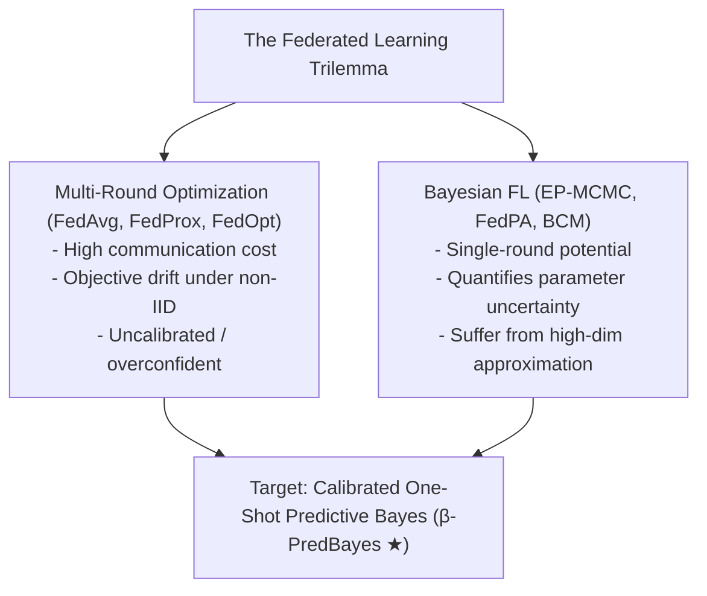
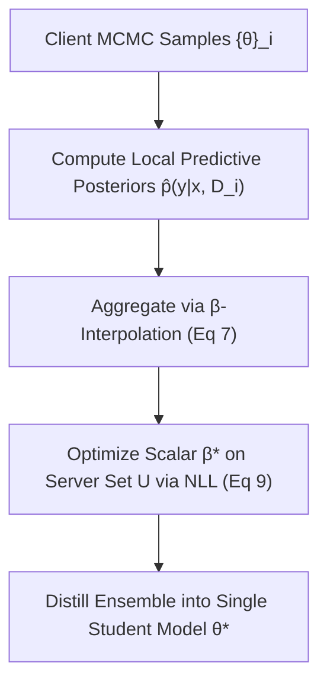
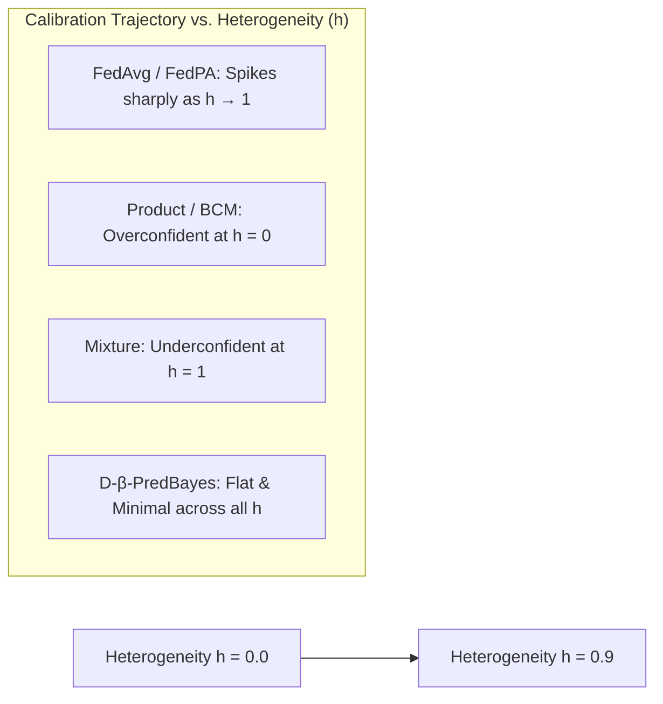

# Calibrated One Round Federated Learning with Bayesian Inference in the Predictive Space

Here is a structured, end-to-end walk-through of **"Calibrated One Round Federated Learning with Bayesian Inference in the Predictive Space"** (Hasan et al., _AAAI_, 2024).

This 5-module analysis breaks down the paper's theoretical framework, calibration proofs, interpolation mechanics, empirical performance, and system limitations—specifically contextualized to inform your dissertation background on uncertainty estimation, one-shot aggregation, and dynamic enforcement in heterogeneous federated learning.

---

## **Module 1: The FL Trilemma & The Bayesian Predictive Shift**

### 1. Core Problem: The Three-Way Tension

Standard Federated Learning (FL) operates as a distributed optimization problem (e.g., $\text{FedAvg}$, $\text{FedProx}$). These frameworks navigate a fundamental trade-off across three critical system dimensions:

1. **Communication Efficiency**: High parameter sizes in deep networks make multi-round synchronization expensive over bandwidth-limited edge networks.
2. **Robustness to Data Heterogeneity**: Non-IID client distributions ($D_i \nsim D$) cause local models to drift, degrading global model convergence and accuracy.
3. **Model Calibration & Uncertainty Quantification**: Small local sample sizes ($k_i$) and noisy edge data require models to produce well-calibrated probabilistic predictions ($p(y|x)$) rather than overconfident, miscalibrated outputs.

Standard optimization-based FL algorithms prioritize accuracy via frequent communication rounds, but lack systematic mechanisms to represent or calibrate predictive uncertainty.

### 2. Parameter-Space vs. Predictive-Space Bayesian Aggregation

To achieve single-round execution ($T=1$) while managing heterogeneity, Bayesian FL aggregates local parameter posteriors into a global posterior:

- **Parameter-Space Bayesian FL (EP-MCMC, FedPA)**: These algorithms collect Markov Chain Monte Carlo (MCMC) weight samples to approximate the parameter posterior $p(\theta|D)$ from local posteriors $p(\theta|D_i)$.
  - _The Computational Barrier_: Approximating local parameter posteriors as Gaussians requires inverting covariance matrices at $O(d^3)$ computational cost, where $d$ is the number of parameters. For deep neural networks ($d \gg 10^6$), this is computationally intractable. Furthermore, parameter posteriors in deep networks are highly multimodal, rendering Gaussian approximations inaccurate.
- **Predictive-Space Bayesian FL (Bayesian Committee Machine - BCM)**: Instead of aggregating high-dimensional parameter posteriors $p(\theta|D*i)$, the BCM combines lower-dimensional local **predictive posteriors** $p(y|x, D_i)$:
  $$p(y|x,D) = \frac{1}{p(y|x)^{n-1}} \prod*{i=1}^n p(y|x, D_i) \quad$$
  This avoids $O(d^3)$ matrix inversions. However, as Hasan et al. prove, BCM relies on a strict data-shard independence assumption that introduces severe calibration bias when data distributions overlap.

---

## **Module 2: Theoretical Calibration Dilemma — Product vs. Mixture Models**

The core theoretical contribution of the paper is proving that the two standard ways of combining local predictive distributions occupy opposite extremes of the calibration spectrum under homogeneous vs. heterogeneous data distributions [24–34].

**Predictive Calibration Spectrum (Table 1)**

| | Homogeneous Data (h=0) | Heterogeneous Data (h=1) |
| :--- | :--- | :--- |
| **Product (BCM / Eq 1)** | OVERCONFIDENT (Underestimates Variance) | CALIBRATED (Correct Uncertainty) |
| **Mixture (Eq 4)** | CALIBRATED (Correct Uncertainty) | UNDERCONFIDENT (Overestimates Variance) |

### 1. The Product Model (BCM) Calibration Failure

The Product Model (Eq. 1) multiplies local predictive posteriors. Under Gaussian Process (GP) regression with observation noise $\sigma_o^2$ and bounded inputs $x^\* \in R$:

- **Idealized Homogeneous Partition ($D_i \sim D$)**:
  - **Theorem 1 (Regression)**: As client dataset sizes grow ($|D*i| \to \infty$), BCM underestimates predictive variance: $\sigma^2*{\text{BCM}}(x^\*) < \sigma_o^2$.
  - **Theorem 5 (Classification)**: Assuming uniform prior $p*P(y|x)$, BCM computes $p*{\text{BCM}}(y|x, D) \propto p*T(y|x)^n$, inflating the probability of the true class $c$ beyond the true probability: $p*{\text{BCM}}(c|x^_, D) > p_T(c|x^_, D)$.
  - _Result_: **Systematically overconfident predictions** on homogeneous data.
- **Idealized Heterogeneous Partition (Disjoint Clusters in Input Space)**:
  - **Theorem 2 (Regression) & Theorem 6 (Classification)**: For a test point near cluster $D*k$, only client $k$'s posterior deviates from the uniform prior, yielding an exact, well-calibrated estimate: $\sigma^2*{\text{BCM}}(x^_) = \sigma*o^2$ and $p*{\text{BCM}}(c|x^_, D) = p_T(c|x^\*, D)$.

### 2. The Predictive Mixture Model Alternative

The Mixture Model (Eq. 4) averages local predictions weighted by dataset size: $\sum_i \frac{|D_i|}{|D|} p(y|x, D_i)$.

- **Idealized Homogeneous Partition**:
  - **Theorem 3 (Regression) & Theorem 8 (Classification)**: The mixture moments match the true predictive distribution: $\sigma^2*{\text{mix}}(x^\*) = \sigma_o^2$ and $p*{\text{mix}}(y|x, D) = p_T(y|x)$.
  - _Result_: **Perfectly calibrated** on homogeneous data.
- **Idealized Heterogeneous Partition**:
  - **Theorem 4 (Regression) & Theorem 7 (Classification)**: Averaging out-of-domain prior predictions from distant clients overestimates predictive variance ($\sigma^2*{\text{mix}}(x^\*) > \sigma_o^2$) and depresses class confidence ($p*{\text{mix}}(c|x^_, D) < p_T(c|x^_, D)$).
  - _Result_: **Systematically underconfident predictions** on heterogeneous data.

---

## **Module 3: The $\beta$-Predictive Bayes ($\beta$-PredBayes) Framework**

To resolve this dichotomy without requiring prior knowledge of where the network sits on the heterogeneity spectrum, Hasan et al. introduce **$\beta$-Predictive Bayes**.

### 1. Log-Predictive Space Interpolation Formulation

$\beta$-PredBayes interpolates between the Product Model (accurate under heterogeneity) and the Mixture Model (accurate under homogeneity) using a continuous scalar parameter $\beta \in$ [34–36]:

$$\log p_\beta(y|x,D) = \beta \log \left( \frac{1}{p(y|x)^{n-1}} \prod_{i=1}^n p(y|x, D_i) \right) + (1-\beta) \log \left( \sum_{i=1}^n \frac{|D_i|}{|D|} p(y|x, D_i) \right) \quad$$

- When $\beta = 1.0$: Reduces strictly to the BCM Product Model.
- When $\beta = 0.0$: Reduces strictly to the Predictive Mixture Model.
- For Gaussian regression outputs, inverse variance (precision) interpolates linearly:
  $$\sigma_\beta^{-2}(x) = \beta \cdot \sigma_{\text{prod}}^{-2}(x) + (1-\beta) \cdot \sigma_{\text{mix}}^{-2}(x) \quad$$

### 2. Single-Parameter Optimization & Knowledge Distillation

Rather than manually guessing data heterogeneity, the central server optimizes $\beta^\*$ empirically by minimizing the Negative Log-Likelihood (NLL) over a small, unlabelled server dataset $U$:

$$\beta^* = \arg\min_\beta \sum_{(x,y) \in U} -\log p_\beta(y|x, D) \quad$$

Because $\beta$ is a single scalar parameter, optimization requires minimal server data ($|U|$ can be small) and converges quickly via gradient descent.

Finally, to avoid transmitting a multi-model ensemble back to clients, the server uses $U$ as a distillation dataset to compress the teacher ensemble $p\_{\beta^_}(y|x, D)$ into a single student model $\theta^_$ by minimizing Kullback-Leibler (KL) divergence or Mean-Squared Error (MSE).

---

## **Module 4: Empirical Evaluation & Calibration Benchmarks**

### 1. Experimental Protocol

- **Communication Rounds**: Executed strictly in **a single round** ($T=1$).
- **Clients & Server Set**: $N=5$ clients; server distillation set $U$ contains $20\%$ of the training data.
- **Heterogeneity Parameter ($h \in$)**: $h=0$ represents uniform IID data; $h=1$ represents full class-sorted non-IID data.
- **Classification Datasets**: MNIST, Fashion-MNIST, EMNIST (62 classes), CIFAR-10, CIFAR-100.
- **Regression Datasets**: Air Quality, Bike Rental, Wine Quality, Real Estate, Forest Fire.
- **Evaluation Metrics**: Negative Log-Likelihood (NLL) for uncertainty calibration quality and Expected Calibration Error (ECE) for probability alignment.
- **Baselines**: EP-MCMC, FedBE, OneshotFL, FedAvg, FedProx, FedPA, AdaptFL, Pure Mixture, and Pure Product.

### 2. Key Empirical Findings

1. **Calibration Stability Under Severe Non-IID Skew**: As heterogeneity increases ($h \to 0.9$), NLL and ECE for standard baselines ($\text{FedAvg}$, $\text{FedPA}$, $\text{AdaptFL}$) degrade or diverge sharply. In contrast, distilled $\beta$-PredBayes (`D-β-PredBayes`) maintains flat, consistently minimal NLL and ECE curves across all datasets.
2. **Regression Superiority**: On UCI regression tasks, `D-β-PredBayes` achieves statistically significant NLL improvements over all baselines (e.g., reaching **0.32** NLL on Bike Rental vs. FedBE's **0.94** and EP-MCMC's **1.92**).
3. **Distillation Regularization Effect**: The distilled student variant (`D-β-PredBayes`) frequently outperforms the raw non-distilled ensemble, which the authors attribute to the implicit capacity-regularization effect of distilling into a smaller student network.

---

## **Module 5: System Limitations & Strategic Dissertation Bridge**

### 1. Systemic Limitations & Open Gaps Identified

- **Dependency on Server Dataset $U$**: The framework assumes the central server holds an unlabelled public dataset $U$ for tuning $\beta$ and executing knowledge distillation. If $U$ is unavailable or out-of-domain, performance degrades.
- **Global Model Limitation (No Personalization)**: $\beta$-PredBayes learns a single calibrated global model $\theta^\*$. When clients possess conflicting class-conditional distributions $p_i(y|x)$, localized personalization is unhandled.
- **Privacy Leakage Risks**: Transmitting raw MCMC parameter weight samples $\{\theta\}\_i$ to the server exposes local client data to reconstruction or gradient inversion attacks unless formal Differential Privacy (DP-MCMC) noise is injected.
- **Static Scalar Optimization**: Tuning $\beta$ via NLL minimization over $U$ is a static, offline calculation. It lacks mechanisms for **online adaptation under non-stationary runtime data drift**, adversarial poisoning attacks, or group fairness constraints ($\text{EOD}/\text{SPD}$).

---

### **Strategic Bridge to Your Dissertation (Fair FL with Agentic Enforcement)**

$\beta$-PredBayes provides a theoretical foundation for your dissertation research:

1. **Quantifying Uncertainty for Fair Client Selection**: Uncalibrated, overconfident local models cause standard FL aggregators to over-weight biased updates. By incorporating $\beta$-PredBayes predictive uncertainty estimates, your **Server Governor Agent** can evaluate client confidence, filtering out overconfident or out-of-distribution local updates during aggregation.
2. **Dynamic $\beta(t)$ Tuning via Autonomous Agents**: Instead of treating $\beta$ purely as a static NLL-minimized scalar over a fixed dataset $U$, your **runtime agentic control plane** can treat $\beta(t)$ as a dynamic control variable. The agent can continuously tune $\beta(t)$ round-by-round to balance the Pareto frontier between **predictive calibration (NLL)**, **group demographic fairness ($\text{EOD}$)**, and **byzantine attack resilience**.
3. **One-Shot / Low-Communication Agentic Synthesis**: Combining $\beta$-PredBayes one-shot predictive aggregation with **Helmsman-style modular code synthesis** allows agents to build, calibrate, and deploy fair federated systems in minimal communication rounds, reducing edge device battery and bandwidth consumption.
