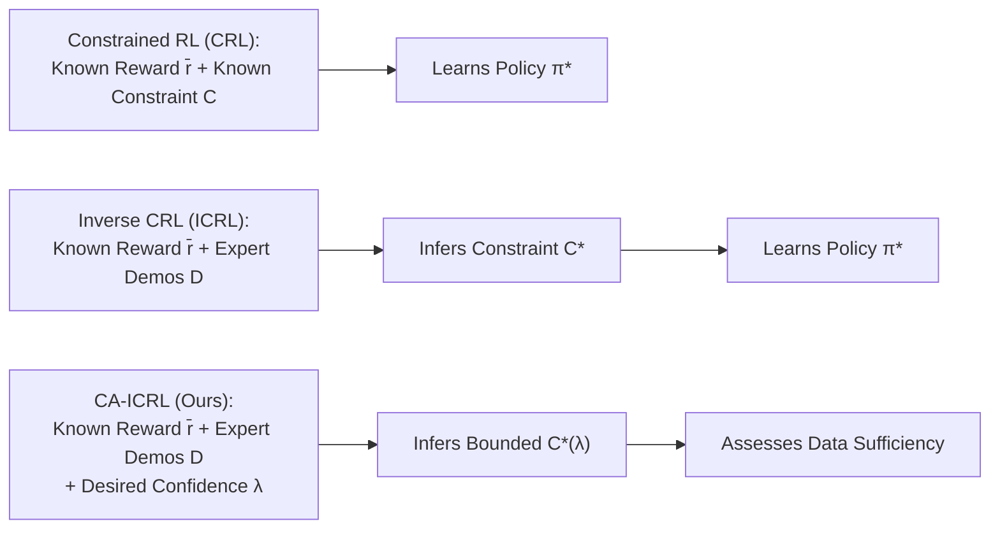
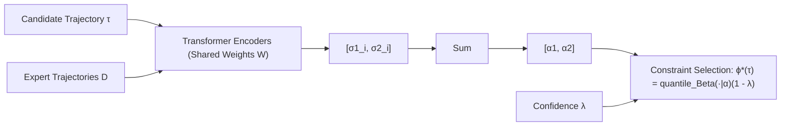
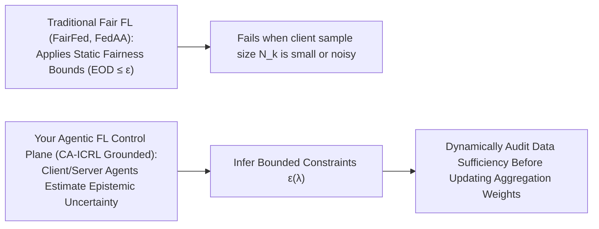

# Confidence Aware Inverse Constrained Reinforcement Learning

Here is a structured, end-to-end walk-through of **"Confidence Aware Inverse Constrained Reinforcement Learning"** (Subramanian, Liu, Elmahgiubi, Rezaee, & Poupart, _ICML_, 2024).

This paper introduces **Confidence-Aware Inverse Constrained Reinforcement Learning (CA-ICRL)**. It transitions Inverse Constrained RL from returning brittle, uncalibrated point estimates or mean constraints to estimating **statistically bounded, confidence-aware constraint distributions** under epistemic data scarcity.

---

## **Module 1: Problem Space, Inverse Constrained RL (ICRL), & Epistemic Uncertainty**

### 1. Constrained RL (CRL) vs. Inverse Constrained RL (ICRL)

In safety-critical environments (e.g., autonomous driving or robotics), standard RL agents exploring arbitrary state-action spaces risk catastrophic failures. Constrained Reinforcement Learning (CRL) models the domain as a **Constrained Markov Decision Process (CMDP)** $\langle S, A, P_T, P_R, \mu, \gamma, C \rangle$, where the agent maximizes expected cumulative rewards subject to upper bounds $\epsilon_i$ on expected cumulative costs $c_i(s,a)$:

$$\max*{\pi} \mathbb{E}*{P*\pi} [\bar{r}(\tau)] \quad \text{such that} \quad \mathbb{E}*{P\_\pi} [\bar{c}_i(\tau)] \le \epsilon_i \quad \forall i$$

However, in complex real-world tasks, human designers cannot explicitly specify all necessary safety constraints. **Inverse Constrained Reinforcement Learning (ICRL)** resolves this by assuming the reward function $\bar{r}$ is known, while learning the underlying constraint set $C$ offline from expert demonstrations $D = \{\tau*j\}*{j=1}^n$.



### 2. The Epistemic Uncertainty Deficit in Prior ICRL

Prior state-of-the-art ICRL methods (such as ICRL, VICRL, or BC2L) attempt to recover feasibility indicators $\phi(\tau) \in$ using maximum likelihood or variational posterior projections. However, they suffer from two critical structural limitations:

1. **Uncalibrated Point/Mean Estimates**: Prior methods return a single point estimate or expected mean constraint $\mathbb{E}[\phi(\tau)]$ that **lacks any measure of confidence**. They cannot guarantee that the inferred constraint is at least as constraining as the ground-truth safety boundary.
2. **Insensitivity to Data Volume**: As expert trajectories $D$ increase, an agent's epistemic uncertainty (uncertainty due to limited data) decreases. Previous frameworks cannot leverage larger demonstration sets to safely loosen conservative constraint bounds or inform developers whether available expert demonstrations are sufficient.

---

## **Module 2: Mathematical Formulation — Beta Distribution Modeling & Quantile Bounds**

CA-ICRL models epistemic uncertainty over trajectory safety by parameterizing constraint feasibility as a continuous probability distribution.



### 1. Epistemic Uncertainty via Beta Distributions

Let $\phi(\tau) \in$ represent the true fraction of experts who judge trajectory $\tau$ as safe. CA-ICRL models the agent's epistemic uncertainty over $\phi(\tau)$ using a **Beta distribution** $P(\phi(\tau)) = \text{Beta}(\phi(\tau) \mid \alpha)$, where $\alpha = [\alpha_1, \alpha_2]$.

The choice of the Beta distribution is mathematically grounded in its conjugacy with binomial proportions (modeling binary safe/unsafe human evaluations) over the finite probability domain $\$.

### 2. Confidence-Conditioned Quantile Inversion

Given a user-specified confidence level $\lambda \in (0, 1)$ (e.g., $90\%$), CA-ICRL seeks the highest feasibility threshold $\phi^_(\tau)$ such that the true feasibility $\phi(\tau)$ is at least as constraining as $\phi^_(\tau)$ with probability $\ge \lambda$:

$$P(\phi(\tau) \ge \phi^*(\tau)) \ge \lambda$$

This value $\phi^\*(\tau)$ corresponds exactly to the **$(1 - \lambda)$ quantile** of the estimated $\text{Beta}(\cdot \mid \alpha)$ distribution:

$$\phi^*(\tau) = \text{quantile}_{\text{beta}(\cdot \mid \alpha)}(1 - \lambda)$$

- _Safety Mechanics_: For a high confidence requirement ($\lambda = 90\%$), the agent evaluates the lower $10\%$ tail quantile, forcing the learned constraint $\phi^_(\tau)$ to be highly conservative. As data volume increases, the Beta variance shrinks, allowing $\phi^_(\tau)$ to safely relax toward ground truth.

### 3. Attention-Based Neural Encoder Network

To compute $\alpha = [\alpha_1, \alpha_2]$ dynamically for any candidate trajectory $\tau$ relative to expert dataset $D$, CA-ICRL uses a neural network $\alpha_w(D, \tau)$ with weights $w$. The architecture passes state-action pairs through transformer/attention encoder blocks (e.g., Bidirectional Attention Flow):

- Each encoder block compares $\tau$ to expert trajectory $\tau_i^e$, outputting fractional counts $[\sigma_1^i, \sigma_2^i] \in^2$ representing degree of feasibility/infeasibility.
- Summing these contributions yields concentration parameters $\alpha_1 = 1 + \sum_i \sigma_1^i$ and $\alpha_2 = 1 + \sum_i \sigma_2^i$.

---

## **Module 3: The CA-ICRL Algorithmic Pipeline & Dual Operational Objectives**

CA-ICRL operates across two unified objectives: inferring confidence-aware constraints and assessing trajectory sufficiency.

```mermaid
flowchart TD
    subgraph OBJ1["OBJECTIVE 1: Confidence-Aware Constraint Learning"]
    A1["1. Forward Control: Policy Update π* = argmax_π E[r̄] + β H(P_π) s.t. E[ϕ*(τ)] ≤ ε"]
    A2["2. Constraint Distribution Update: Gradient Ascent on w using Numerical Quantile"]
    A3["3. Compute Quantile Bound: ϕ*(τ) = quantile_Beta(·|α_w(D,τ))(1 - λ)"]
    A1 --> A2 --> A3
    end
    subgraph OBJ2["OBJECTIVE 2: Trajectory Sufficiency Audit"]
    B1["Evaluate Policy Performance V*(s0) against desired reward threshold δ"]
    B2{"V*(s0) < δ ?"}
    B3["Collect additional expert trajectories D_new; Re-run Obj 1"]
    B4["TERMINATE (Certified Safe & High-Performing Policy)"]
    B1 --> B2
    B2 -->|Yes| B3
    B2 -->|No, V*(s0) ≥ δ| B4
    end
    OBJ1 --> OBJ2
```

### 1. Objective 1: Learning Confidence-Aware Constraints (Algorithm 1)

The system alternates between policy optimization and constraint distribution updates:

1. **Forward Control**: Solves a constrained policy optimization step (using PPO-Lagrange) to maximize expected rewards and entropy subject to $E*{P*\pi}[\phi^*(\tau)] \le \epsilon$.
2. **Constraint Distribution Update**: Updates neural weights $w$ via gradient ascent to maximize expert trajectory likelihood:
   $$\nabla*w \left[ \sum*{\tau \in D} \beta \bar{r}(\tau) + \log \text{quantile}\_{\text{beta}(\cdot \mid \alpha_w(D,\tau))}(1 - \lambda) - \log Z(w) \right]$$
   Gradients through the inverse Beta CDF are computed via finite forward difference lookups, and partition function gradients $\nabla_w \log Z(w)$ are approximated via importance sampling over older policy trajectories.
3. **Quantile Selection**: Updates $\phi^\*(\tau) \leftarrow \text{quantile}\_{\text{beta}(\cdot \mid \alpha_w(D,\tau))}(1 - \lambda)$.

### 2. Objective 2: Determining Sufficiency of Expert Demonstrations

When demonstration data $D$ is sparse, high confidence $\lambda$ forces the inferred constraint to be overly restrictive, suppressing policy rewards. CA-ICRL checks if the optimized policy value $V^\*(s_0)$ reaches a user-defined performance threshold $\delta$:

- If $V^_(s_0) < \delta$, the framework flags $D$ as insufficient, prompting the user to collect more expert trajectories. Adding data narrows the Beta variance, relaxing $\phi^_(\tau)$ until $V^\*(s_0) \ge \delta$.

---

## **Module 4: Empirical Benchmarks & Performance Analysis**

Subramanian et al. benchmark CA-ICRL across 5 stochastic MuJoCo continuous control domains (transition noise $\sigma = 0.2$) and 2 realistic driving tasks from the HighD dataset (vehicle distance and velocity constraints).

**Benchmark Violation Rate & Reward Profiles**

| Metric | Baselines | CA-ICRL |
| :--- | :--- | :--- |
| Constraint Violation Rate (Lower is Better) | VICRL/ICRL: 30% - 70% | (λ = 70%): < 30% ★ |
| Accumulated Rewards (Higher is Better) | Low / Oscillating Rewards | Statistically Superior ★ |

### 1. Baseline Comparisons & Statistical Significance

CA-ICRL was evaluated against VICRL, ICRL, BC2L, and GACL (GAIL adapted for ICRL) across 50 random seeds:

- **Constraint Violation Rate**: At confidence $\lambda = 70\%$, CA-ICRL's constraint violation rate consistently dropped below $30\%$ across tasks (e.g., Blocked Half-Cheetah, Blocked Ant, Blocked Walker, Blocked Swimmer, and HighD driving), whereas baselines suffered from high violation rates ($30\% - 70\%$).
- **Cumulative Rewards**: CA-ICRL achieved statistically significant higher accumulated rewards ($p < 0.05$ on two-sided t-tests). Because CA-ICRL starts training conservatively, it avoids the aggressive early constraint violations of baseline algorithms that require long "unlearning" phases.

### 2. Calibration Quality (ECE)

Expected Calibration Error (ECE) evaluates how accurately predicted feasibility probabilities match empirical safety. CA-ICRL achieved lower ECE than VICRL across MuJoCo environments because its attention mechanism directly compares candidate trajectories against expert demonstrations, whereas VICRL relies on unbounded posterior approximations.

### 3. Sensitivity to Confidence ($\lambda$) & Trajectory Volume ($N$)

- **Varying Confidence $\lambda \in \{30\%, 50\%, 70\%, 90\%\}$**: Increasing $\lambda$ monotonically decreases constraint violation rates while producing more conservative reward profiles.
- **Varying Demonstrations $N \in \{100, 200, 300\}$**: Increasing expert trajectories for a fixed $\lambda = 80\%$ systematically reduced constraint violation below $20\%$ while increasing accumulated rewards, validating Objective 2.

---

## **Module 5: System Limitations & Strategic Dissertation Bridge**

### 1. Open System Limitations Identified

Subramanian et al. highlight five key limitations in CA-ICRL:

1. **Prerequisite of Known Rewards**: Assumes reward function $\bar{r}(s,a)$ is fully known, learning only the constraint function.
2. **Online Simulator Dependence**: Requires active environment simulation during the forward policy update phase, limiting applicability to purely offline RL.
3. **Infallible Expert Assumption**: Assumes demonstration trajectories $D$ come from flawless oracles.
4. **Computational Complexity Scaling**: Trajectory similarity encoding scales as $O(KLMNX)$, creating high computational overhead for large trajectory buffers $D$.
5. **Soft Probabilistic Bounds**: Guarantees bounds probabilistically ($1 - \lambda$) rather than providing absolute zero-violation deterministic safety.

---

### **Strategic Bridge to Your Dissertation (Fair FL with Agent-Based Dynamic Enforcement)**

While CA-ICRL was developed for single-agent robotics and driving, its core philosophy—**confidence-aware constraint inference under epistemic data scarcity**—directly addresses the primary open gap in your dissertation research on Fair Federated Learning:



1. **Epistemic Fairness Uncertainty in Non-IID Edge Networks**:
   In heterogeneous FL, individual edge clients or minority clusters often possess small sample sizes ($N_k$). Evaluating group demographic metrics (such as Equal Opportunity Difference, $EOD_k$) on small local batches introduces high epistemic uncertainty. Instead of applying static aggregation penalties (e.g., FairFed's static $\beta$ or FedAA's static $M\%$), your **Server Governor Agent** can apply CA-ICRL's Beta-quantile formulation to infer **confidence-bounded fairness constraints $EOD^\*(\lambda)$**.
2. **Trajectory Sufficiency Audits for Dynamic Client Selection**:
   Your server agent can adapt CA-ICRL's Objective 2 to audit client participation. If an underrepresented client node lacks sufficient sample volume to satisfy a target fairness bound $EOD^\* \le \delta$ at confidence $\lambda$, the server agent can dynamically request additional local samples or prioritize that client in future selection rounds before adjusting global aggregation weights.
3. **Dynamic Constraint Steering Without Retraining**:
   Coupling CA-ICRL's confidence-aware constraint estimation with **NMFDP memory tracking** (_Remembering to Be Fair_) enables your runtime agents to continuously adjust enforcement boundaries on the fly as client data drifts mid-training—achieving provable, calibrated fairness without full model retraining.
