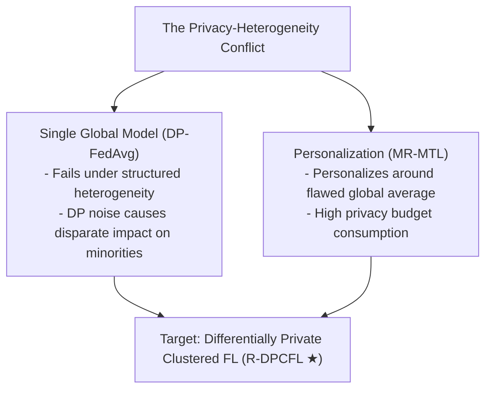
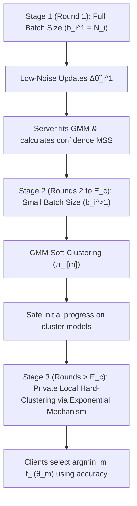
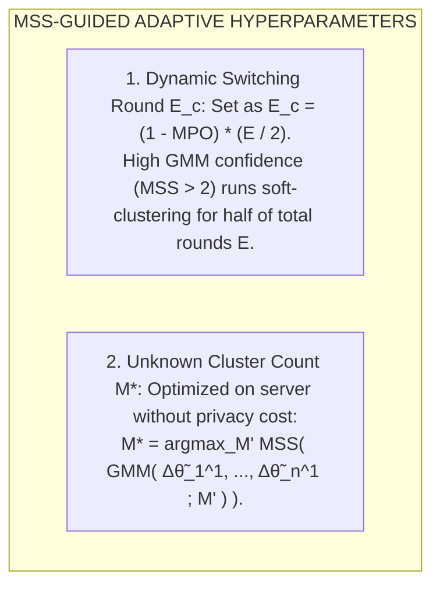
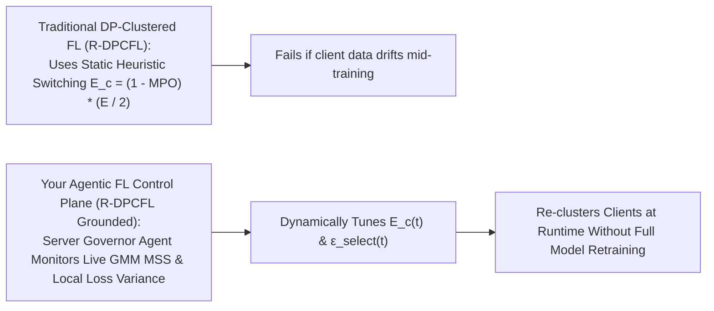

# Differentially Private Clustered Federated Learning

Here is a module-by-module walk-through of **"Differentially Private Clustered Federated Learning"** (Malekmohammadi, Taik, & Farnadi, _ICML_, 2024; introducing the **R-DPCFL** framework).

---

## **Module 1: Problem Space, The Privacy-Heterogeneity Conflict, & Clustered FL Failure Modes**

### 1. The Privacy-Heterogeneity Conflict in FL

Federated Learning (FL) enables distributed clients $C*1, \dots, C_n$ to train models collaboratively without sharing raw local datasets $D_i$. To guard against gradient inversion and membership inference attacks, FL is reinforced with sample-level Differential Privacy (DP-SGD), where clients clip local gradients with threshold $c$ and inject Gaussian noise $N(0, \sigma*{i,\text{DP}}^2 I_p)$ prior to aggregation.

However, combining DP with high **structured data heterogeneity** (where subsets of clients naturally group into clusters with distinct underlying data distributions $P_i(x,y)$) creates a severe performance failure:

- **Single Global Model Collapse**: A single shared model $\theta$ (e.g., DP-FedAvg / Global) fails to adapt to diverse client distributions.
- **Disparate Impact of DP Noise**: Uniform gradient clipping and noise addition in DP-SGD disproportionately degrade utility for minority client subgroups whose local gradient directions align poorly with majority updates.

### 2. Vulnerability of Existing Clustered FL Algorithms

Clustered FL addresses structured heterogeneity by partitioning $n$ clients into $M$ clusters and learning a dedicated model $\theta_m$ for each cluster $m \in \{1, \dots, M\}$. However, existing non-private clustered FL algorithms suffer from severe structural vulnerabilities that are heavily exacerbated by DP noise:

- **Loss-Based Clustering (e.g., IFCA)**: Clients assign themselves to cluster $m$ by choosing $\arg\min_m f_i(\theta_m)$. In early communication rounds, random model initialization causes loss values to be uninformative, leading clients to select wrong clusters. Under DP noise, these initial clustering mistakes propagate throughout training.
- **Model Update / Gradient-Based Clustering**: Clients are grouped based on Euclidean distance or cosine similarity of updates $\Delta \theta_i$. While effective in early rounds if models share an initialization, as cluster models approach local optima in later rounds ($\nabla f_i(\theta) \to 0$), gradient norms shrink to zero. Consequently, updates from distinct clusters become indistinguishable in parameter space, causing severe misclustering late in training.

---

## **Module 2: The R-DPCFL Paradigm — Three-Stage Hybrid Clustering & Noise Reduction Theory**

To solve early-round initialization errors and late-round gradient collapse under DP noise, Malekmohammadi et al. propose **R-DPCFL** (Robust Differentially Private Clustered Federated Learning).

### 1. Algorithmic Pipeline (Algorithm 1)

R-DPCFL executes across three distinct stages:

1.  **Stage 1 (Round $e=1$)**: Clients train initial model $\theta*{\text{init}}$ locally using a **full batch size** ($b_i^1 = N_i$). Uploaded updates $\{\Delta \tilde{\theta}\_i^1\}*{i=1}^n$ are low-noise, enabling the server to fit a Gaussian Mixture Model (GMM) over parameter updates.
2.  **Stage 2 (Rounds $2 \le e \le E_c$)**: The server soft-clusters clients using the learned GMM. Clients switch to small batch sizes ($b_i^{>1}$) and contribute to each cluster model $\theta_m$ proportional to their GMM posterior assignment probability $\pi_i[m]$.
3.  **Stage 3 (Rounds $e > E_c$)**: Once cluster models $\theta_m$ have made sufficient training progress, the server switches to **private local hard-clustering**. Clients assign themselves to the cluster model yielding the lowest local loss/highest accuracy.

### 2. Mathematical Proofs for Initial Full Batch Sizes

Why does using a full batch size ($b_i^1 = N_i$) in Round 1 unlock robust clustering under DP noise? The authors provide three theoretical proofs:

- **Update Noise Variance Reduction (Lemma 4.1)**: After $K$ local epochs with learning rate $\eta*l$, the variance of DP noise in client $i$'s model update $\Delta \tilde{\theta}\_i^e$ is derived as:
  $$\sigma*{i,e}^2(b_i^e) := \text{Var}(\Delta \tilde{\theta}\_i^e \mid \theta_i^{e,0}) \approx \frac{K \cdot N_i \cdot \eta_l^2 \cdot p \cdot c^2 z_i^2}{(b_i^e)^3} \quad$$
  Because noise variance decreases cubically with batch size $(b_i^e)^3$, setting $b_i^1 = N_i$ in Round 1 drastically reduces parameter update noise, separating client updates into distinct spatial clusters. (If memory is constrained, hardware execution uses **gradient accumulation** to achieve logical full batch sizes without GPU memory overflow).

- **Cluster Separation Score (Lemma 4.2)**: Modeling updates as a mixture of $M$ Gaussians $\mathcal{N}(\mu*m^*, \Sigma*m^*)$ with covariance $\Sigma_m^\* = \frac{\sigma_1^2(b_1)}{p} I_p$, the pairwise component overlap $O*{m,m'}$ between clusters $m$ and $m'$ is:
  $$O*{m,m'} = 2 Q \left( \frac{\sqrt{p} \Delta\_{m,m'}(b_1)}{2 \sigma_1(b_1)} \right) = 2 Q \left( \text{SS}(m,m') \right) \quad$$
  where $\text{SS}(m,m')$ is the **Separation Score**. Increasing batch size $b*1 \to k b_1$ scales the separation score by $\sqrt{k}$, bounding pairwise overlap to $O*{m,m'} \le 2 Q \left( \frac{\sqrt{k p} \Delta\_{m,m'}(b_1)}{2 \rho \sigma_1(b_1)} \right)$.

- **Super-Linear EM Convergence Rate (Theorem 4.3)**: Given maximum pairwise overlap $O*{\text{max}}(\psi^*(b*1))$, as sample count $n$ increases, the Expectation-Maximization (EM) algorithm fitting the GMM converges around true parameters $\psi^*(b_1)$ at a super-linear rate:
  $$\lim*{r \to \infty} \frac{\|\psi^{r+1} - \psi^*(b*1)\|}{\|\psi^r - \psi^*(b*1)\|} = o \left( [O*{\text{max}}(\psi^\*(b_1))]^{0.5 - \gamma} \right) \quad$$
  This proves that using full batch sizes in Round 1 drastically reduces the number of EM iterations required on the server, minimizing computational complexity.

---

## **Module 3: GMM Confidence Metrics & Adaptive Hyperparameter Tuning**

### 1. Minimum Pairwise Separation Score (MSS) & Uncertainty (MPO)

Using learned spherical GMM parameters, the server estimates the pairwise separation between all cluster pairs. The server computes the **Minimum Pairwise Separation Score (MSS)** as a direct measure of clustering confidence:
$$\text{MSS} = \min\_{m,m'} \hat{\text{SS}}(m,m') \in [0, +\infty) \quad$$
The corresponding **Maximum Pairwise Overlap** measures GMM uncertainty: $\text{MPO} = 2 Q(\text{MSS}) \in [0, 1)$. An $\text{MSS} > 2.0$ mathematically and empirically guarantees correct cluster detection.

### 2. Deriving $M^\*$ and Strategy Switching Round $E_c$

- **Adaptive Strategy Switching ($E_c$)**: The switching boundary $E_c$ is set as a decreasing function of uncertainty: $E_c = (1 - \text{MPO}) \frac{E}{2}$. If the GMM is highly confident ($\text{MPO} \to 0$), Stage 2 soft-clustering runs for the first half of training ($E/2$) before transitioning to Stage 3 loss-based hard-clustering.
- **Estimating Unknown Cluster Count ($M$)**: If $M$ is unknown, the server fits candidate GMMs for $M' \in S$ on Round 1 updates and selects $M^_ = \arg\max*{M'} \text{MSS}(GMM(\cdot; M'))$. Under-clustering (merging true clusters) inflates component covariance, while over-clustering (splitting a true cluster) reduces inter-component distance $\Delta*{m,m'}$; both cause $\text{MSS}$ to drop sharply, making $M^_$ easily identifiable at the peak $\text{MSS}$.

### 3. Differentially Private Local Selection in Stage 3

In Stage 3 ($e > E_c$), clients privately select cluster models $\arg\min_m f_i(\theta_m)$. To prevent privacy leakage from model selection:

- **Low-Sensitivity Scoring**: Clients evaluate candidate models using local validation accuracy rather than raw loss. Because accuracy sensitivity is bounded by $\Delta\_{\text{acc}} \le \frac{1}{N_i - 1}$, it requires minimal noise addition.
- **Exponential Mechanism & Budget Allocation**: Selection uses the Exponential Mechanism with Gumbel noise under $z$-CDP / Rényi DP (RDP) accounting. To preserve privacy budget for local DPSGD training, selection budget is capped at $\epsilon\_{\text{select}} = 0.03 \epsilon$ (3% of total budget), and local selection is run for only 10% of total communication rounds $E$ before fixing cluster assignments.

---

## **Module 4: Empirical Evaluation, Minority Cluster Protection, & Baselines**

### 1. Experimental Setup

- **Datasets & Data Skew**: Evaluated on MNIST, FMNIST, and CIFAR-10 across 21 clients partitioned into 4 clusters $\{3, 6, 6, 6\}$ (1 minority cluster of 3 clients, 3 majority clusters of 6 clients). Data heterogeneity is induced via **Covariate Shift** (image rotation by $k \times 90^\circ$) and **Concept Shift** (label flipping $y \to (y+k) \bmod 10$).
- **Privacy Budgets**: Total privacy budget $\epsilon \in \{3, 4, 5, 10, 15\}$ with $\delta = 10^{-4}$ managed via Rényi DP accountants.
- **Baselines**: Global (DP-FedAvg), Local (DP-Local), MR-MTL (Mean-Regularized Multi-Task Learning), IFCA (DP loss-based clustered FL), and O-DPCFL (Oracle with ground-truth cluster knowledge).

**Accuracy & Cluster Success Profiles**

| Metric | Method | Result |
| :--- | :--- | :--- |
| Average Test Accuracy (RQ1) | Oracle (O-DPCFL) | Upper Bound (~93%) |
| Average Test Accuracy (RQ1) | R-DPCFL (Ours) | Matches Oracle ★ |
| Average Test Accuracy (RQ1) | MR-MTL / Local | Moderate (~89%) |
| Average Test Accuracy (RQ1) | IFCA | Degrades under DP |
| Average Test Accuracy (RQ1) | Global | Fails (<70%) |
| Minority Cluster Detection Rate (RQ2) | R-DPCFL | 100% Success (4/4 runs) ★ |
| Minority Cluster Detection Rate (RQ2) | IFCA | Fails frequently (1/4 or 2/4) |

### 2. Key Empirical Findings

- **Overall Utility (RQ1)**: R-DPCFL significantly outperforms Global, Local, MR-MTL, and IFCA across all privacy budgets, achieving test accuracy nearly identical to the non-private Oracle baseline (O-DPCFL). IFCA performs poorly on MNIST/FMNIST because early loss-based selection errors under DP noise permanently misassign clients.
- **Minority Cluster Protection (RQ2)**: R-DPCFL achieves a 100% success rate in isolating the minority cluster ($M_0$ with 3 clients) across all privacy budgets. Correctly isolating minority clients prevents their updates from being overwhelmed by majority clusters, restoring accuracy parity. In contrast, IFCA fails to detect minority clusters in most runs, causing severe performance drops for minority nodes.
- **Data Scarcity Compensation (RQ3)**: For clients with smaller local datasets $N_i$, full batch sizes ($b_i^1 = N_i$) yield lower initial $\text{MSS}$ scores. However, reducing post-Round 1 batch sizes ($b_i^{>1} \in \{4, 8, 16\}$) compensates for noise scale $z_i$, restoring high separation scores ($\text{MSS} > 2.0$) and preserving 100% clustering accuracy.

---

## **Module 5: System Limitations & Strategic Bridge to Dissertation**

### 1. Open System Limitations Identified

- **Cross-Silo Requirement**: Relies on moderate-to-large local dataset sizes $N_i$ per client to enable full batch sizes ($b_i^1 = N_i$) in Round 1 without extreme noise scale expansion (though gradient accumulation mitigates physical memory constraints).
- **Static Cluster Membership Assumption**: Assumes client true cluster assignments $s(i)$ remain static throughout training; it cannot accommodate dynamic concept drift where clients shift cluster memberships mid-training.
- **Static Threshold Heuristics**: Switching round $E*c = (1-\text{MPO})\frac{E}{2}$ and selection allocations ($\epsilon*{\text{select}} = 0.03\epsilon$) rely on pre-set scalar heuristics rather than adaptive, closed-loop runtime policies.

---

### **Strategic Bridge to Your Dissertation (Agent-Based Dynamic Enforcement)**

R-DPCFL provides a foundational baseline for your dissertation research on **fair federated learning with agent-based dynamic enforcement**:

1.  **Resolving the Privacy-Fairness Paradox**: R-DPCFL demonstrates that isolating structured client clusters prevents Differential Privacy noise from causing disparate impact on minority groups.
2.  **Stateful Agentic Switching**: Instead of relying on a fixed, static formula for strategy switching ($E_c$), your **Server Governor Agent** can maintain a stateful memory trace ($m_t$) tracking live GMM confidence ($\text{MSS}$) and local performance variance. If non-stationary data drift occurs at Round 50, the agent can dynamically trigger a GMM re-clustering phase at runtime.
3.  **Dynamic Privacy Allocation**: Your **Client Guardian Agents** can dynamically monitor sample sensitivity and local loss drift, adaptively negotiating selection budget $\epsilon\_{\text{select}}(t)$ per round to protect minority data utility without violating total privacy bounds $(\epsilon, \delta)$.
