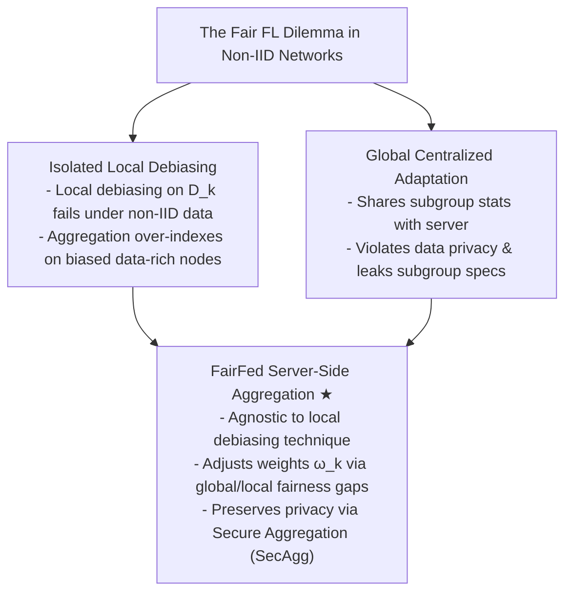
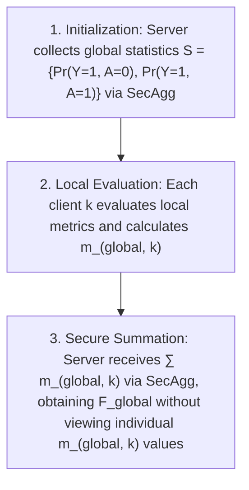
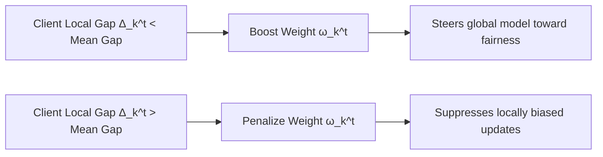
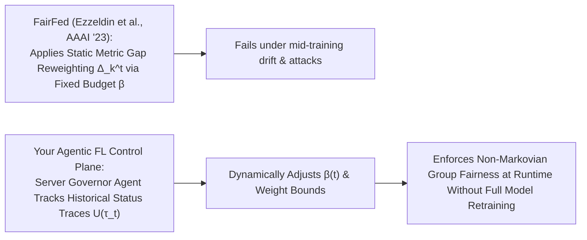

# FairFed: Enabling Group Fairness in Federated Learning

## **Module 1: Problem Space & The Global vs. Local Fairness Paradox in Non-IID FL**

### 1. Centralized Fair ML vs. Federated Learning Constraints

In traditional centralized machine learning, group fairness techniques (pre-processing, in-processing, and post-processing) rely on centralized access to data and sensitive demographic attributes $A \in \{0, 1\}$ (e.g., race, gender). In Federated Learning (FL), $K$ clients collaboratively train a shared parameter vector $\theta$ by minimizing the dataset-weighted empirical risk:
$$\min_\theta f(\theta) = \sum_{k=1}^K \omega_k L_k(\theta) \quad \text{where } \omega_k = \frac{n_k}{n} \quad$$

Applying centralized debiasing directly to FL introduces two severe failure modes:

- **Naive Local Debiasing Failure**: If clients apply local debiasing independently on their local datasets $D_k$ prior to standard $\text{FedAvg}$ aggregation, non-IID data distribution across clients causes local debiasing efforts to cancel out or perform poorly at the global level.
- **Global Debiasing Privacy Leakage**: Adapting centralized debiasing globally requires clients to transmit detailed statistical summaries or group-specific subgroup performance metrics (e.g., model accuracy on male vs. female cohorts) to the central server. This explicitly leaks private subgroup composition data.

### 2. Local vs. Global Group Fairness

Ezzeldin et al. formalize the mathematical distinction between local and global fairness under non-IID data partitioning [17–19]:

- **Global Group Fairness ($F\_{\text{global}}$)**: Evaluated over the full joint dataset distribution $\bar{D} = \bigcup\_{k=1}^K D_k$ across all $K$ clients.
- **Local Group Fairness ($F_k$)**: Evaluated strictly over the local dataset distribution $D_k$ at client $k$.

Under IID conditions, local and global fairness metrics align. However, under non-IID covariate or sensitive attribute skew, local fairness evaluations $F*k$ diverge significantly from global fairness $F*{\text{global}}$.

---

## **Module 2: Group Fairness Metrics & Secure Global Metric Computation**

### 1. Mathematical Definitions of Group Fairness

FairFed evaluates group fairness using two standard centralized metrics extended to binary classification ($\hat{Y} \in \{0, 1\}$) with privileged ($A=1$) and unprivileged ($A=0$) demographic groups:

- **Equal Opportunity Difference (EOD)**: Measures disparity in True Positive Rates (TPR) between unprivileged and privileged groups:
  $$\text{EOD} = \Pr(\hat{Y}=1 \mid A=0, Y=1) - \Pr(\hat{Y}=1 \mid A=1, Y=1) \quad$$
- **Statistical Parity Difference (SPD)**: Measures disparity in positive selection rates regardless of true labels:
  $$\text{SPD} = \Pr(\hat{Y}=1 \mid A=0) - \Pr(\hat{Y}=1 \mid A=1) \quad$$

For both metrics, values closer to zero indicate optimal fairness.

### 2. Secure Computation of $F\_{\text{global}}$ via Secure Aggregation ($\text{SecAgg}$)

To calculate the global metric $F*{\text{global}}$ without requiring clients to share raw dataset proportions or subgroup performance logs, FairFed decomposes global EOD using Bayes' rule into localized summation components $m*{\text{global}, k}$ [29–31]:

$$F*{\text{global}} = \sum*{k=1}^K \frac{n_k}{n} \left[ \frac{\Pr(\hat{Y}=1 \mid A=0, Y=1, C=k) \Pr(A=0, Y=1 \mid C=k)}{\Pr(Y=1, A=0)} - \frac{\Pr(\hat{Y}=1 \mid A=1, Y=1, C=k) \Pr(A=1, Y=1 \mid C=k)}{\Pr(Y=1, A=1)} \right] \quad$$

---

## **Module 3: The FairFed Aggregation Mechanism & Weight Adjustment Kinetics**

### 1. Adaptive Aggregation Weight Formula

FairFed replaces dataset-size averaging ($\omega_k = n_k/n$) with dynamic, fairness-aware reweighting. In communication round $t$, client aggregation weights $\omega_k^t$ are calculated as:

$$\Delta_k^t = \begin{cases} \left| \text{Acc}_k^t - \text{Acc}^t \right| & \text{if } F_k^t \text{ is undefined} \\ \left| F_{\text{global}}^t - F_k^t \right| & \text{otherwise} \end{cases} \quad$$

$$\bar{\omega}_k^t = \bar{\omega}_k^{t-1} - \beta \left( \Delta_k^t - \frac{1}{K} \sum_{i=1}^K \Delta_i^t \right), \quad \omega_k^t = \frac{\bar{\omega}_k^t}{\sum_{i=1}^K \bar{\omega}_i^t} \quad$$

- **Metric Gap ($\Delta_k^t$)**: Quantifies how far client $k$'s local fairness view $F*k^t$ deviates from global fairness $F*{\text{global}}^t$. If a client's dataset lacks samples for a specific group combination (rendering $F_k^t$ undefined), accuracy discrepancy is used as a proxy.
- **Fairness Budget ($\beta$)**: A positive scalar hyperparameter controlling the update magnitude. When $\beta = 0$, FairFed reduces strictly to standard $\text{FedAvg}$. Setting $\beta > 0$ increases fairness impact at the cost of potential perturbations to global accuracy.
- **Intuition**: Clients whose local fairness measures align closer to $F\_{\text{global}}^t$ (below average gap $\frac{1}{K} \sum \Delta_i^t$) receive weight boosts, leveraging their local debiasing to steer global parameter updates.

### 2. Agnostic Flexibility to Local Debiasing

Because FairFed operates on server aggregation weights using scalar evaluation metrics, it is **debiasing-agnostic**. Participating clients can independently run different local pre-processing (e.g., Reweighting), in-processing (e.g., FairBatch), or representation learning (e.g., FairRep) algorithms tailored to local hardware constraints.

---

## **Module 4: Empirical Benchmarks & Real-World Case Studies**

### 1. Synthetic Non-IID Benchmarks (Adult & COMPAS)

Ezzeldin et al. evaluate FairFed on the **Adult** (income prediction) and **ProPublica COMPAS** (recidivism prediction) datasets under Dirichlet non-IID distributions $\text{Dir}(\alpha)$ governing sensitive attributes across clients:

| Dataset    | Heterogeneity ($\alpha$) | Strategy                  | Accuracy  | EOD        |
| :--------- | :--------------------------- | :------------------------ | :-------- | :--------- |
| **Adult**  | $\alpha = 0.1$ (Extreme) | $\text{FedAvg}$       | 0.835     | -0.174     |
| **Adult**  | $\alpha = 0.1$ (Extreme) | Local Reweighting         | 0.831     | 0.052      |
| **Adult**  | $\alpha = 0.1$ (Extreme) | Global Reweighting        | 0.834     | -0.030     |
| **Adult**  | $\alpha = 0.1$ (Extreme) | **FairFed / Reweighting** | **0.830** | **-0.017** |
| **Adult**  | $\alpha = 0.1$ (Extreme) | **FairFed / FairBatch**   | **0.829** | **-0.020** |
| **COMPAS** | $\alpha = 0.1$ (Extreme) | $\text{FedAvg}$       | 0.674     | -0.065     |
| **COMPAS** | $\alpha = 0.1$ (Extreme) | **FairFed / FairBatch**   | **0.659** | **-0.048** |

- **Key Finding**: Under severe data heterogeneity ($\alpha = 0.1$), FairFed improves EOD on Adult by **93%** and on COMPAS by **50%** relative to $\text{FedAvg}$, with only a **0.3%** trade-off in top-line accuracy.
- **Fairness Budget ($\beta$) Trade-Off**: Sweeping $\beta \in [0.01, 5.0]$ demonstrates that higher $\beta$ values drive EOD closer to zero while monotonically decreasing model accuracy.

### 2. Real-World Case Studies: ACSIncome & TILES

To validate naturally heterogeneous distributions, the authors evaluate two domain deployments:

- **Case Study 1: ACSIncome (US Census across 51 States)**: Predicts income $>\$50\text{k}$ across 51 state partitions with race (white/non-white) as the sensitive attribute. Local reweighting worsens EOD (-0.066) compared to $\text{FedAvg}$ (-0.062) due to inter-state demographic variance. FairFed overcomes this, improving EOD to **-0.050**.
- **Case Study 2: TILES (Wearable Sensors in Healthcare)**: Predicts daily stress levels among hospital workers partitioned across 3 job roles (RN-day shift, RN-night shift, CNA) with gender as the sensitive attribute. FairFed reduces EOD disparity from **-0.199** ($\text{FedAvg}$) to **0.004** with minimal accuracy loss (0.567 to 0.556).

---

## **Module 5: Methodological Limitations, Open Gaps, & Connection to Dissertation**

### 1. Methodological Gaps Left Open in FairFed

While FairFed advances fairness-aware aggregation, it leaves four critical gaps open:

1.  **Static Hyperparameter Brittleness ($\beta$)**: The fairness budget $\beta$ is a **fixed, static scalar** set prior to training. It cannot adapt dynamically if client distributions undergo mid-training non-stationary concept drift.
2.  **Susceptibility to Strategic Manipulation & Attacks**: FairFed assumes all participating clients honestly report local metrics $F_k^t$. Malicious or colluding clients can artificially inflate or falsify local metric reports to manipulate aggregation weights $\omega_k^t$.
3.  **Conflict with Inverted Demographics**: As established in subsequent literature (_pFedFair_), when client demographic proportions are inverted (e.g., Client 1 has a female majority while Clients 2–5 have male majorities), forcing a single global fair model drives negative prediction rates to favor the majority attribute, requiring localized personalization rather than global weight adjustments.
4.  **Lack of Runtime Cognitive Orchestration**: FairFed relies on reactive mathematical reweighting per round. It lacks long-term memory or cognitive reasoning capabilities (such as those provided by _Agentic-FL_ or _FedAA_) to anticipate network volatility or balance multi-objective trade-offs dynamically.

---

### **Connection to Your Dissertation Landscape**

FairFed provides a foundational baseline for your research on **fair federated learning with agent-based dynamic enforcement**:

- **From Static Budget $\beta$ to Dynamic Agentic Control**: You can replace FairFed's fixed scalar budget $\beta$ with an **autonomous Server Governor Agent**. By maintaining a stateful memory trace ($m*t$) tracking cumulative fairness trajectories over time (_Remembering to Be Fair_), the agent can dynamically scale $\beta(t)$ round-by-round to enforce **non-Markovian group fairness** as client data drifts at runtime.
- **Tool-Gated Metric Verification**: Client Guardian Agents can execute local secure verification tools to audit reported metric gaps $\Delta_k^t$, preventing Byzantine attackers or free-riders from spoofing fairness scores to hijack aggregation weights.
