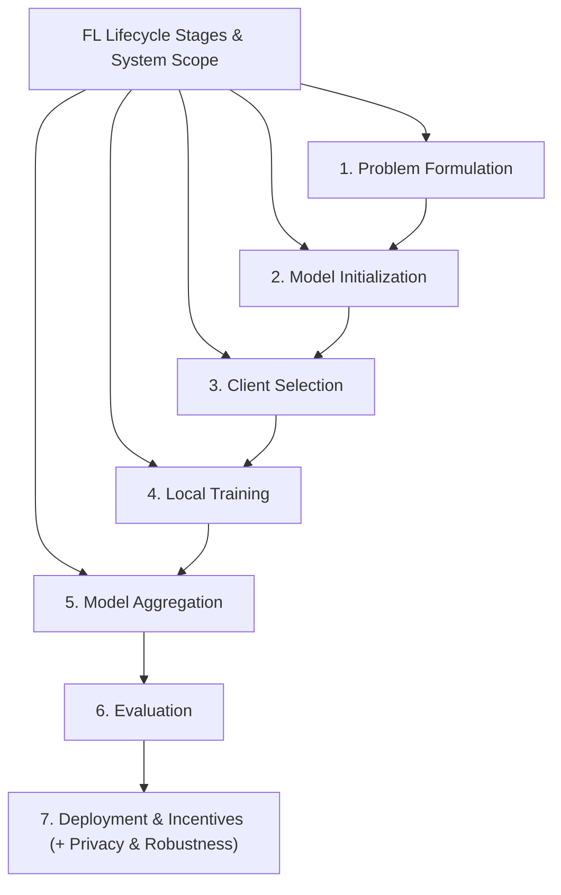
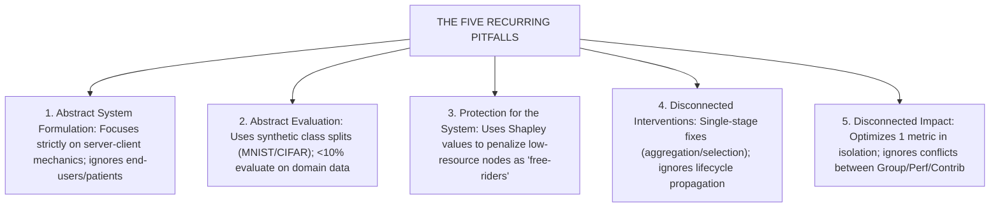
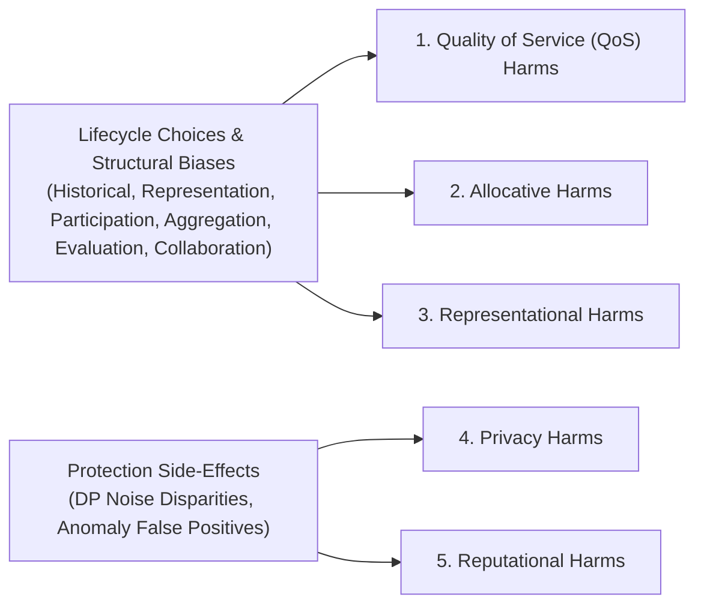
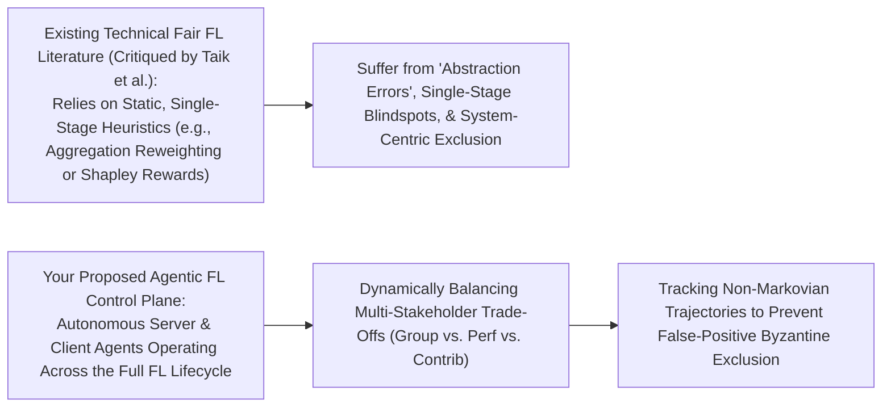

# Fairness in Federated Learning: Fairness for Whom?

Here is a comprehensive, module-by-module walk-through of **"Fairness in Federated Learning: Fairness for Whom?"** (Taik, Chehbouni, & Farnadi, _AIES_, 2025).

This 5-part walk-through breaks down the paper's systematic review of 121 papers, its critique of technical abstraction errors, the taxonomy of fairness definitions, the 5 recurring research pitfalls, and its proposed harm-centered framework.

---

## **Module 1: The Core Thesis, Structural Drivers, & FL Lifecycle Mapping**

### 1. The Core Thesis: The "Abstraction Error" in Fair FL

Taik et al. argue that the rapidly growing literature on fairness in Federated Learning (FL) suffers from a fundamental **abstraction error** (sensu Selbst et al., 2019). Existing approaches treat fairness as a narrow, isolated system-level optimization objective—such as minimizing test loss variance across clients or allocating rewards via Shapley values—while abstracting away the sociotechnical contexts, power dynamics, and real-world harms experienced by human stakeholders (e.g., patients, loan applicants, marginal consumers) [1, 4, 20–22].

### 2. Structural System Drivers: Heterogeneity & Scarcity

The paper establishes that fairness challenges in FL are not incidental, but stem directly from two structural properties of distributed networks:

- **Heterogeneity** across three distinct axes:
  1.  _Data Heterogeneity_: Non-IID label distributions, sample size imbalances, and varying demographic compositions across client nodes.
  2.  _Resource Heterogeneity_: Severe disparities in computational throughput, memory constraints, battery state, and network communication bandwidth.
  3.  _Contextual Heterogeneity_: Differing legal, institutional, regional, or institutional constraints governing local data collection.
- **Scarcity**: Limited availability of compute and representative data, particularly among edge nodes serving underrepresented or low-resource populations.

Together, heterogeneity and scarcity induce **partial participation** (sampling bias) and **limited visibility** (the server cannot inspect local private datasets or sensitive demographic attributes), making fairness enforcement technically difficult.

### 3. The 7-Stage FL Lifecycle

To move beyond simplistic server-client abstractions, the authors formalize the standard FL pipeline across 7 sequential stages [8–11]:

1.  **Problem Formulation**: Formalizing the learning objective, input/output structures, loss functions, and system constraints.
2.  **Model Initialization**: Selecting network architecture, pre-trained weights, hyperparameters, and stopping criteria.
3.  **Client Selection**: Sampling participating client subsets per communication round based on resource availability or data properties.
4.  **Local Training**: Executing local empirical risk minimization (local epochs, optimizer selection, local regularization, or personalization).
5.  **Model Aggregation**: Server-side parameter update weighting (e.g., dataset-weighted averaging) and synchronization timing.
6.  **Evaluation**: Assessing global or personalized models on central held-out validation sets or local client test distributions.
7.  **Deployment & Incentives**: Deploying final models and disbursing rewards or payouts based on contribution estimates.

---

## **Module 2: Taxonomy of Fairness Definitions in FL (The Four Paradigms)**

Based on their systematic annotation of 121 papers up to December 2024, the authors categorize existing technical literature into **four primary fairness paradigms** (Figure 1 in the paper) [14–18]:

| Paradigm | Share of 121 Papers |
| :--- | :--- |
| Group Fairness-Inspired | 34.0% |
| Performance-Centered | 28.0% |
| Collaborative Fairness | 21.6% |
| Participation Fairness | 8.4% |
| Surveys & Other | 8.0% |

1.  **Group Fairness-Inspired Definitions (34.0%)**: Adapts classical centralized demographic fairness criteria—such as Statistical Parity Difference (SPD), Equal Opportunity Difference (EOD), or Equalized Odds—to global aggregates or local client models. Primarily studied in **cross-silo FL** (institutional collaboration like hospitals or banks) where models must not discriminate against protected demographic attributes (e.g., race, gender).
2.  **Performance-Centered Fairness (28.0%)**: Focuses on achieving uniform model performance across participating clients or client groups. The dominant definition minimizes variance in local loss or accuracy across clients. Sub-variants include:
    - _Rawlsian Fairness (e.g., Agnostic FL / AFL)_: Maximizing utility for the worst-performing client or client group.
    - _Individual Fairness_: Ensuring structurally similar clients receive similar predictive performance.
3.  **Collaborative Fairness (21.6%)**: Grounded in cooperative game theory (e.g., Shapley values), ensuring clients receive model quality, utility, or payouts strictly proportional to their contributed data value. Sub-metrics include _contribution fairness_ (payoff positively correlated with utility), _regret distribution fairness_, and _expectation fairness_.
4.  **Participation Fairness (8.4%)**: Enforces equity in client sampling during training, ensuring underrepresented or low-resource edge nodes are not permanently excluded. Often formulated as a long-term participation constraint (e.g., setting a lower bound threshold on selection frequency) or grouping clients by geographic/language metadata.

---

## **Module 3: The Five Recurring Pitfalls in FL Fairness Research**

The central critical contribution of the paper is exposing **five systemic pitfalls** that characterize current fair FL literature:

### **Pitfall 1: Abstract System Formulation (Narrow Server-Client Focus)**

FL is framed purely as an abstract two-party technical protocol between a central aggregator and edge devices. This ignores the broader sociotechnical ecosystem. For instance, in a cross-silo medical FL deployment, the "client" is an institutional hospital, but the downstream impact directly affects patients and physicians. Optimizing server-client convergence without defining who is being protected creates a severe abstraction error.

### **Pitfall 2: Abstract Evaluation (Synthetic Clients vs. Real Harms)**

There is a massive disconnect between theoretical claims and empirical evaluations. Over 90% of papers evaluate fairness using centralized benchmarks (MNIST, CIFAR-10, Adult, COMPAS) artificially split into synthetic "clients" via class imbalance or image rotation. Fewer than 10% evaluate on domain-specific FL datasets (e.g., ACS Income, FLAMBY). Minority class imbalance in synthetic image datasets is used as an oversimplified proxy for real-world structural disadvantage, obscuring genuine domain shifts.

### **Pitfall 3: Protection for the System, Not the Vulnerable**

Collaborative fairness frameworks rely heavily on Shapley values to penalize or assign degraded models to "low-contributor" clients. The authors highlight that this conflates **adversarial robustness** with **fairness**. In high-stakes domains (healthcare, credit scoring), clients with sparse or noisy data are penalized not because they are malicious free-riders, but because they serve resource-constrained or minority populations. This transforms fairness mechanisms into exclusionary tools that safeguard system utility for powerful clients while penalizing vulnerable nodes [27–29].

### **Pitfall 4: Disconnected Interventions (One-Stage Solutions to Lifecycle Harms)**

Existing technical solutions are heavily localized to just two stages of the FL lifecycle: **model aggregation** (e.g., loss reweighting) and **client selection** (Figure 2 in the paper). Critical upstream stages—such as problem formulation, model initialization, and downstream evaluation—are almost entirely ignored. Biases introduced during problem formulation or model architecture selection propagate unchecked through the pipeline, rendering single-stage aggregation fixes reactive and incomplete.

### **Pitfall 5: Disconnected Impact (No Single Definition is Enough)**

Existing papers treat fairness definitions as mutually exclusive. However, in real-world deployments, multiple fairness dimensions are deeply entangled and directly conflict:

- Enforcing global group fairness locally can reduce global model accuracy.
- Maximizing global performance fairness disproportionately benefits data-rich clients.
- Prioritizing contribution-based rewards actively punishes institutions serving underrepresented minority populations.

---

## **Module 4: The Harm-Centered Framework (Biases, Interventions, & Downstream Harms)**

To replace isolated bias metrics, Taik et al. propose a **Harm-Centered Framework** mapping structural system conditions and developer choices across the FL lifecycle directly to **5 Downstream Harms**:

### 1. Lifecycle Biases

- **Historical & Measurement Bias**: Pre-existing societal inequalities encoded in raw local datasets or faulty sensor proxies.
- **Representation & Participation Bias**: Exclusion of low-power edge devices due to bandwidth limits, battery dropouts, or large model initialization architectures that cannot execute on constrained hardware [41–43].
- **Aggregation Bias**: Weighted averaging routines (e.g., dataset size weighting in FedAvg) that allow dominant data-rich clients to drown out unique minority updates.
- **Evaluation Bias**: Relying on central average accuracy metrics that obscure severe local subgroup performance drops.
- **Collaboration Bias**: Misattributing client utility via flawed contribution metrics, penalizing honest but non-conforming nodes.

### 2. Downstream Harms & Protection Side-Effects

- **Quality of Service (QoS) Harms**: Unequal predictive model performance across client nodes or user groups driven by aggregation bias.
- **Allocative Harms**: Inequitable distribution of real-world resources or credit opportunities resulting from learning bias or flawed incentive payouts.
- **Representational Harms**: Reinforcement of cultural stereotypes in vision or language models due to measurement bias.
- **Privacy Harms**: Disparate performance degradation caused by Differential Privacy (DP-SGD), where Gaussian noise disproportionately destroys utility for minority client clusters.
- **Reputational Harms**: Robustness mechanisms (outlier/anomaly detection) misclassifying honest non-IID minority clients as malicious Byzantine attackers, excluding them from future participation and rewards.

---

## **Module 5: Strategic Dissertation Positioning (Agentic Dynamic Enforcement)**

Taik et al.'s critical critique provides a compelling justification for your dissertation research on **fair federated learning with agent-based dynamic enforcement**:

### **How Your Work Resolves the 5 Pitfalls:**

1.  **Resolving Pitfall 3 (System Protection vs. User Vulnerability)**:
    Taik et al. show that static outlier filtering (e.g., FedAA's $M\%$ or Shapley thresholds) misclassifies honest minority clients as Byzantine adversaries [27–29, 50, 54]. By deploying **Client Guardian Agents** that estimate epistemic data uncertainty (grounded in _CA-ICRL_), your system allows edge nodes to verify and certify that their non-conforming updates stem from legitimate distribution shift rather than malicious poisoning, preventing reputational and allocative harms.
2.  **Resolving Pitfall 4 (Disconnected One-Stage Interventions)**:
    Instead of limiting fairness enforcement to a static server aggregation formula, your **distributed agentic control plane** operates continuously across client selection, local training regularization, and aggregation reweighting, providing **lifecycle-aware dynamic enforcement**.
3.  **Resolving Pitfall 5 (Multi-Stakeholder Conflict & Static Metrics)**:
    Taik et al. demonstrate that no single static fairness metric is sufficient because Group, Performance, and Contribution fairness actively conflict. Your **Server Governor Agent** acts as a live, closed-loop orchestrator. By tracking stateful non-Markovian memory traces ($m_t$), the agent dynamically steers the live Pareto frontier between $EOD$ bounds, client performance variance, and contribution rewards as client data drifts at runtime.
