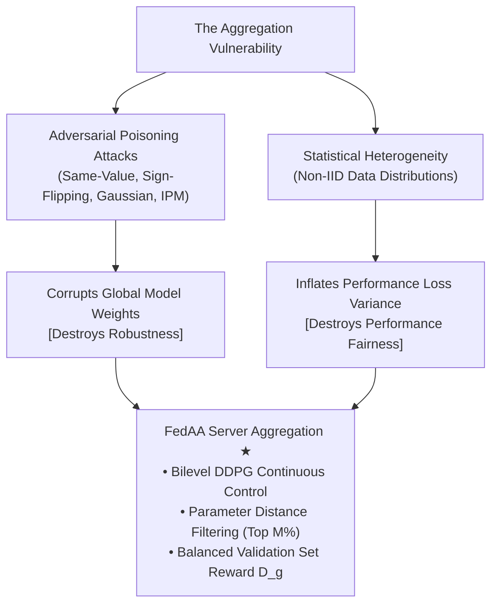
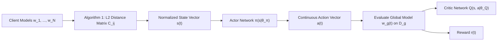
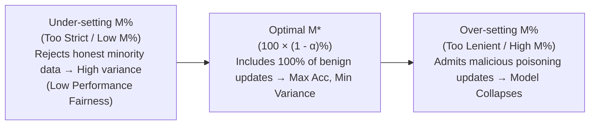
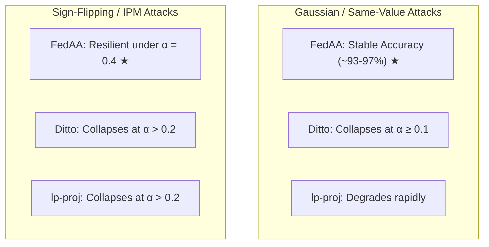
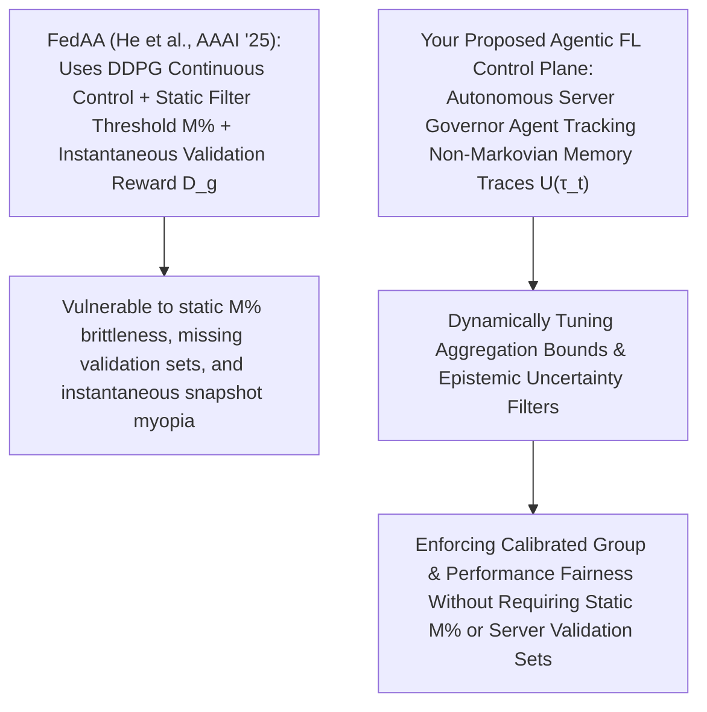

# FedAA: A Reinforcement Learning Perspective on Adaptive Aggregation for Fair and Robust Federated Learning

Here is a comprehensive, module-by-module walk-through of **"FedAA: A Reinforcement Learning Perspective on Adaptive Aggregation for Fair and Robust Federated Learning"** (He, Chen, & Zhang, _AAAI_, 2025).

This 5-module analysis breaks down the paper's theoretical formulation, DDPG continuous control loop, client selection mechanics, empirical benchmarks under adversarial attacks, and open research gaps—specifically tailored to inform your dissertation research on fair federated learning and agent-based dynamic enforcement.

---

## **Module 1: Systemic Problem Space & Bilevel Optimization**

### 1. The Dual Vulnerability of Server-Side Aggregation

Standard Federated Learning (FL) relies on dataset-size weighted parameter averaging (e.g., $\text{FedAvg}$). He et al. argue that this standard aggregation mechanism suffers from two systemic vulnerabilities:

- **Adversarial Fragility**: An $\alpha$-fraction ($\alpha < 0.5$) of Byzantine malicious clients sending poisoned updates or sign-flipped gradients can completely corrupt the global model $w_g$.
- **Performance Inequity**: Weighting client updates strictly proportional to local dataset size ($n_k / N$) over-indexes on data-rich clients. In heterogeneous (non-IID) environments, this creates severe performance variance across benign clients, disadvantaging nodes holding rare or minority data distributions.

### 2. Limitations of Existing Countermeasures

- **Personalized FL (Ditto, $l_p$-proj)**: While personalization tailors local heads to individual client distributions, it operates primarily at the local client level and remains vulnerable during server-side aggregation. Under strong attacks (such as sign-flipping or Inner Product Manipulation), local personalized models collapse.
- **Isolated Defensive Frameworks**: Robust aggregators (e.g., Krum, Trimmed Mean, FABA) and fairness-aware reweighting schemes (e.g., $q$-FFL, FairFed) treat robustness and performance fairness as separate concerns, lacking a unified server-side optimization mechanism.

### 3. Formalization of Performance Fairness & Robustness

He et al. adopt two precise definitions to evaluate system performance:

- **Performance Fairness (Definition 2)**: Model $w*1$ is fairer than $w_2$ if it achieves a lower standard deviation ($\text{std}$) of test performance/loss across all $N$ participating clients:
  $$\text{std} \{ F_k(w_1) \}*{k \in [N]} < \text{std} \{ F*k(w_2) \}*{k \in [N]}$$
- **Robustness (Definition 1)**: Model $w_1$ is more robust than $w_2$ under a Byzantine attack if it achieves a higher mean test accuracy across benign clients.

### 4. The Server-Side Bilevel Optimization Objective

FedAA formulates adaptive aggregation as a bilevel optimization problem:
$$\max_{w_g} F_g(w_g) := \text{Acc}(w_g, D_g) \quad \text{s.t.} \quad w_g = \sum_{k=1}^N a_k w_k, \quad a_k \ge 0, \quad \sum_{k=1}^N a_k = 1$$
$$\text{where } w*k = \arg\min_w F_k(w) = \arg\min_w \mathbb{E}*{x_k}[f(w, x_k)]$$
The central server maximizes global accuracy $\text{Acc}(w_g, D_g)$ on a small, fair, held-out validation set $D_g$ by dynamically optimizing the continuous aggregation weight vector $a = [a_1, \dots, a_N]$ over local client models $w_k$.

---

## **Module 2: The FedAA Architecture & DDPG Continuous Control Loop**

To handle continuous aggregation weight allocation without falling into the greedy or discrete action limits of Q-learning (such as FAVOR or FedRL), FedAA deploys a **Deep Deterministic Policy Gradient (DDPG)** actor-critic agent on the central server.

### 1. State Space Reduction via Distance Filtering (Algorithm 1)

Passing raw neural network parameters into an RL state space causes an intractable dimensionality explosion. FedAA solves this via distance-based state compression inspired by FABA:

1.  Flatten client model parameters: $w'\_1, \dots, w'\_N$.
2.  Compute an $N \times N$ Euclidean parameter distance matrix $C$, where $C\_{i,j} = \|w'\_i - w'\_j\|\_2$.
3.  Sum the rows of $C$ to compute total distance $d*i = \sum*{j=1}^N C\_{i,j}$ for each client.
4.  Select the **top $M\%$ clients** possessing the minimum total distance sums, filtering out distant Byzantine updates.
5.  Form the normalized state vector $s(t) = [d_m, \dots, d_M]$ representing parameter proximity among the selected $M\%$ clients.

### 2. Action Space & Continuous Aggregation Control

The Actor network $\pi(s \mid \theta*\pi)$ receives state $s(t)$ and outputs a continuous action vector $a(t) = [a_m, \dots, a_M]$ satisfying $\sum_i a_i = 1$. These continuous values serve directly as the aggregation weights assigned to the selected top $M\%$ client models:
$$w_g(t) = \sum*{i=1}^M a*i(t) \cdot w*{\text{top}, i}(t)$$

### 3. Reward Function Design ($D_g$)

The scalar reward $r(t)$ is the test accuracy of the aggregated global model $w_g(t)$ evaluated on a small, perfectly balanced server-side validation set $D_g$ (e.g., 100 images per digit for MNIST, totaling 1,000 images):
$$r(t) = \text{Acc}(w_g(t), D_g)$$
Evaluating against a balanced $D_g$ incentivizes the DDPG agent to assign higher aggregation weights to clients holding rare or underrepresented classes, directly driving performance fairness without requiring clients to reveal local sample distributions.

### 4. Algorithmic Execution Pipeline (Algorithm 2)

1.  **State Observation**: The server receives local updates $w_k$, executes Algorithm 1 to filter outliers, and constructs state $s(t)$.
2.  **Action Selection**: The Actor network outputs continuous weights $a(t) = \pi(s(t) \mid \theta\_\pi) + \mathcal{N}$ (incorporating exploration noise).
3.  **Aggregation & Reward**: The server aggregates $w*g(t) = \sum a_i(t) w*{\text{top}, i}(t)$ and evaluates $r(t) = \text{Acc}(w_g(t), D_g)$.
4.  **Replay Buffer & Network Updates**: Transition $(s(t), a(t), r(t), s(t+1))$ is stored in replay buffer $\mathcal{U}$. The Critic network minimizes MSE loss $L(\theta*Q)$, while the Actor network updates via deterministic policy gradient ascent:
    $$\nabla*{\theta*\pi} J \approx \frac{1}{N_d} \sum_i \nabla_a Q(s^{(i)}, \pi(s^{(i)}) \mid \theta_Q) \nabla*{\theta*\pi} \pi(s^{(i)} \mid \theta*\pi)$$
    Target networks ($\theta*{\pi'}, \theta*{Q'}$) undergo soft updates $\theta' \leftarrow \varepsilon \theta + (1-\varepsilon)\theta'$ every 2 steps to preserve learning stability.

---

## **Module 3: The $M\%$ Robustness-Fairness Trade-Off**

A key theoretical and practical contribution of FedAA is characterizing the operational role of the client selection percentage $M\%$.

### 1. Mechanics of the Trade-Off

When network contamination contains an $\alpha$-fraction ($\alpha < 0.5$) of Byzantine malicious clients, $M\%$ acts as a control valve:

- **Increasing $M\%$**: Admits a broader set of client updates into aggregation. In non-IID benign settings, incorporating more client data enhances model generalization and improves performance fairness (lowering test accuracy variance across clients).
- **Decreasing $M\%$**: Restricts aggregation to a tighter distance cluster, isolating benign updates from adversarial poisoning.

### 2. The Theoretical Optimal Threshold ($M^\*$)

He et al. empirically demonstrate across poisoning attacks that accuracy and performance variance exhibit an inverted threshold behavior:
$$M^* = 100 \times (1 - \alpha)\%$$

- **At $M = M^\*$**: Test accuracy reaches its absolute maximum, while performance variance reaches its absolute minimum. For example, under a $20\%$ same-value attack, setting $M = 80\%$ yields peak test accuracy ($90.3\%$) and minimal variance ($0.013$).
- **If $M > M^\*$**: Malicious parameters cross the distance threshold, causing global accuracy to plummet and variance to spike.
- **If $M < M^\*$**: Valid benign updates from honest minority clients are discarded, increasing test loss variance across clients.

### 3. Why $M\%$ Cannot Be Dynamically Automated via RL (The Collusion Risk)

The authors explicitly explain why $M\%$ is kept as a static hyperparameter rather than learned dynamically by the RL agent:

> If malicious clients collaborate, they can send honest, benign updates for $t$ communication rounds. An automated RL policy would adaptively raise $M \to 100\%$ to maximize validation accuracy. Once $M$ reaches $100\%$, the colluding clients execute a coordinated poisoning attack, completely corrupting the FL system.

---

## **Module 4: Benchmark Performance & Empirical Analysis**

### 1. Experimental Setup

- **Datasets**: MNIST, FASHION-MNIST, CIFAR-10, EMNIST, CIFAR-100, Tiny-ImageNet, AGNEWS-100.
- **Adversarial Attacks**: Same-value attacks ($w_k = m \mathbf{1}$), Sign-flipping attacks ($w_k = -|m| w'\_k$), Gaussian attacks ($w_k \sim \mathcal{N}(0, \tau^2 I)$), and Inner Product Manipulation (IPM) attacks.
- **Baselines**: FedAvg, Ditto, $l_p$-proj-1, $l_p$-proj-2.

### 2. Key Empirical Findings

- **Resilience Against Model Update Poisoning**: Under Gaussian and same-value attacks, baseline methods (Ditto, $l_p$-proj) experience severe degradation as the malicious client fraction $\alpha$ reaches $0.1$. FedAA maintains high test accuracy ($97.7\%$ on MNIST, $87.3\%$ on CIFAR-10) even when $\alpha = 0.4$.
- **Sign-Flipping & IPM Defense**: Under strong sign-flipping and Inner Product Manipulation (IPM) attacks, Ditto and $l_p$-proj collapse when $\alpha > 0.2$. FedAA remains stable across all client participation ratios ($C=100\%$ and $C=50\%$).
- **Complex NLP and Vision Benchmarks**: On challenging 100-class benchmarks (CIFAR-100, Tiny-ImageNet, AGNEWS-100), FedAA outperforms Ditto by **$30.5\%$**, **$5.7\%$**, and **$0.5\%$** in test accuracy, respectively.
- **Compression & Operational Runtime**: To reduce runtime latency, parameter distance calculations can be restricted to the **Last Hidden Layer (LHL)** parameters rather than All Layers (AL). This reduces execution time (from 19,872s to 18,314s on FASHION-MNIST) with zero loss in test accuracy ($97.4\%$).

---

## **Module 5: Open Research Gaps & Strategic Dissertation Bridge**

### 1. Methodological Gaps Identified in FedAA

While FedAA advances server-side adaptive aggregation, it leaves four critical gaps open:

1.  **Static Threshold Brittleness ($M\%$)**: Because $M\%$ is set statically offline to avoid colluding trap attacks, FedAA cannot adapt dynamically if client availability or non-stationary data drift shifts mid-training.
2.  **Dependency on Server Validation Set ($D_g$)**: The reward mechanism assumes the central server can construct an uncorrupted, perfectly balanced validation dataset $D_g$. If $D_g$ is unavailable, domain-shifted, or unrepresentative of real edge populations, the DDPG reward function incentivizes biased aggregation weights.
3.  **High Sample Complexity & Lacks Cognitive Meta-Reasoning**: DDPG requires extensive transition sampling to converge. It operates as a purely numerical continuous controller, lacking qualitative semantic reasoning or long-term memory architectures (such as those provided by _Agentic-FL_ or _Remembering to Be Fair_).
4.  **Instantaneous Snapshot Reward (Markovian Assumption)**: FedAA evaluates reward $r(t)$ strictly on the instantaneous model snapshot $w_g(t)$ at round $t$. It has no stateful memory mechanism to track historical fairness trajectories across rounds ($U(\tau_t)$), making it incapable of enforcing non-Markovian fairness bounds over the full training lifecycle.

---

## **Strategic Bridge to Your Dissertation (Fair FL with Agentic Dynamic Enforcement)**

FedAA provides a strong baseline for your dissertation research on **fair federated learning with agent-based dynamic enforcement**:

- **Replacing Static $M\%$ with Epistemic Uncertainty Filtering**: Rather than relying on a static offline threshold $M\%$ to filter parameter distances, your **Client Guardian Agents** can estimate local epistemic data uncertainty (grounded in _CA-ICRL_), allowing the **Server Governor Agent** to distinguish honest non-IID minority updates from malicious Byzantine attacks without hardcoding $M\%$.
- **From Instantaneous Rewards to Non-Markovian Trajectories**: Instead of evaluating scalar validation accuracy $r(t)$ at a single snapshot round, your server agent can maintain a stateful memory trace ($m*t$) tracking cumulative demographic disparities ($EOD/SPD$) over time (\_Remembering to Be Fair*). This enables **runtime dynamic enforcement** of fairness bounds as client distributions drift mid-training, without requiring full model retraining or offline code re-synthesis.
