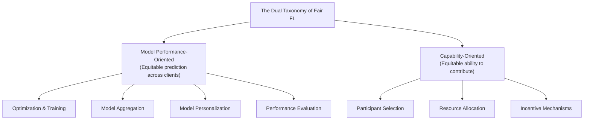
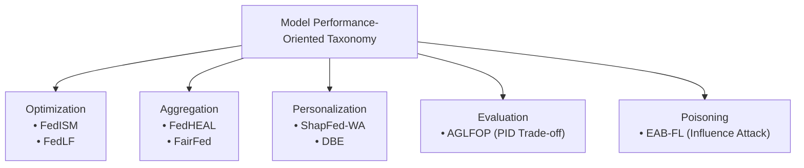
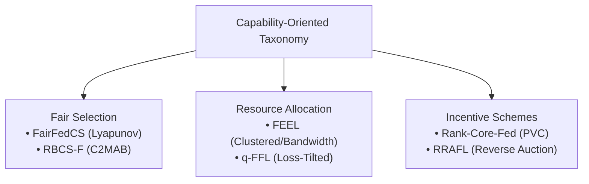
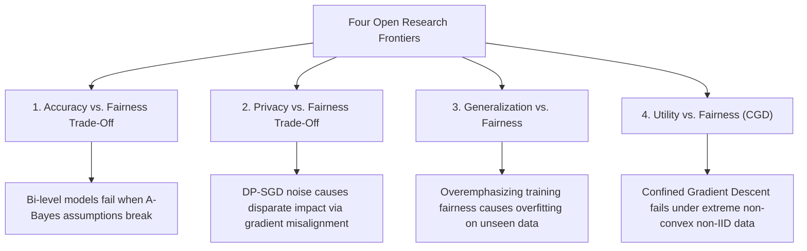

# Federated Learning at the Forefront of Fairness: A Multifaceted Perspective

Here is a comprehensive, module-by-module walk-through of **"Federated Learning at the Forefront of Fairness: A Multifaceted Perspective"** (Mukhtiar, Mahmood, Zhou, Yang, Teng, & Sheng, _IJCAI_, 2024).

This paper provides a structured taxonomy that expands fairness in Federated Learning (FL) beyond simple client selection strategies by establishing a dual classification scheme: **Model Performance-Oriented** versus **Capability-Oriented** fairness.

---

## **Module 1: Foundational Scope & The Dual Structural Taxonomy**

### 1. The Core Problem: System Disparities in Decentralized Networks

Federated Learning enables decentralized clients $C_1, \dots, C_N$ to train a shared global model locally while keeping raw datasets localized. However, conventional FL relies on random client sampling or threshold-based selection heuristics—filtering devices by bandwidth availability, local accuracy, or convergence speed.

Mukhtiar et al. emphasize that this introduces severe systemic biases across two distinct fronts:

- **Capability Exclusion**: High-capability edge devices dominate participation, while resource-constrained or low-bandwidth clients are systematically filtered out, driving client dissatisfaction and dropout.
- **Model Performance Disparities**: Non-IID, skewed, or imbalanced client datasets disproportionately bias global predictions, leading to underfitting or overfitting on specific client subpopulations and marginalizing underrepresented cohorts.

### 2. The Dual Taxonomy Framework

To address these dual failure modes, the authors categorize all state-of-the-art fairness interventions into two non-mutually exclusive domains:

1.  **Model Performance-Oriented Approaches**: Prioritize uniform predictive quality across all client data distributions, mitigating representation biases and accuracy variance.
2.  **Capability-Oriented Approaches**: Focus on reducing hardware, computational, and communication barriers to ensure low-capability devices are not excluded from training and are rewarded equitably.

---

## **Module 2: Model Performance-Oriented Interventions**

This branch focuses on ensuring that global or personalized models achieve equitable accuracy across heterogeneous client distributions regardless of local dataset size or class skew.

### 1. Optimization & Local Training Formulations

- **Inter-Client Sharpness Matching (_FedISM_, Wu et al., IJCAI '24)**: Formulates local optimization using Sharpness-Aware Minimization (SAM). Clients simultaneously minimize loss and loss-landscape sharpness; the server aggregates updates using a sharpness-dependent weighting scheme to harmonize generalization boundaries across clients. _Evaluated on RSNA ICH and ISIC 2019 medical benchmarks_.
- **Layer-Wise Fair FL (_FedLF_, Pan et al., AAAI '24)**: Solves multi-objective optimization by calculating layer-wise gradient direction fragments to mitigate improvement bias and prevent dominant clients from dictating update trajectories. _Evaluated on Fashion-MNIST and CIFAR-10/100_.

### 2. Fairness-Aware Model Aggregation

- **Parameter Consistency (_FedHEAL_, Chen et al., CVPR '24)**: Addresses domain skew by discarding insignificant parameter updates to insulate weak clients, aligning global parameters with an unbiased reference trajectory. _Evaluated on Digits and Office-Caltech_.
- **Fairness Gap Reweighting (_FairFed_, Ezzeldin et al., AAAI '23)**: Dynamically adjusts server aggregation weights based on the mismatch ($\Delta*k$) between local client fairness metrics (Equal Opportunity Difference, $EOD_k$, or Statistical Parity Difference, $SPD_k$) and the global metric. \_Evaluated on Adult, COMPAS, ACSIncome, and TILES*.

### 3. Model Personalization

- **Shapley-Driven Personalization (_ShapFed-WA_, Tastan et al., IJCAI '24)**: Evaluates class-specific client contributions using Shapley Values (SV) to personalize model updates based on verified data utility. _Evaluated on CIFAR-10, Chest X-ray, and Fed-ISIC 2019_.
- **Domain Bias Eliminator (_DBE_, Zhang et al., NeurIPS '23)**: Detaches domain bias from feature representations and stores it in local memory, applying mean regularization during local training to align local feature extractors with a consensual global mean. _Evaluated on Tiny-ImageNet, CIFAR-100, Fashion-MNIST, and AG News_.

### 4. Performance Evaluation & Security Vulnerabilities

- **Partial Information Decomposition (_AGLFOP_, Hamman & Dutta, ICLR '24)**: Deconstructs local and global fairness conflicts into Unique, Redundant, and Masked Disparities using partial information decomposition, proving convex Pareto boundaries between accuracy and local/global parity.
- **Group Unfairness Poisoning (_EAB-FL_, Meerza & Liu, IJCAI '24)**: Demonstrates an adversarial attack where malicious clients upload poisoned updates designed to maximize group unfairness against a target demographic cohort while preserving overall top-line model utility, using sample influence scores to target demographic subpopulations. _Evaluated on CelebA, Adult, UTK-Faces, and MovieLens 1M_.

---

## **Module 3: Capability-Oriented Interventions**

Capability-oriented approaches prevent edge devices with lower computational throughput, constrained memory, or poor network links from being permanently excluded.

### 1. Fair Participant Selection

- **Dynamic Reputation Restoration (_FairFedCS_, Shi et al., ICME '23)**: Formulates client selection as a Lyapunov optimization problem, balancing selection probability with participation frequency, reputation, and contribution without threshold filtering, allowing low-capability devices to restore reputation over time. _Evaluated on MNIST and CIFAR-10_.
- **Reputation-Based Exchange Minimization (_RBCS-F_, Huang et al., IEEE TPDS '20)**: Uses a Contextual Combinatorial Multi-Armed Bandit (C2MAB) framework with Lyapunov drift optimization to minimize model exchange latency subject to long-term participation constraints. _Evaluated on Fashion-MNIST and CIFAR-10_.

### 2. Fair Resource Allocation

- **Clustered Bandwidth Reuse (_FEEL_, Albaseer et al., IEEE TNSM '23)**: Schedules edge devices in clustered multi-task FL by reusing bandwidth for stragglers and employing greedy selection once cluster convergence criteria are met. _Evaluated on FEMNIST and CIFAR-10_.
- **Loss-Tilted Reweighting (_q-FFL_, Li et al., ICLR '20)**: Inspired by fair resource allocation in wireless networks, $q$-FFL minimizes a reweighted objective parameterized by $q$, assigning higher optimization weights to devices suffering from higher losses to equalize performance across hardware. _Evaluated on Synthetic, Vehicle, Sent140, and Shakespeare_.

### 3. Fair Incentive Mechanisms

- **Proportional Veto Core (_Rank-Core-Fed_, Chaudhury et al., ICML '24)**: Applies cooperative game theory to guarantee Proportional Veto Core (PVC) stability, evaluating model quality based on ordinal preference rankings rather than cardinal utility values. _Evaluated on MNIST and CIFAR-10_.
- **Reverse Auction Contribution Detection (_RRAFL_, Zhang et al., WWW '21)**: Combines reputation tracking with reverse auction theory, allowing participants to bid for tasks based on execution costs and rewarding them based on detected marginal contributions. _Evaluated on MNIST, Fashion-MNIST, and IMDB_.

---

## **Module 4: Quantitative Evaluation Metrics Spectrum**

The survey outlines the mathematical metrics leveraged across the literature to quantify fairness:

1.  **Performance Dispersion Metrics**:
    - _Average Variance (AV)_: $\text{AV} = \frac{1}{n} \sum\_{i=1}^n (F_i(t) - \bar{F}(t))^2$, measuring accuracy spread across clients.
    - _Standard Deviation ($\sigma$)_: $\sigma = \sqrt{\text{AV}}$, preserving the original unit of measurement to track client-level performance uniformity.
2.  **Contribution Alignment**:
    - _Pearson Correlation Coefficient (PCC)_: $\text{PCC} = \frac{\sum (\phi*i^* - \bar{\phi}^_)(\phi_i - \bar{\phi})}{S_{\phi*i^\*} S*{\phi_i}}$, calculating the linear alignment between predicted client contribution values $\phi_i$ and ground-truth Shapley Values $\phi_i^\*$.
3.  **Resource Allocation Equity**:
    - _Jain's Fairness Index (JFI)_: $\text{JFI} = \frac{(\sum F_i(t))^2}{n \sum (F_i(t))^2} \in [\frac{1}{n}, 1.0]$, measuring equity in utility distribution.
4.  **Demographic Group Parity**:
    - _Statistical Parity Difference (SPD)_: $|\Pr(\hat{Y}=1 \mid A=0) - \Pr(\hat{Y}=1 \mid A=1)|$.
    - _Equal Opportunity Difference (EOD)_: $\Pr(\hat{Y}=1 \mid A=0, Y=1) - \Pr(\hat{Y}=1 \mid A=1, Y=1)$.

---

## **Module 5: Four Critical Open Frontiers & The Dissertation Sweet Spot**

Mukhtiar et al. identify **four major open research trade-offs** that current literature fails to resolve, defining the open gap for advanced research:

1.  **Accuracy vs. Fairness Trade-Off**: Bi-level optimization approaches (e.g., Shui et al.) assume similar ground-truth $A$-Bayes predictors across subgroups. When this assumption is violated under extreme non-IID skew, accuracy collapses. _Open Need_: Differentiable fairness loss functions integrated directly into global optimization without decoupling fairness from accuracy.
2.  **Privacy vs. Fairness Trade-Off**: Differential Privacy ($\text{DP-SGD}$) introduces gradient misalignment that disproportionately degrades accuracy for underrepresented groups. _Open Need_: Fairness-preserving noise calibration techniques that dynamically adjust DP noise based on local gradient confidence and convergence behavior.
3.  **Generalization vs. Fairness Trade-Off**: Over-constraining a model to enforce static fairness across a specific training client pool causes overfitting, degrading performance on unseen edge data. _Open Need_: Adaptive regularization schemes that track cross-validation generalization bounds across client partitions.
4.  **Utility vs. Fairness Boundary (_Confined Gradient Descent_)**: Confined Gradient Descent (_CGD_, Zhang et al., WWW '24) constrains updates within a pre-defined fairness region. However, CGD relies on strict theoretical bounds that fail under highly non-convex loss landscapes and extreme data heterogeneity. _Open Need_: Dynamic frameworks that adaptively modulate client influence based on marginal utility and temporal fairness deviations.

---

## **Synthesis: Connecting Mukhtiar et al. to Your Research Landscape**

While Mukhtiar et al. provide a comprehensive taxonomy, their survey reinforces the **foundational limitation** across all 19 papers in your notebook:

- Existing methods rely on **static, offline rules** or **single-stage heuristics** (e.g., static $q$ in $q$-FFL, static bounds in CGD, or snapshot metric gaps in FairFed).
- None of these frameworks provide **runtime, agent-based dynamic enforcement** capable of continuously tracking non-Markovian fairness trajectories ($U(\tau_t)$) and adaptively steering the Pareto frontier between **Accuracy, Privacy, Generalization, and Utility** as edge data drifts mid-training.

This taxonomy directly validates positioning your dissertation around **runtime agentic control planes** as the unified solution to these open frontiers.
