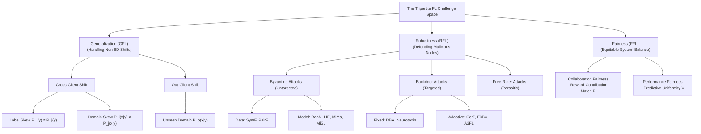
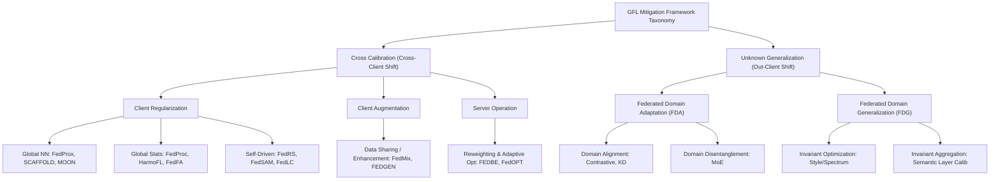
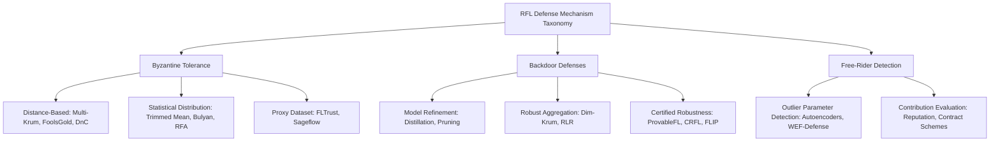
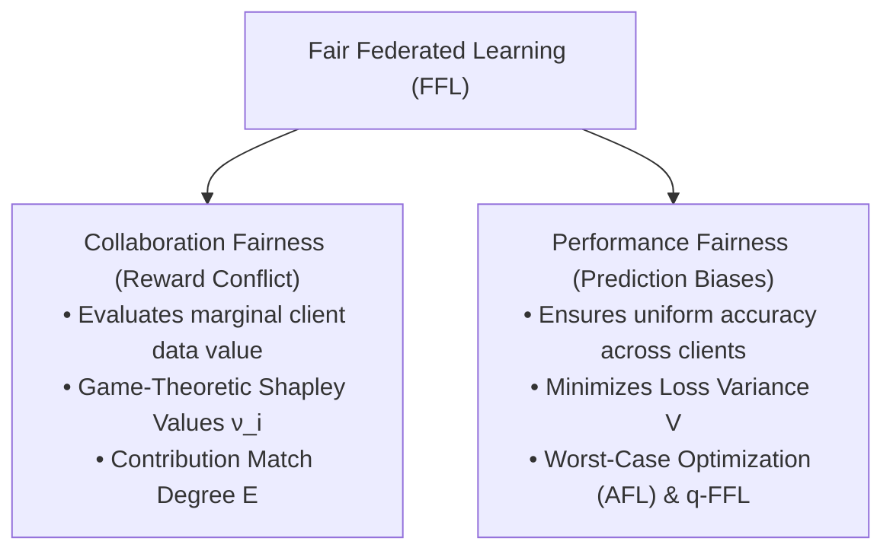
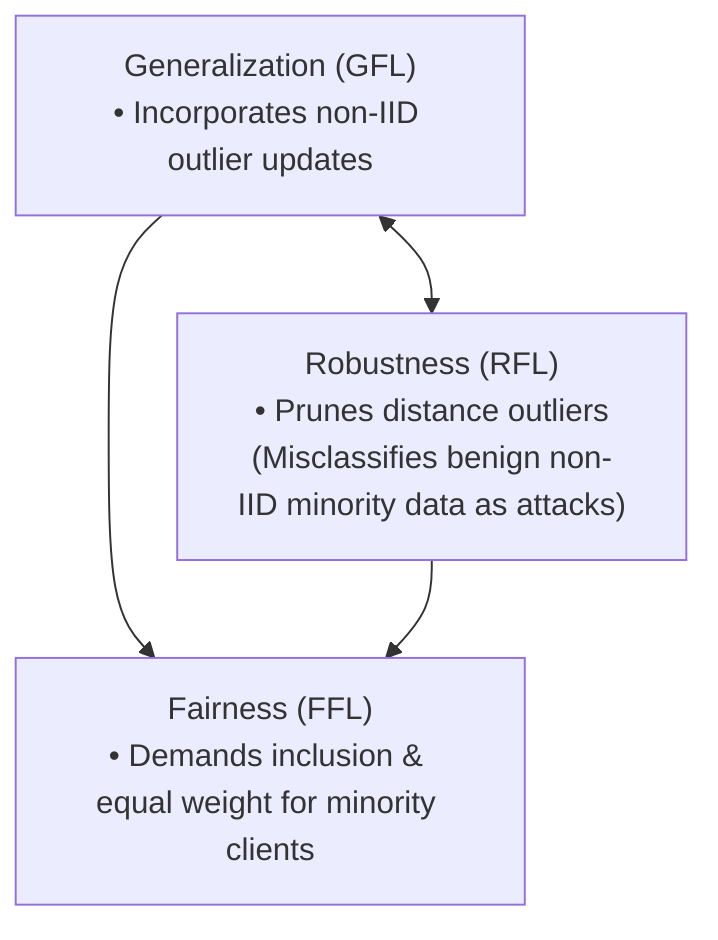

# Federated Learning for Generalization, Robustness, Fairness: A Survey and Benchmark

Here is an end-to-end, module-by-module walk-through of **"Federated Learning for Generalization, Robustness, Fairness: A Survey and Benchmark"** (Huang et al., _IEEE Transactions on Pattern Analysis and Machine Intelligence (TPAMI)_, 2024).

This survey is the first in the literature to simultaneously formalize and benchmark the three foundational pillars of practical Federated Learning (FL): **Generalization (GFL)**, **Robustness (RFL)**, and **Fairness (FFL)**.

---

## **Module 1: Architectural Setup, Empirical Risk Minimization, & The Tripartite Problem Scope**

### 1. The Standard Horizontal FL (HFL) Optimization Loop

In Horizontal Federated Learning (HFL)—where $M$ distributed client nodes share an identical feature space $X$ but hold distinct private sample spaces $D_i$ ($N_i = |D_i|$)—the central objective is learning an optimal global parameter vector $w^\* = f \circ g$ (backbone $f$, classifier $g$). The system minimizes the aggregated empirical loss without consolidating raw private data:

$$\min_{w} \sum_{i=1}^M \alpha_i F_i(w, D_i) \quad \text{subject to} \quad \sum_{i=1}^M \alpha_i = 1$$

where $\alpha_i = \frac{N_i}{\sum N_i}$ (dataset-weighted averaging, e.g., $\text{FedAvg}$) or $\alpha_i = \frac{1}{M}$ (uniform client weighting). The optimization pipeline executes across three sequential operations per communication round:

1. **Server Broadcast**: The central server distributes global weights $w$ to participating clients ($w_i \leftarrow w$).
2. **Local Optimization**: Client $i$ executes local empirical risk minimization on private dataset $D*i$: $\min*{w*i} \mathbb{E}*{\xi \in D_i} [L_i(w_i, \xi)]$.
3. **Server Aggregation**: The server aggregates local parameters to construct updated global weights: $w = \sum\_{i=1}^M \alpha_i w_i$.

### 2. The Core Tripartite Scope

Huang et al. demonstrate that real-world FL deployments fail due to three interconnected vulnerabilities:

- **Generalization Bottlenecks**: Non-IID client data distributions cause local optimization paths to diverge, slowing convergence and degrading accuracy on both participating and unseen test domains.
- **Robustness Vulnerabilities**: The open, privacy-preserving nature of FL prevents servers from verifying client integrity, leaving systems vulnerable to parameter poisoning, backdoors, and free-riding.
- **Fairness Disparities**: Uniform model aggregation over-indexes on data-rich or dominant clients, creating severe predictive disparities against minority nodes and disincentivizing participation due to misaligned rewards.

---

## **Module 2: Generalizable Federated Learning (GFL) — Distribution Shifts & Mitigation Paradigms**

When local client data distributions $P_i(x,y) = P_i(x|y) P_i(y)$ diverge across participating nodes, standard optimization suffers from objective inconsistency. The authors classify distribution shifts into two structural settings:

### 1. Taxonomy of Distribution Shifts

- **Cross-Client Shift**: Distributional variance among active, participating clients $i, j \in M$:
  - _Label Skew_: Marginal label distributions differ ($P_i(y) \neq P_j(y)$) while class-conditional feature distributions are shared ($P_i(x|y) = P_j(x|y)$) (e.g., specialized hospitals holding distinct disease ratios, modeled via Dirichlet distribution sampling $\text{Dir}(\beta)$).
  - _Domain Skew_: Conditional feature distributions differ ($P_i(x|y) \neq P_j(x|y)$) across a shared label space ($P_i(y) = P_j(y)$) (e.g., medical imaging sensors operating under varying lighting, resolution, or style attributes).
- **Out-Client Shift**: Distributional gap between participating source clients $P_i(x|y)$ and unseen outer deployment target domains $P_o(x|y)$. Unlike centralized **Domain Generalization (DG)**—which requires centralizing source data and violates privacy laws—**Federated Domain Generalization (FDG)** forces multiple participating domains to learn domain-invariant representations collaboratively without aggregating raw data.

### 2. Cross-Calibration & Unknown Generalization Taxonomies

- **Cross Calibration (Addressing Cross-Client Shift)**:
  - _Client Regularization_: Constrains local drift using shared global models (parameter $\ell_2$ penalty in $\text{FedProx}$; control variates in $\text{SCAFFOLD}$; feature-level contrastive loss in $\text{MOON}$), global statistical prototypes ($\text{FedProc}$, $\text{HarmoFL}$), or self-driven logit/softmax restrictions ($\text{FedRS}$, $\text{FedSAM}$).
  - _Client Augmentation_: Supplements local representations via data-sharing warm-ups ($\text{DC-Adam}$), generative zero-shot augmentation ($\text{FEDGEN}$, $\text{FedMix}$), or active client selection ($\text{FedACS}$).
  - _Server Operations_: Applies dynamic Bayesian ensemble aggregation ($\text{FEDBE}$) or adaptive server-side momentum optimizers ($\text{FedOPT}$).
- **Unknown Generalization (Addressing Out-Client Shift)**:
  - _Federated Domain Adaptation (FDA)_: Utilizes unlabelled target domain data during training via dynamic adversarial alignment ($\text{FADA}$) or disentangled domain-invariant feature heads ($\text{COPA}$).
  - _Federated Domain Generalization (FDG)_: Learns domain-invariant features for completely unseen domains by sharing amplitude spectrums ($\text{FedDG}$), executing cross-client style transfers ($\text{CCST}$), or applying layer-wise semantic aggregation.

---

## **Module 3: Robust Federated Learning (RFL) — Attack Vectors & Defense Mechanisms**

The decentralized, uninspected nature of FL exposes systems to three major adversarial attack classes:

### 1. Taxonomy of Adversarial Attacks

- **Byzantine Attacks (Untargeted)**: Malicious clients upload distorted parameters to prevent the global model from converging.
  - _Data-based_: Symmetry Flipping ($\text{SymF}$) and Pair Flipping ($\text{PairF}$) label noise.
  - _Model-based_: Gradient manipulation via Random Noise ($\text{RanN}$), Little-Is-Enough ($\text{LIE}$), Fang, Min-Max ($\text{MiMa}$), and Min-Sum ($\text{MiSu}$).
- **Backdoor Attacks (Targeted)**: Attackers inject stealthy trigger patterns $\Phi$ into local samples ($x = (1-m)x + m\Phi$) to induce specific misclassifications ($\tilde{y}$) on triggered inputs while maintaining high baseline accuracy on clean main tasks:
  - _Fixed-Trigger Paradigm_: Distributed Backdoor Attacks ($\text{DBA}$) decompose global triggers into local sub-patterns; $\text{Neurotoxin}$ and $\text{BCLayer}$ target infrequently updated parameter layers to evade detection.
  - _Adaptive/Optimization Paradigm_: $\text{F3BA}$, $\text{CerP}$, and $\text{A3FL}$ dynamically adapt trigger patterns during active training rounds to persist against evolving server defenses.
- **Free-Rider Attacks (Parasitic)**: Malicious nodes download global weights while uploading fake or uninformative updates (e.g., random Gaussian noise or scaled model subtractions) to consume system rewards without spending compute or sharing data.

### 2. Defense Mechanisms & The Non-IID Fragility

- **Byzantine Tolerance**: Distance-based filters ($\text{Multi-Krum}$, $\text{FoolsGold}$, $\text{DnC}$) and statistical distribution aggregators ($\text{Trimmed Mean}$, $\text{Bulyan}$, $\text{RFA}$) prune parameter updates far from spatial cluster medians. However, **these methods assume IID data distributions**; under non-IID conditions, honest minority updates naturally manifest as parameter outliers, causing distance-based aggregators to misidentify and discard benign minority nodes.
- **Backdoor Defenses**: Employs model refinement via distillation/pruning, robust aggregation filtering ($\text{Dim-Krum}$, $\text{RLR}$), or certified randomized smoothing guarantees ($\text{CRFL}$, $\text{ProvableFL}$).

---

## **Module 4: Fair Federated Learning (FFL) — Collaboration Equity vs. Performance Uniformity**

Huang et al. divide fairness in FL into two distinct, mathematically formalized objectives: **Collaboration Fairness** (reward allocation) and **Performance Fairness** (predictive parity).

### 1. Collaboration Fairness (Resolving Reward Conflicts)

When clients contribute varying volumes of high-quality or rare data, uniform model distribution creates interest conflicts. Collaboration fairness evaluates true marginal data utility using cooperative game theory:

- **Shapley Value ($\nu_i$)**: Measures client $i$'s marginal accuracy contribution across all possible coalition subsets $S \subseteq M \setminus \{i\}$:

$$\nu*i = \sum*{S \subseteq M \setminus \{i\}} \frac{|S|!(|M| - |S| - 1)!}{|M|!} \left[ A^u_{S \cup \{i\}} - A^u_S \right]$$

- **Contribution Match Degree ($E$)**: Measures the cosine alignment between pre-allocated aggregation weights $\alpha$ and the empirical accuracy drop vector $\Gamma$ obtained via leave-one-out testing ($\Gamma*i = A - A*{-i}$):

$$E = \frac{\Gamma \cdot \alpha}{\|\Gamma\|_2 \|\alpha\|_2}$$

### 2. Performance Fairness (Mitigating Prediction Biases)

Heterogeneous data distributions cause shared global models to overfit dominant client distributions while underperforming on minority clients.

- **Performance Deviation Metric ($V$)**: Quantifies predictive performance inconsistency by calculating the standard deviation ($\sigma$) of accuracy across all target testing distributions $U$:

$$V = \sqrt{\frac{1}{|U|} \sum_{u \in U} (A_u - \bar{A})^2} \times 100\%$$

- **Mitigation Paradigms**:
  - _Performance Debias Optimization_: Formulates min-max optimization over the single worst-performing client ($\text{AFL}$) or solves multi-objective Pareto gradient descent ($\text{FCFL}$, $\text{FedMGDA+}$).
  - _Performance Debias Reweighting_: Loss-tilted reweighting ($q\text{-FFL}$) and domain consistency reweighting ($\text{FedHEAL}$, $\text{FedCE}$) assign higher aggregation weights to clients experiencing higher local losses.

---

## **Module 5: Cross-Realm Benchmarks, The Triadic Tension, & Dissertation Strategic Bridge**

### 1. Cross-Realm Benchmark Insights

The survey's empirical benchmarks across CIFAR-10, CIFAR-100, MNIST, Fashion-MNIST, Digits, and Office-Caltech highlight critical real-world trade-offs:

- **GFL vs. Non-IID Severity**: Under extreme label skew ($\beta = 0.1$), standard $\text{FedAvg}$ accuracy drops drastically on CIFAR-100 (from $68.47\%$ to $21.21\%$). Regularization methods like $\text{SCAFFOLD}$ maintain $68.24\%$ accuracy, but suffer under heavy model poisoning.
- **RFL Collapse Under Data Heterogeneity**: Byzantine-robust aggregators ($\text{Multi-Krum}$, $\text{Trimmed Mean}$) perform well under IID conditions, but experience massive performance drops under non-IID distributions because benign non-IID updates are misclassified as attacks.

### 2. The Core Open Frontier: The Generalization-Robustness-Fairness Tension Triad

The paper's primary conceptual takeaway is that **GFL, RFL, and FFL directly conflict when deployed simultaneously**:

1. **GFL / FFL vs. RFL Conflict**: Generalization and Performance Fairness require the global model to absorb diverse, non-conforming parameters from minority edge clients. However, Byzantine defenses reliance on spatial parameter distance thresholds causes them to **prune benign minority updates as malicious outliers**, destroying performance fairness for underrepresented clients.
2. **RFL vs. FFL Conflict**: Enforcing certified robustness or distance clipping depresses the aggregation weights of non-conforming clients, directly violating Collaboration Fairness ($E$) and disincentivizing participation.

---

## **Strategic Bridge to Your Dissertation**

Huang et al.'s TPAMI survey establishes the exact structural baseline for your dissertation research on **fair federated learning with agent-based dynamic enforcement**:

1. **The Static Threshold Failure**: Current RFL and FFL frameworks rely on **static, offline heuristics** (e.g., static distance thresholds in Krum/DnC, fixed loss-tilting exponents $q$ in $q\text{-FFL}$, or fixed aggregation budgets $\beta$ in FairFed). Under mid-training non-stationary data drift, static rules fail, triggering the Triadic Conflict.
2. **Runtime Agentic Control Planes**: You can position your proposed **distributed agentic control plane** as the unified orchestrator that resolves this Triadic Conflict at runtime:
   - **Client Guardian Agents**: Deploying local epistemic uncertainty estimation on edge devices allows client agents to certify that non-conforming updates stem from legitimate non-IID distribution shifts rather than malicious poisoning, preventing false-positive Byzantine exclusion.
   - **Server Governor Agents**: Maintaining stateful memory traces ($m_t$) tracking cumulative non-Markovian fairness trajectories allows server agents to dynamically adjust aggregation bounds ($M\%$, $\beta(t)$) on the fly as client data drifts mid-training—achieving simultaneous **Generalization, Robustness, and Calibrated Fairness** without full model retraining.
