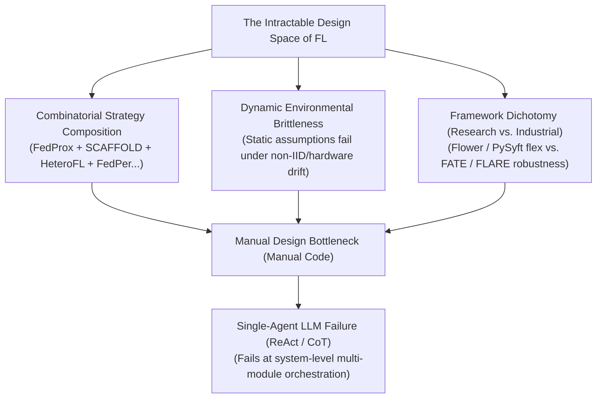
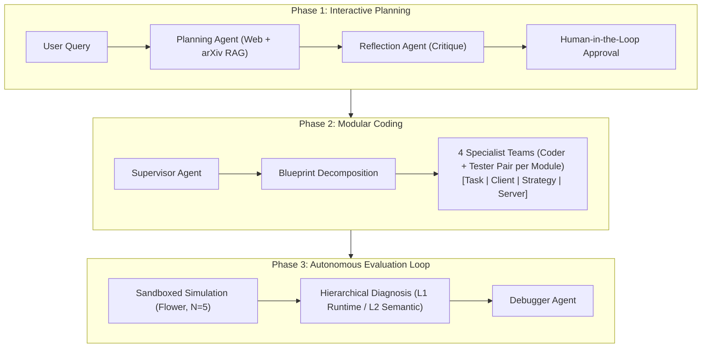
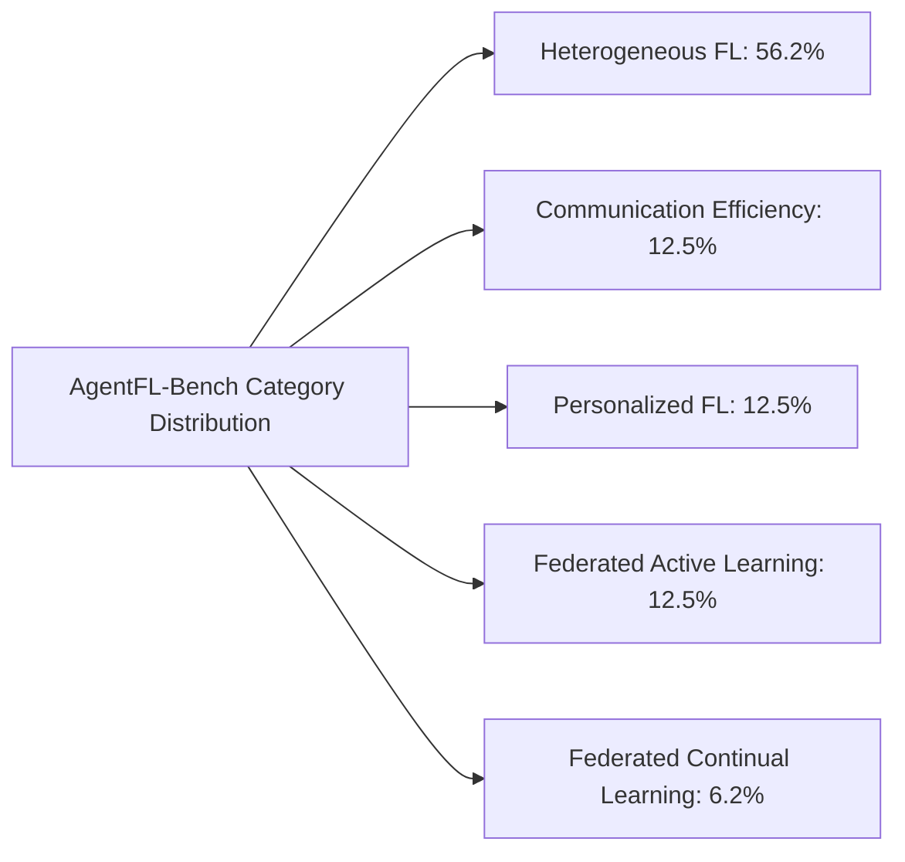
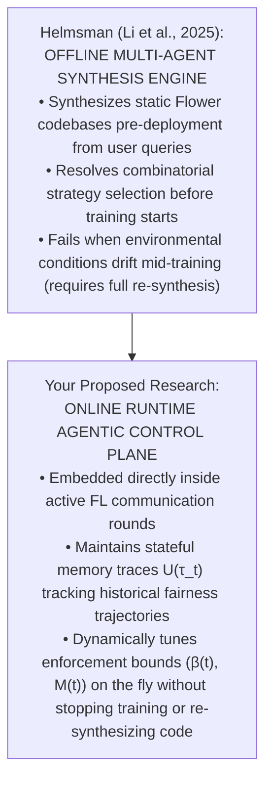

# Helmsman: Autonomous Synthesis of Federated Learning Systems via Collaborative LLM Agents

Here is a structured, end-to-end walk-through of **"Helmsman: Autonomous Synthesis of Federated Learning Systems via Collaborative LLM Agents"** (Li, Funk, & Saeed, 2025).

This 4-module analysis breaks down the paper's theoretical motivation, its three-phase multi-agent R&D architecture, the AgentFL-Bench benchmark results, and its open system limitations—specifically framed to contextualize how offline code synthesis connects to your dissertation on online, runtime agentic fair enforcement.

---

## **Module 1: The Engineering Bottleneck & The "Intractable Design Space"**

### 1. Core Research Problem: Manual Engineering Complexity

Federated Learning (FL) promises privacy-centric collaborative machine learning, but deploying practical systems requires navigating a complex design space. Practitioners rarely face a single challenge in isolation; real-world deployments present a **combinatorial confluence** of non-IID data distributions, resource-constrained edge hardware, unreliable network connections, and shifting task objectives.

The literature is saturated with specialized, point-solution algorithms designed in research silos—such as FedProx for stragglers, SCAFFOLD for client drift, FedNova for system heterogeneity, and HeteroFL for model size variance. However, composing and tuning these isolated strategies into a single, cohesive, deployment-ready system creates an **intractable combinatorial search space** for human engineers.

### 2. The Failure of Single-Agent LLM Code Generation

While recent LLM coding agents excel at self-contained, algorithmic function generation (e.g., HumanEval tasks), Li et al. demonstrate that single-agent architectures—even when augmented with Chain-of-Thought (CoT) or ReAct prompting—**fail completely when confronted with system-level FL orchestration**. Designing an FL system requires orchestrating interdependent modules across data loading, client-side local training, strategy formulation, and server-side aggregation while satisfying hardware and communication constraints simultaneously.

### 3. The Framework Dichotomy

The authors observe a split in the FL software ecosystem:

- **Research Frameworks (e.g., Flower, PySyft)**: Offer modularity and flexibility for rapid prototyping, but lack automated system synthesis.
- **Industrial Platforms (e.g., FATE, NVIDIA FLARE)**: Prioritize production-grade scalability and reliability, but suffer from rigid configurations.

**Helmsman** is designed to bridge this gap by automating the end-to-end translation of high-level user specifications into deployable, verified FL codebases.

---

## **Module 2: The Helmsman Multi-Agent R&D Architecture**

Helmsman structures the software engineering lifecycle into three collaborative phases: **Interactive Planning**, **Modular Coding**, and **Autonomous Evaluation**.

## Phase 1: Interactive and Verifiable Planning

Transforms a high-level user query (specifying problem statement, task description, and framework requirements) into a structured research plan through a two-step verification loop [15–20]:

1.  **Agentic Plan Generation & Self-Reflection**: A specialized **Planning Agent** queries external tools—combining live Tavily web search with a Retrieval-Augmented Generation (RAG) vector database of arXiv FL literature (indexed via hybrid BM25 + Voyage-3-large embeddings + Cohere rerank-v3.5). Before showing the plan to the user, a **Reflection Agent** conducts an automated meta-cognitive critique, categorizing the plan as `COMPLETE` or `INCOMPLETE` to fix logical gaps autonomously [16, 114–116].
2.  **Human-in-the-Loop (HITL) Verification**: The self-corrected plan undergoes final human approval. HITL ensures safety alignment, prunes unnecessary search spaces (saving context and simulation costs), and provides fine-grained control over experimental parameters.

## Phase 2: Modular Code Generation via Supervised Agent Teams

Guided by the software engineering principle of _separation of concerns_, a **Supervisor Agent** decomposes the approved plan into a blueprint comprising four interdependent modules:

- **Task Module**: Data loaders, model architecture definition, and basic train/test loops [21, 122–126].
- **Client Module**: Stateful client representation managing local updates using the Flower framework [21, 133–140].
- **Strategy Module**: Custom aggregation logic and mathematical reweighting algorithms [21, 126–132].
- **Server Module**: Global orchestration, evaluation loops, and server-side update management [21, 141–148].

The Supervisor spawns **four dedicated agent teams** (each pairing a **Coder Agent** with a **Tester Agent** for real-time syntax checking). Implementation follows a strict dependency graph—for example, the Server module is coded only after the Task and Strategy modules pass initial unit verification.

## Phase 3: Autonomous Evaluation and Refinement

To catch system integration and runtime bugs, Helmsman executes the integrated script (`run.py`) inside a sandboxed simulation environment [23, 28, 148–152]:

1.  **Sandboxed Simulation**: Runs the code for a short simulation horizon ($N=5$ rounds) using Flower.
2.  **Hierarchical Diagnosis**: An **Evaluator Agent** scans simulation logs across two levels [24, 153–156]:
    - _Level 1 (L1) Runtime Integrity_: Scans for explicit Python crashes, syntax errors, or stack traces.
    - _Level 2 (L2) Semantic Correctness_: Inspects structured logs for subtle algorithmic failures, such as zero client participation (`aggregate_fit received 0 results`), stagnant loss curves, or exploding gradients.
3.  **Automated Code Correction**: If an error is detected, a **Debugger Agent** receives the error report $E*i$ and patches the codebase $C*{i+1}$ [25, 157–160]. The loop repeats until the code passes both L1 and L2 checks or hits a max attempt limit ($T\_{\max} = 10$).

---

## **Module 3: AgentFL-Bench & Empirical Performance**

### 1. Benchmark Design (AgentFL-Bench)

To evaluate end-to-end FL system synthesis, Li et al. introduced **AgentFL-Bench**, a benchmark containing **16 diverse tasks** across five core FL research domains [8, 29–32]:

1.  _Data Heterogeneity_ (Q1–Q8): Long-tail class imbalance (CIFAR-10-LT), feature/label noise (CIFAR-100-C, CIFAR-10N), and domain shifts (Office-Home, HAR, Speech Commands, Fed-ISIC2019, Caltech101) [30, 92–96].
2.  _System & Model Heterogeneity_ (Q9): Heterogeneous model architectures (ResNet-18 at full, 1/2, and 1/4 capacities across devices).
3.  _Communication Efficiency_ (Q10–Q11): Low client participation under bandwidth caps and connectivity drops [34, 97–98].
4.  _Personalization_ (Q12–Q13): Balancing global knowledge sharing with local user adaptation on FEMNIST and CIFAR-10 [35, 98–99].
5.  _Cross-Disciplinary Domains_ (Q14–Q16): Federated Active Learning (DermaMNIST, CIFAR-10) and Federated Continual Learning (Split-CIFAR100) [36, 100–101].

### 2. Key Empirical Results & Hybrid Strategy Discovery

- **Superiority Over Hand-Crafted Baselines**: Across the 16 tasks, Helmsman synthesized codebases that consistently matched or outperformed established baselines (FedAvg, FedProx, FedNova, HeteroFL, FedPer, FAST, FedWeIT) [30, 34–38].
- **Discovery of Novel Hybrid Combinations**: On the Federated Continual Learning task (Q16: Split-CIFAR100 incremental tasks), Helmsman synthesized a novel hybrid strategy combining **client-side experience replay with global model distillation**. It achieved **51.04% average accuracy** and **0.07 forgetting**, massively outperforming specialized baselines like TARGET (34.89% acc, 0.24 forgetting) and FedWeIT (28.56% acc, 0.49 forgetting).
- **Ablation Study Insights**:
  - Single ReAct agents (like standard AutoGPT or single-prompt architectures) suffered a **0% success rate** across benchmark tasks.
  - Removing the dual-layer (L1/L2) evaluator verification caused a 0% success rate, proving that runtime sandboxed execution is essential for system stability.
  - Full Helmsman system achieved a **100% synthesis success rate** across LLM backends (Gemini-2.5-flash, Claude-Sonnet-4.5, GPT-5.1) at an average cost of ~\$0.57–\$1.04 per task [41–43, 68–77].

---

## **Module 4: System Limitations & Strategic Dissertation Bridge**

### 1. Systemic Limitations of Helmsman

While Helmsman advances automated FL software engineering, it leaves several critical system-level gaps open:

1.  **Pre-Deployment Offline Code Synthesis**: Helmsman operates as an **offline compiler/developer**. It generates and certifies a static Flower codebase _before_ training begins. Once compiled and deployed to edge devices, the generated system is static.
2.  **Inability to Handle Mid-Training Dynamic Drift**: If client data distributions undergo non-stationary concept drift, if new malicious Byzantine nodes join at Round 50, or if local edge hardware capabilities fluctuate mid-training, Helmsman's compiled code **cannot adapt dynamically at runtime** without halting execution, returning to Phase 1, and re-synthesizing the codebase from scratch.
3.  **Absence of Online Runtime Governance**: Helmsman does not deploy active, stateful agents _inside_ the live FL communication loop to monitor parameter updates, track historical non-Markovian fairness trajectories ($U(\tau_t)$), or adjust aggregation weights ($\beta(t)$) on the fly.

---

## **Strategic Dissertation Bridge: Offline Synthesis vs. Online Runtime Control**

Helmsman provides the perfect **structural contrast** for your dissertation proposal:

- **Complementary Positioning**: In your literature review, you can frame Helmsman as the state-of-the-art for **offline FL system compilation**, while positioning your work as the essential **online runtime control plane**.
- **The Runtime Gap**: While Helmsman solves the offline "how do we compose FedProx + FairFed + Differential Privacy into a single codebase?" problem, your architecture solves the online "how do edge and server agents dynamically steer fairness bounds ($\beta(t)$) and Byzantine distance thresholds ($M\%$) when client data drifts at Round 50 without restarting training?" problem.
