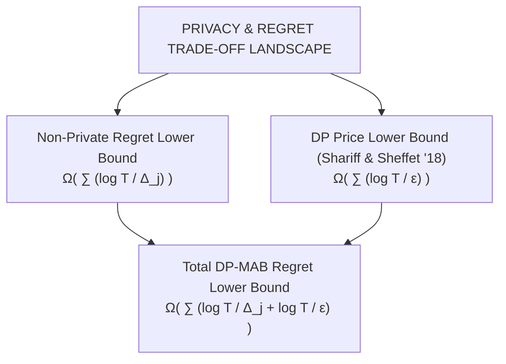
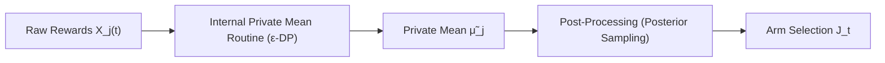
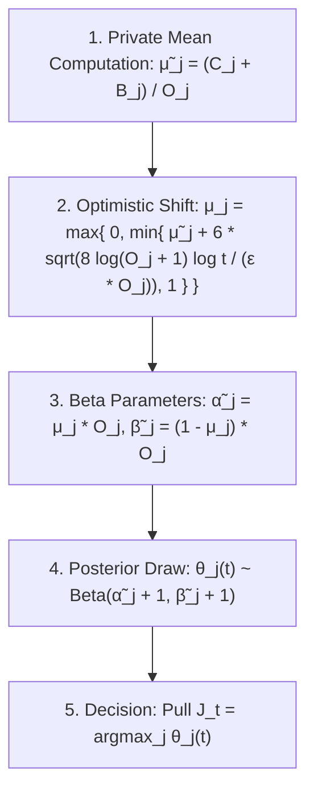
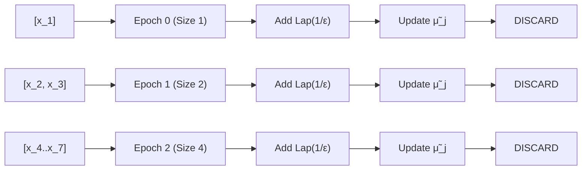
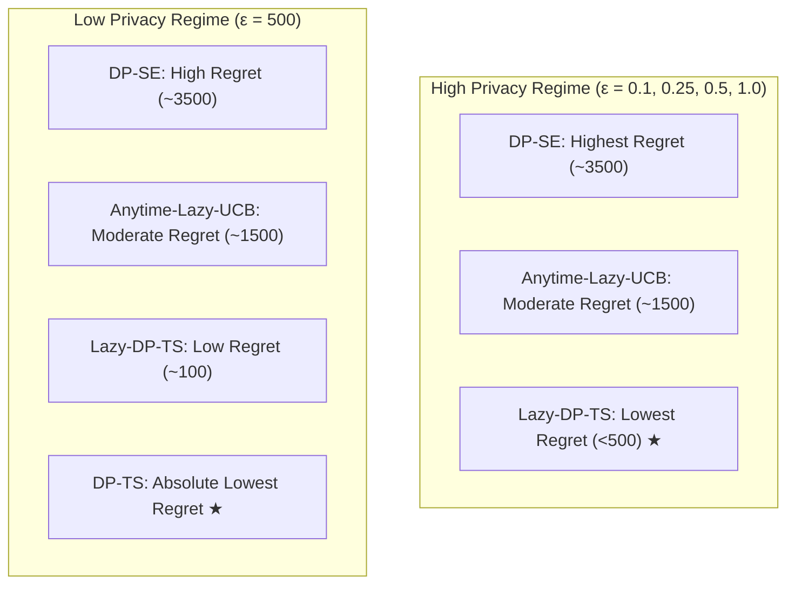

# Near-Optimal Thompson Sampling-Based Algorithms for Differentially Private Stochastic Bandits

## **Module 1: Problem Formulation, Regret Metrics, and the Differential Privacy Model**

### **1. Stochastic Multi-Armed Bandit (MAB) Environment**

The paper addresses a stochastic multi-armed bandit with a fixed set $\mathcal{A}$ of $K$ arms. At each discrete time round $t = 1, 2, \dots, T$, pulling an arm $J*t \in \mathcal{A}$ yields an independent Bernoulli reward $X*{J_t}(t) \in \{0, 1\}$ with expected mean $\mu_j \in (0, 1)$. Without loss of generality, arm 1 is assumed to be the unique optimal arm ($\mu_1 > \mu_j, \forall j \neq 1$). The performance loss per sub-optimal arm pull is defined by the mean reward gap $\Delta_j := \mu_1 - \mu_j$.

The learning objective is to minimize expected cumulative **pseudo-regret** over $T$ rounds:
$$R(T) = T \cdot \mu*1 - \sum*{j \in \mathcal{A}} \mathbb{E}\left[\sum_{t=1}^T \mathbf{1}\{J_t = j\}\right] \cdot \mu*j = \sum*{j \in \mathcal{A}: \Delta_j > 0} \mathbb{E}[T_j(T)] \cdot \Delta_j$$
where $T_j(T)$ represents the total number of pulls of sub-optimal arm $j$ up to horizon $T$.

### **2. Differential Privacy ($\epsilon$-DP) Model for Rewards**

In privacy-sensitive online applications (e.g., ad clicks revealing user preferences or personal choices), individual reward observations $X*t$ must be protected against adversarial inference. Let $\mathbf{X}*{1:t}$ and $\mathbf{X'}\_{1:t}$ be two neighboring reward sequences up to time $t$ that differ in at most one reward vector at some round $s \le t$.

- **Definition 1 ($\epsilon$-Differential Privacy)**: An online learning algorithm $\mathcal{M}$ is **$\epsilon$-differentially private** if for all rounds $t = 1, \dots, T$, neighboring sequences $\mathbf{X}$ and $\mathbf{X'}$, and any set $\mathcal{D}$ of decision sequences (arm selections):
  $$P\{\mathcal{M}(\mathbf{X}) \in \mathcal{D}\} \le e^\epsilon \cdot P\{\mathcal{M}(\mathbf{X'}) \in \mathcal{D}\}$$
  This bounds the maximum privacy loss (max divergence $D\_\infty(Q, Q') \le \epsilon$) resulting from an adversary witnessing output selection sequence $y$.

### **3. Literature Gap and Prior Work Failures**

Prior work in DP online learning established an asymptotic lower bound of $\Omega\left(\sum\_{j:\Delta_j > 0} \left( \frac{\log T}{\Delta_j} + \frac{\log T}{\epsilon} \right)\right)$ for private stochastic bandits. While optimal upper bounds were achieved for UCB-based methods (**Anytime-Lazy-UCB**) and elimination-style methods (**DP-SE**), no optimal Thompson Sampling-based algorithm existed in the literature.

Previous attempts at private Thompson Sampling (Mishra & Thakurta, 2015) suffered from severe structural and operational limitations:

1. **Sub-Optimal Regret Bounds**: Achieved $O\left(\frac{K \log^3 T}{\epsilon \cdot \Delta}\right)$ or $O\left(\frac{K \log^3 T}{\epsilon^2 \cdot \Delta^2}\right)$, far above the theoretical lower bound.
2. **Horizon Dependence**: Required pre-knowing horizon $T$ to calibrate tree-based noise mechanisms, preventing them from operating as anytime algorithms.
3. **Operational Failure Mode**: The tree-based noise mechanism could generate negative noisy reward totals ($r_a(t) < 0$), yielding negative alpha/beta parameters for Beta distributions, causing the algorithm to crash.

---

## **Module 2: Core Algorithmic Principles — Post-Processing Invariance & Reshaping the Posterior**

To resolve prior operational failures and achieve order-optimality, Hu and Hegde combine two core theoretical mechanics:

### **1. Differential Privacy via Post-Processing Invariance**

By Proposition 2.1 of Dwork et al. (2014), differential privacy is invariant to post-processing: if an internal routine calculating empirical arm means is made $\epsilon$-differentially private, any downstream decision rule (such as posterior sampling or arm selection) that operates solely on those private means automatically guarantees $\epsilon$-differential privacy without touching raw reward data.

### **2. Reshaping the Posterior via Optimism in the Face of Uncertainty**

Standard non-private Thompson Sampling draws posterior samples $\theta*j'(t) \sim \text{Beta}(\alpha'\_j(t) + 1, \beta'\_j(t) + 1)$ using exact counts of success $\alpha'\_j(t) = \hat{\mu}*{j, O*j} \cdot O_j$ and failure $\beta'\_j(t) = (1 - \hat{\mu}*{j, O_j}) \cdot O_j$.

In the private setting, injected Laplace noise introduces variance into private empirical mean $\tilde{\mu}\_{j, O_j}$. To prevent under-exploration caused by noise-induced underestimation of optimal arms, the algorithms **reshape the posterior distribution in an optimistic direction** by shifting private means to the right:

1. **Optimism Offset Offset Addition**: Add an explicit optimism buffer $\upsilon$ to the private mean $\tilde{\mu}\_{j, O_j}$.
2. **Clipping Boundary**: Enforce clipping $\mu*{j, O_j} = \max\left\{0, \min\{\tilde{\mu}*{j, O*j} + \upsilon, 1\}\right\}$ to strictly bound $\mu*{j, O*j} \in$. This fixes the operational bug of Mishra & Thakurta by ensuring non-negative Beta parameters $\tilde{\alpha}\_j = \mu*{j, O*j} \cdot O_j \ge 0$ and $\tilde{\beta}\_j = (1 - \mu*{j, O_j}) \cdot O_j \ge 0$.
3. **Stochastic Dominance**: With high probability, $\mu*{j, O_j} \ge \hat{\mu}*{j, O_j}$, ensuring that the private posterior $\text{Beta}(\tilde{\alpha}\_j + 1, \tilde{\beta}\_j + 1)$ **stochastically dominates** the non-private posterior, driving optimistic exploration.

---

## **Module 3: Algorithm 1 — Differentially Private Thompson Sampling (DP-TS)**

### **1. Structural Mechanism (All-Observation Partitioning)**

**DP-TS** (Algorithm 1) utilizes all $n = O_j(t-1)$ historical observations collected for arm $j$ up to round $t$. To keep noise additions bounded over expanding historical horizons, DP-TS partitions the sequence $(x_1, \dots, x_n)$ into two sub-sequences at $m = 2^{\lfloor \log(n+1) \rfloor} - 1$:

- **First Partition $(x_1, \dots, x_m)$**: Processed using a modified **Logarithmic Mechanism** preserving $0.5\epsilon$-DP. Fresh Laplace noise $\text{Lap}\left(\frac{1}{0.5\epsilon}\right)$ is injected only at epoch boundaries where observation counts hit $2^{r_j+1}-1$.
- **Second Partition $(x\_{m+1}, \dots, x_n)$**: Processed using a $2^{r_j+1}$-bounded **Binary Mechanism** preserving $0.5\epsilon$-DP.

By basic composition, aggregating outputs $C*j$ and $B_j$ to construct private empirical mean $\tilde{\mu}*{j, O_j} = \frac{C_j + B_j}{O_j}$ guarantees $1.0\epsilon$-differential privacy.

### **2. Theoretical Regret Bounds (Theorem 2)**

The optimistic offset for DP-TS is set to $\upsilon\_{\epsilon, O_j, t} = 6 \sqrt{\frac{8 \log(O_j + 1) \log t}{\epsilon \cdot O_j}}$.

- **Theorem 1 (Privacy)**: Algorithm 1 is $\epsilon$-differentially private.
- **Theorem 2 (Problem-Dependent Regret Bound)**: The pseudo-regret of DP-TS satisfies:
  $$R_{\text{DP-TS}}(T) \le \sum_{j \in \mathcal{A}: \Delta_j > 0} O\left( \max \left\{ \frac{\log T}{\Delta_j}, \frac{\log T}{\epsilon} \log\left( \frac{\log T}{\epsilon \cdot \Delta_j} \right) \right\} \right)$$
- **Problem-Independent Regret Bound**: $R\_{\text{DP-TS}}(T) \le O\left( \sqrt{KT \log T} + \frac{K \log T}{\epsilon} \log\left( \frac{\sqrt{T \log T}}{\sqrt{K}\epsilon} \right) \right)$.

- **Analysis**: DP-TS is **near-optimal up to an extra $\log(\log T / (\epsilon \Delta))$ factor**. Because it reuses historical observations across rounds, noise accumulates over time, requiring the extra logarithmic term to maintain privacy.

---

## **Module 4: Algorithm 2 — Lazy Differentially Private Thompson Sampling (Lazy-DP-TS)**

### **1. Structural Mechanism (Observation Dropping & Epoch Updating)**

To eliminate the extra log factor and achieve exact order-optimality, **Lazy-DP-TS** (Algorithm 2) introduces **observation dropping**. Once an observation has been incorporated into an epoch update, it is permanently abandoned and never reused.

1. **Doubling Epochs**: The number of observations $O_j(t-1)$ used to compute the private mean doubles at each update step ($O_j \in \{2^r \mid r \ge 0\}$).
2. **Single Noise Invalidation**: Updates occur only when local buffer $\Psi_j$ accumulates $2^{r_j+1}$ fresh observations. A single noise variable $\text{Lap}\left(\frac{1}{\epsilon}\right)$ is added to the fresh batch, ensuring that the private empirical mean contains **exactly one noise variable at all times**.
3. **Lazy Optimism Offset**: The offset simplifies to $\upsilon\_{\epsilon, O_j, t} = \frac{3 \log t}{\epsilon \cdot O_j}$.

### **2. Theoretical Regret Bounds (Theorem 4)**

- **Theorem 3 (Privacy)**: Algorithm 2 is $\epsilon$-differentially private.
- **Theorem 4 (Problem-Dependent Regret Bound)**: The pseudo-regret of Lazy-DP-TS satisfies:
  $$R_{\text{Lazy-DP-TS}}(T) \le \sum_{j \in \mathcal{A}: \Delta_j > 0} O\left( \frac{\log T}{\min\{\epsilon, \Delta_j\}} \right) = \sum_{j \in \mathcal{A}: \Delta_j > 0} O\left( \frac{\log T}{\Delta_j} + \frac{\log T}{\epsilon} \right)$$
- **Problem-Independent Regret Bound**: $R\_{\text{Lazy-DP-TS}}(T) \le O\left( \sqrt{KT \log T} + \frac{K \log T}{\epsilon} \right)$.

- **Analysis**: Lazy-DP-TS **matches the theoretical regret lower bound** $\Omega\left( \sum \frac{\log T}{\Delta_j} + \frac{\log T}{\epsilon} \right)$ derived by Shariff & Sheffet (2018), achieving **exact order-optimality** and minimax optimality up to a $\sqrt{\log T}$ factor.

---

## **Module 5: Empirical Benchmarks, Comparative Analysis, & Open Research Frontiers**

### **1. Experimental Benchmarks**

The authors benchmark DP-TS, Lazy-DP-TS, DP-SE, and Anytime-Lazy-UCB across $K=5$ Bernoulli arms with true mean rewards $\boldsymbol{\mu} = [0.75, 0.625, 0.5, 0.375, 0.25]$ over a horizon $T = 10^5$ across privacy levels $\epsilon \in \{0.1, 0.25, 0.5, 1.0, 500\}$.

### **2. Empirical Regret Observations**

1. **Regret Profile under High Privacy ($\epsilon \in [0.1, 1.0]$)**: **Lazy-DP-TS strictly outperforms** both DP-SE and Anytime-Lazy-UCB across all privacy budgets. For instance, at $\epsilon = 1.0$, Lazy-DP-TS stabilizes at a cumulative regret below 500, whereas Anytime-Lazy-UCB reaches ~1500 and DP-SE reaches ~3500.
2. **Regret Profile under Low Privacy ($\epsilon = 500$)**: When privacy constraints are relaxed ($\epsilon \to \infty$), **DP-TS outperforms Lazy-DP-TS**. Because DP-TS reuses all historical observations, its leading term achieves asymptotic optimality like non-private Thompson Sampling, whereas Lazy-DP-TS's observation-dropping mechanism limits it to order-optimality.

---

## **Summary Comparison of Private Bandit Algorithms**

| Algorithm                       | Method Family          | Observation Usage | Operational Stability                        | Regret Order Bound                                                                                                                               | Matches Lower Bound?         |
| :------------------------------ | :--------------------- | :---------------- | :------------------------------------------- | :----------------------------------------------------------------------------------------------------------------------------------------------- | :--------------------------- |
| **Mishra & Thakurta (2015)**    | Thompson Sampling      | All (Tree-based)  | Unstable (Negative Beta $\alpha, \beta$) | $O\left( \frac{K \log^3 T}{\epsilon^2 \Delta^2} \right)$                                                                                     | No (Far sub-optimal)         |
| **DP-SE (Sajed & Sheffet '19)** | Successive Elimination | Epoch Dropping    | Stable                                       | $O\left( \sum \frac{\log T}{\min\{\epsilon, \Delta_j\}} \right)$                                                                             | Yes (Optimal)                |
| **Anytime-Lazy-UCB (Hu '21)**   | Upper Confidence Bound | Epoch Dropping    | Stable                                       | $O\left( \sum \frac{\log T}{\min\{\epsilon, \Delta_j\}} \right)$                                                                             | Yes (Optimal)                |
| **DP-TS (Algorithm 1)**         | Thompson Sampling      | All (Partitioned) | Stable (Clipped $$)                      | $O\left( \sum \max\left\{\frac{\log T}{\Delta_j}, \frac{\log T}{\epsilon} \log\left(\frac{\log T}{\epsilon \Delta_j}\right)\right\} \right)$ | Near-Optimal (Extra log-log) |
| **Lazy-DP-TS (Algorithm 2)**    | Thompson Sampling      | Epoch Dropping    | Stable (Clipped $$)                      | $O\left( \sum \frac{\log T}{\min\{\epsilon, \Delta_j\}} \right)$                                                                             | **Yes (Exact Optimal)**      |

---

## **Open Research Frontiers & Dissertation Integration**

Hu and Hegde highlight two major open research directions:

1. **"Privacy for Free" via Posterior Sampling Randomness**: DP-TS and Lazy-DP-TS explicitly inject external Laplace noise into empirical means. An open theoretical frontier is leveraging the **inherent stochasticity of the posterior sampling draw itself** (e.g., Wang et al., 2015; Foulds et al., 2016) to satisfy differential privacy without adding explicit external Laplace noise.
2. **Combinatorial & Distributed Extensions**: Extending lazy optimism and posterior reshaping to **Differentially Private Combinatorial Multi-Armed Bandits (C2MAB)** and federated edge environments.

## **Connecting to Your Dissertation (Agentic Fair FL under Privacy Constraints)**

- **Client Guardian Privacy Managers**: In your multi-agent FL control plane, edge devices act as autonomous decision-makers facing local resource, privacy, and performance trade-offs. **Lazy-DP-TS** provides the exact mathematical framework for **Client Guardian Agents** to execute private exploration over client selection or localized hyperparameter tuning without leaking local reward distributions to the central server.
- **Dynamic Epistemic Balancing**: Coupling Lazy-DP-TS's optimism offsets ($\upsilon = \frac{3 \log t}{\epsilon \cdot O*j}$) with epistemic data uncertainty models (e.g., \_CA-ICRL*) enables server orchestrators to dynamically balance **Differential Privacy budgets ($\epsilon$)**, **group demographic fairness ($EOD$)**, and **Byzantine robustness** during live communication rounds without causing system instability or uncalibrated posterior sampling collapse.
