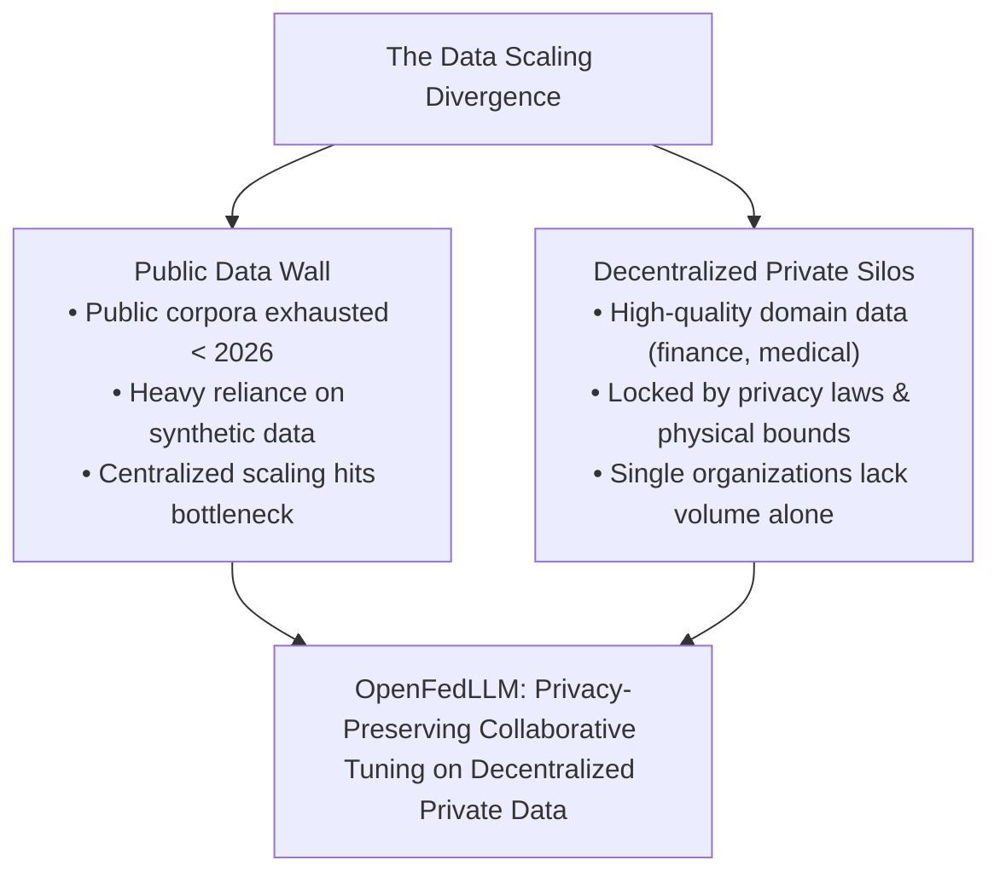
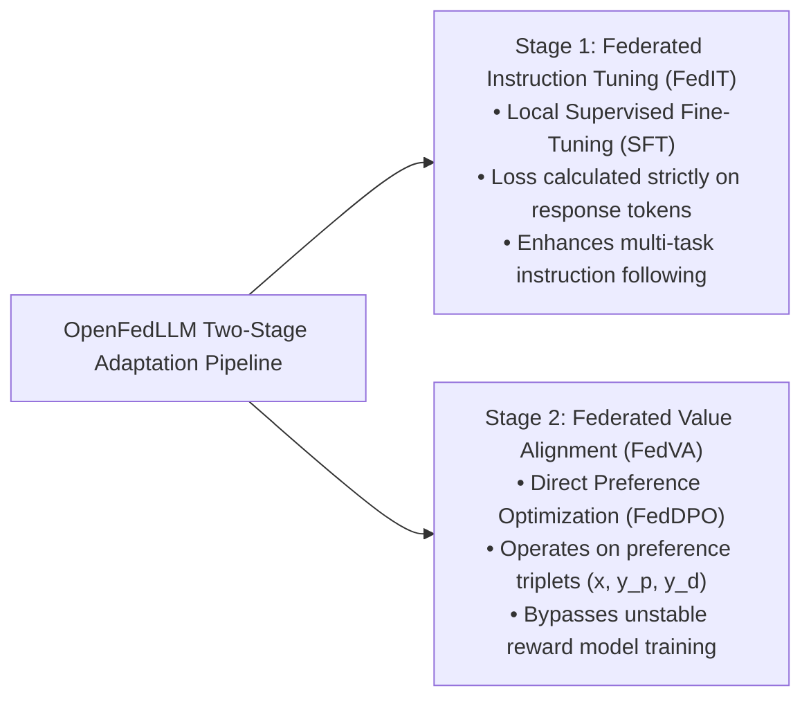
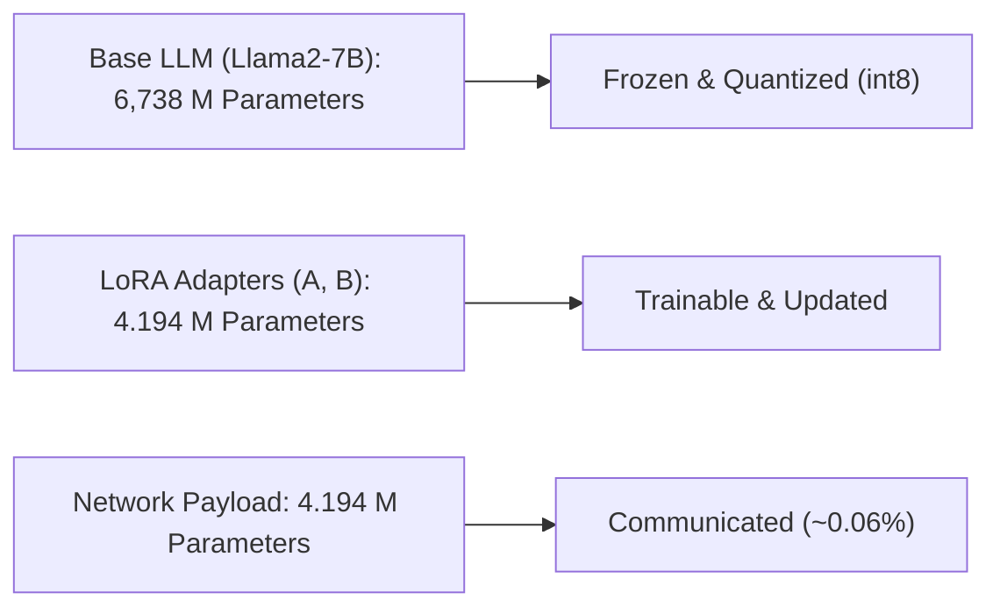
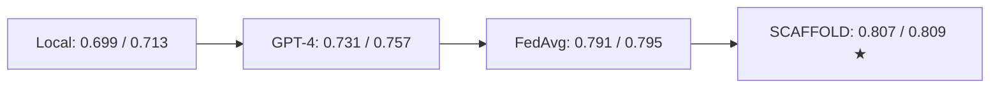
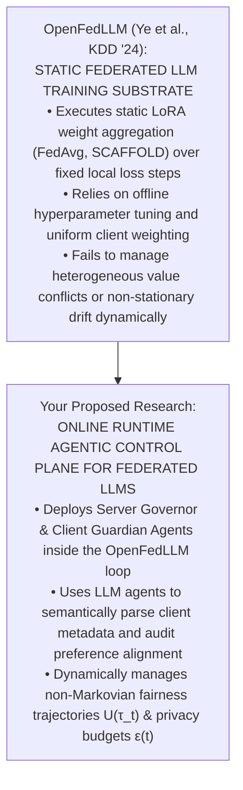

# OpenFedLLM: Training Large Language Models on Decentralized Private Data via Federated Learning

Here is a comprehensive, module-by-module walk-through of **"OpenFedLLM: Training Large Language Models on Decentralized Private Data via Federated Learning"** (Ye et al., _ACM SIGKDD_, 2024).

This 5-module analysis tracks the paper from its foundational motivation to its algorithmic formulations, Parameter-Efficient Fine-Tuning (PEFT) mechanics, empirical benchmarks against commercial closed-source models, and open research frontiers.

---

## **Module 1: Motivation, Systemic Context, & The Public Data Exhaustion Crisis**

### 1. The Impending Public Data Wall

Contemporary Large Language Models (LLMs) rely on multi-stage training pipelines where pre-training scales auto-regressively over massive web-scraped public corpora. However, recent data scaling analyses project that **high-quality, publicly available text corpora will be fully exhausted before 2026**. As a result, standard centralized pre-training is approaching a fundamental data scaling bottleneck.

### 2. The Private Data Abundance & The FL Opportunity

In contrast to depleting public datasets, vast amounts of high-quality, domain-specific text reside within private organizational silos—such as electronic health records (EHRs) in hospitals, transaction logs in financial institutions, and proprietary enterprise software codebases. Domain-specific models like _BloombergGPT_ demonstrate the immense value of training on private domain data.

However, individual organizations face two major roadblocks:

1. **Regulatory & Privacy Barriers**: Data privacy legislation (e.g., HIPAA, GDPR) and proprietary trade secrets strictly prohibit centralizing raw private text onto external servers.
2. **Data Scarcity per Entity**: A single regional bank or medical clinic rarely possesses sufficient data volume to fine-tune a high-capacity LLM independently.

### 3. Federated Learning for Post-Pretraining

To bridge this gap, Ye et al. propose leveraging **Federated Learning (FL)**—not for expensive pre-training from scratch, but for the post-pretraining adaptation phase. Starting from an off-the-shelf pre-trained base model (e.g., Llama2-7B), multiple data owners collaboratively fine-tune a shared LLM under server coordination without exchanging raw text.

---

## **Module 2: The Two-Stage Training Pipeline — FedIT & FedVA (FedDPO)**

Contemporary LLM adaptation consists of two sequential post-pretraining stages: **Instruction Tuning** (following prompt directives) and **Value Alignment** (conforming to human safety and helpfulness norms). OpenFedLLM formalizes both stages in a distributed, privacy-preserving setting.

### 1. Stage 1: Federated Instruction Tuning (FedIT)

FedIT enhances an LLM's capability to execute diverse user prompts by training on local instruction-response pairs $D*k = \{(x_i, y_i)\}*{i=1}^{N_k}$ held by client $k$.

- **Local Objective**: During local round iterations, client $k$ computes a Supervised Fine-Tuning (SFT) auto-regressive cross-entropy loss applied **strictly to the response tokens $y_i$** given prompt template $x*i$:
  $$\mathcal{L}\_i = -\sum*{j=1}^{n*i} \log p\left(y*{i,j} \mid x*i \oplus y*{i,<j} \,;\, \boldsymbol{\theta}_k^{(t,r)}\right) \quad$$
  where $x_i \oplus y_{i,<j}$ represents the prompt concatenated with preceding response tokens, and $n_i$ is response length.

### 2. Stage 2: Federated Value Alignment (FedVA via FedDPO)

While FedIT teaches an LLM _how_ to follow instructions, it does not guarantee that responses are helpful, properly formatted, or safe from toxic or harmful requests.

- **The Failure of Federated RLHF**: Standard Reinforcement Learning from Human Feedback (RLHF) requires training a separate reward model alongside the policy network, creating high communication overhead and training instability that degrades under distributed network latency.
- **Federated Direct Preference Optimization (FedDPO)**: OpenFedLLM adapts **Direct Preference Optimization (DPO)** into a single-step federated loss. Each client holds preference triplets $D*k = \{(x_i, y*{i,p}, y*{i,d})\}*{i=1}^{N*k}$, where $y*{i,p}$ is the preferred response and $y*{i,d}$ is the dispreferred response:
  $$\mathcal{L}*{\text{DPO}} = -\mathbb{E}\left[ \log \sigma \left( \beta \log \frac{\pi_{\boldsymbol{\theta}}(y_{i,p} \mid x_i)}{\pi_{\boldsymbol{\theta}^*}(y_{i,p} \mid x_i)} - \beta \log \frac{\pi_{\boldsymbol{\theta}}(y_{i,d} \mid x_i)}{\pi_{\boldsymbol{\theta}^*}(y_{i,d} \mid x_i)} \right) \right] \quad$$
  where $\pi\_{\boldsymbol{\theta}^\*}$ is a frozen reference model initialized from the SFT phase. This simultaneously increases the probability of preferred outputs while penalizing dispreferred/harmful outputs without training a separate reward model.

---

## **Module 3: Framework Architecture, PEFT (LoRA), & Supported FL Baselines**

### 1. Software Architecture & Decoupling

OpenFedLLM decouples the FL communication protocol from local LLM loss computation. The global training process executes over $T$ rounds:

1. **Server Broadcast**: Server transmits global parameters $\boldsymbol{\theta}^t$ to active clients $S_t$.
2. **Local Optimization**: Client $k$ executes $\tau$ local SGD steps on local private dataset $D_k$.
3. **Model Upload**: Clients transmit updated parameters $\boldsymbol{\theta}\_k^{(t,\tau)}$ back to the server.
4. **Aggregation**: Server aggregates local updates weighted by relative dataset size $p*k = \frac{|D_k|}{\sum |D_i|}$:
   $$\boldsymbol{\theta}^{t+1} := \sum*{k \in S_t} p_k \boldsymbol{\theta}\_k^{(t,\tau)} \quad$$

### 2. Parameter-Efficient Fine-Tuning (PEFT / LoRA) Mechanics

Transmitting full 7B parameter LLMs over edge networks is communicationally and memory intractable. OpenFedLLM integrates **Low-Rank Adaptation (LoRA)** alongside `int8` weight quantization:

- For a frozen base weight matrix $W_0 \in \mathbb{R}^{d \times m}$, local updates are parameterized via low-rank decomposition matrices $A \in \mathbb{R}^{d \times r}$ and $B \in \mathbb{R}^{r \times m}$ (where rank $r \ll \min(d,m)$):
  $$W = W_0 + \Delta W = W_0 + A \cdot B \quad$$
- **System Efficiency**: The base model parameters (6,738M) remain frozen on local GPUs. Participating clients train and transmit **only the LoRA adapter matrices (4.194M parameters)**, reducing total communication payloads to just **~0.06% of the full LLM size**. This enables full federated LLM fine-tuning on a single consumer GPU (e.g., NVIDIA RTX 3090) taking 1–2 hours per client over 100 rounds.

### 3. Supported Federated Optimization Baselines

OpenFedLLM implements 7 representative FL algorithms to test optimization behavior on LLMs:

- **Client-Side Regularizers**: _FedAvg_, _FedProx_ (adding an $\ell*2$ distance penalty between local and global LoRA weights), and \_SCAFFOLD* (using control variates to correct local gradient drift).
- **Server-Side Momentum Optimizers**: _FedAvgM_, _FedAdagrad_, _FedYogi_, and _FedAdam_ (applying server-side adaptive momentum to global LoRA weight updates).

---

## **Module 4: Empirical Benchmarks & Cross-Domain Analysis**

Ye et al. conduct extensive empirical evaluations across 8 datasets and over 30 evaluation metrics.

### 1. Benchmark 1: FedIT on General Data (Alpaca-GPT4)

Evaluated across close-ended benchmarks (MMLU, BBH, DROP, HumanEval, CRASS) and open-ended conversation benchmarks (Vicuna-Bench, MT-Bench):

- **FL vs. Local Training**: All 7 FL algorithms consistently outperform individual client local training (e.g., FedYogi achieves **45.79** on MMLU vs. Local's **38.70**; SCAFFOLD achieves **3.488** on MT-Bench vs. Local's **2.844**).
- **Knowledge Retention**: FL collaboration prevents local overfitting, preserving general world knowledge stored in the base LLM during instruction tuning.

### 2. Benchmark 2: Financial Sentiment Analysis (Outperforming GPT-4)

Evaluated across four financial sentiment datasets (FPB, FiQA-SA, TFNS, NWGI) against proprietary baselines (GPT-3.5 and GPT-4):

- **Key Finding**: Llama2-7B fine-tuned via FL (specifically **SCAFFOLD**) achieves an average accuracy/F1 score of **0.807 / 0.809**, **outperforming GPT-4 (0.731 / 0.757) and GPT-3.5 (0.725 / 0.749) by a clear margin**.
- **Incentive for Participation**: Individual local training on a single client's financial data yields an average score of **0.699 / 0.713**, failing to beat GPT-4. Collaborative FL provides a strong economic and technical incentive for institutions to join federations.

### 3. Benchmark 3: Multi-Domain Collaboration Trade-Offs

To evaluate cross-domain collaboration, 4 clients representing distinct domain expertises (General, Math, Code, Finance) were federated:

| Model / Client         | General (MT-Bench) | Math (GSM8K) | Code (HumanEval) | Finance (FPB) | Average Rank |
| :--------------------- | :----------------- | :----------- | :--------------- | :------------ | :----------- |
| **Client 1 (General)** | 4.288              | 0.061        | 0.134            | 0.220         | 2.4          |
| **Client 2 (Math)**    | 4.213              | 0.153        | 0.134            | 0.420         | 2.0          |
| **Client 3 (Code)**    | 4.100              | 0.052        | 0.165            | 0.511         | 2.6          |
| **Client 4 (Finance)** | 2.213              | 0.055        | 0.122            | **0.834**     | 3.0          |
| **FedAvg (Global)**    | **4.600**          | 0.111        | 0.134            | 0.805         | **1.4 ★**    |

- **The Generalization vs. Specialization Gap**: _FedAvg_ achieves the best overall average rank (**1.4**), demonstrating superior well-rounded capabilities across tasks. However, on specific specialized sub-tasks (e.g., Finance FPB), the domain-dedicated local client (**Client 4: 0.834**) slightly outperforms the aggregated global model (**FedAvg: 0.805**).

### 4. Benchmark 4: FedVA Alignment Performance

Evaluated on UltraFeedback (helpfulness) and HH-RLHF (harmlessness and helpfulness):

- On UltraFeedback, _FedAvg_ achieves the highest open-ended helpfulness score (MT-Bench **4.516** vs. Base **4.050**).
- On HH-RLHF, _FedAvgM_ achieves the optimal balance, raising the AdvBench harmless rejection rate (**42.88%** vs. Base **15.58%**) while preserving top-line helpfulness.

---

## **Module 5: Systemic Limitations, Open Frontiers, & Strategic Dissertation Bridge**

### 1. Open Research Frontiers Identified in OpenFedLLM

Ye et al. identify four key open challenges in federated LLM training:

1. **Decentralized Data Management**: Filtering toxic, biased, or low-quality private data without central server visibility into client datasets.
2. **Heterogeneous Value Alignment**: Resolving conflicting cultural, institutional, or ethical preferences during FedVA.
3. **Personalized FedLLM**: Developing personalization architectures that allow clients to maintain local domain expertise while gaining global multi-task capabilities.
4. **Security & Adversarial Poisoning**: Guarding against logically correct yet malicious backdoor attackers during instruction tuning.

---

## **Strategic Bridge to Your Dissertation (Agent-Based Dynamic Enforcement)**

OpenFedLLM supplies the essential **substrate and empirical proof-of-concept** for your dissertation research:

- **Connecting the Substrate to Agentic Control**: While OpenFedLLM proves that distributed LLMs can be fine-tuned via static FL algorithms, it suffers from the exact limitation your dissertation targets: **static enforcement brittleness**.
- **Resolving Preference & Domain Conflicts**: When clients exhibit heterogeneous preferences in FedVA or domain specialization gaps in FedIT, static algorithms like _FedAvg_ average out non-conforming updates. You can position your **distributed agentic control plane** as an intelligent layer built on top of OpenFedLLM. **Client Guardian Agents** can evaluate local preference alignments and epistemic data uncertainty (_CA-ICRL_), while the **Server Governor Agent** dynamically steers personalized aggregation weights ($\beta(t)$) at runtime—achieving calibrated group fairness and domain specialization without requiring static retraining.
