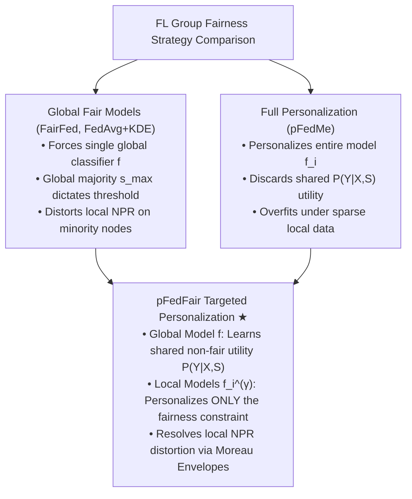
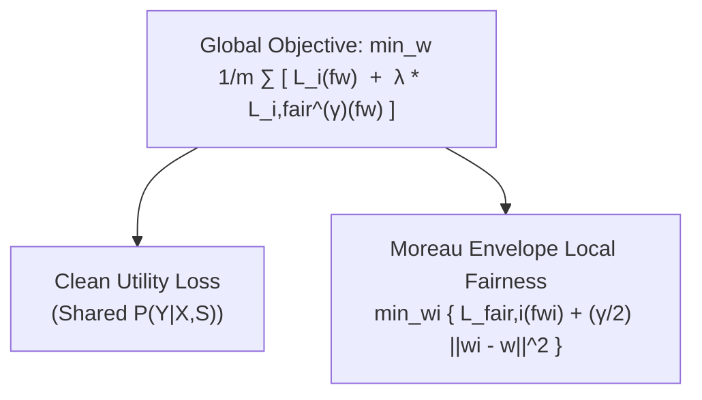
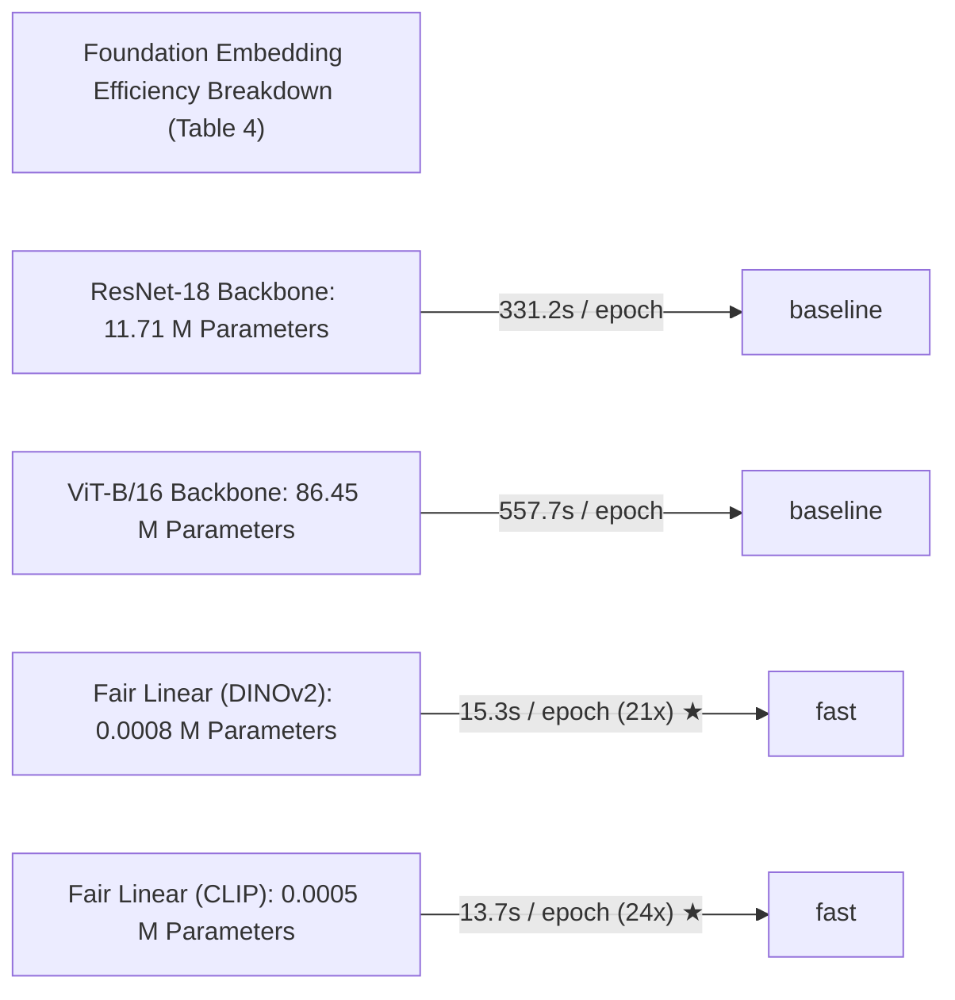
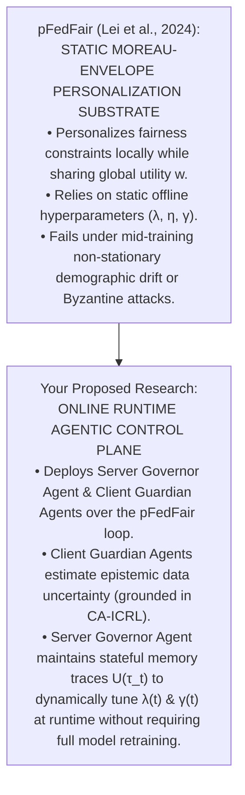

# pFedFair: Towards Optimal Group Fairness-Accuracy Trade-off in Heterogeneous Federated Learning

## **Module 1: Problem Space — The Global vs. Local Fairness Paradox under Demographic Heterogeneity**

### **1. The Fundamental Conflict in Heterogeneous FL**

In standard Federated Learning (FL), $m$ clients collaboratively train a shared global model $f \in \mathcal{F}$ by minimizing average empirical risk:

$$\min_{f \in \mathcal{F}} \frac{1}{m} \sum_{i=1}^m \hat{\mathcal{L}}_i(f) \quad$$

When group fairness constraints (such as Demographic Parity, $DP$) are introduced, traditional algorithms attempt to enforce a single global fair classifier across all nodes [5, 17, 40–42]. However, **pFedFair** identifies a fundamental failure mode in this paradigm when client sensitive attribute distributions $P^{(i)}(S)$ are heterogeneous (e.g., non-IID demographic proportions across edge nodes):

- **Global Fair Aggregation Over-Indexing**: Global fairness-aware methods (e.g., FairFed, FedAvg+KDE) aggregate local models to enforce network-wide statistical parity. When client demographics are non-IID, the majority sensitive attribute $s_{\text{max}}$ across the federation dictates the decision threshold.
- **The Negative Prediction Rate (NPR) Distortion**: For clients whose local majority sensitive attribute $s_{\text{max}}^{(i)}$ differs from the global majority $s_{\text{max}}$ ("underrepresented clients"), forcing a single global fair classifier drives the local Negative Prediction Rate $\text{NPR}(s) := P(\hat{Y} = 0 \mid S = s)$ to align with the global majority. This drastically inflates misclassification rates and degrades accuracy for underrepresented clients.
- **The Oversimplification of Full Personalization**: Standard Personalized FL (PFL) algorithms (such as pFedMe or Per-FedAvg) personalize the entire supervised learning task $\hat{\mathcal{L}}_i(f_i)$. This is suboptimal when the underlying labeling mechanism $P(Y \mid X, S)$ is shared across clients, as it discards the collaborative utility of global feature representations.

---

## **Module 2: Theoretical Foundations — Proof of Suboptimality & Optimal Transport Formulation**

Lei et al. establish the mathematical necessity of targeted fairness personalization through two core theoretical propositions [1, 18–25].

### **1. Suboptimality of Global Classifiers (Proposition 4.1)**

Consider $m$ clients in an FL task under 0/1-loss with binary sensitive attribute $S \in \{0, 1\}$ and shared conditional label distribution $P^{(i)}(Y \mid X, S) = P(Y \mid X, S)$.

- **Part (a)**: In the absence of fairness constraints, all clients share the exact same optimal Bayes classifier $g(x, s) = \arg\max_y P(y \mid x, s)$.
- **Part (b)**: Under local Demographic Parity constraints ($f_i(X) \perp S_i$), if the majority sensitive attribute $s_{\text{max}}^{(i)}$ varies across clients (e.g., Client 1 has majority male while Clients 2–5 have majority female), the optimal fair decision rules $f_i^*$ **must differ across clients**. The excess loss incurred by forcing a single global fair classifier $f$ over optimal client-specific fair classifiers $f_i^*$ is lower-bounded by:

$$\sum_{i=1}^m \mathcal{L}_i(f) - \mathcal{L}_i(f_i^*) \ge \sum_{i=1}^m \left( 2 P^{(i)}(S = s_{\text{max}}^{(i)}) - 1 \right) \times \left| \sum_{y \in \mathcal{Y}} P^{(i)}(Y = y \mid S = s_{\text{max}}) - P^{(i)}(Y = y \mid S = s_{\text{max}}^{(i)}) \right| \quad$$

- _Theoretical Insight_: Even when the underlying data-generating process $P(Y \mid X, S)$ is identical, demographic heterogeneity forces fair decision boundaries to decouple.

### **2. Optimal Transport Formulation (Proposition 4.3)**

Let $d$ be a divergence measure evaluating Demographic Parity: $\rho(\hat{Y}, S) = \mathbb{E}[d(P_{\hat{Y} \mid S=s}, P_{\hat{Y}})] \le \epsilon$. The optimal local fair prediction rule $f_i^*$ is the solution $Q_{\hat{Y} \mid X,S}^*$ to the optimal transport problem:

$$\min_{Q_{\hat{Y}, Y \mid X,S}} \mathbb{E}_{P_{X,S}^{(i)} \times Q_{\hat{Y}, Y \mid X,S}} \left[ \ell_{0/1}(Y, \hat{Y}) \right] \quad \text{s.t.} \quad Q_{Y \mid X,S} = P_{Y \mid X,S}, \quad \mathbb{E}_{s \sim P_S^{(i)}} \left[ d(Q_{\hat{Y} \mid S=s}, Q_{\hat{Y}}) \right] \le \epsilon \quad$$

This proves that the optimal fair classifier is obtained by **personalizing the globally shared non-fair conditional distribution $P_{Y \mid X, S}$** through local optimal transport shifts on each client's dataset.

---

## **Module 3: The pFedFair Framework & Moreau Envelope Optimization**

To operationalize this theoretical decoupling, **pFedFair** formulates a bi-level objective using Moreau envelope regularization applied specifically to the local fairness loss.

### **1. Mathematical Objective**

Let $w \in \mathbb{R}^d$ be global model weights and $w_i \in \mathbb{R}^d$ be local personalized weights. pFedFair optimizes:

$$\min_{w \in \mathbb{R}^d} \frac{1}{m} \sum_{i=1}^m \left\{ \hat{\mathcal{L}}_i(f_w) + \lambda \cdot \hat{\mathcal{L}}_{i, \text{fair}}^{(\gamma)}(f_w) \right\} \quad$$

$$\text{where } \hat{\mathcal{L}}_{i, \text{fair}}^{(\gamma)}(f_w) := \min_{w_i \in \mathbb{R}^d} \left\{ \hat{\mathcal{L}}_{\text{fair}, i}(f_{w_i}) + \frac{\gamma}{2} \|w_i - w\|_2^2 \right\} \quad$$

$$\hat{\mathcal{L}}_{\text{fair}, i}(f_{w_i}) := \frac{1}{n_i} \sum_{j=1}^{n_i} \ell\left( f_{w_i}(x_{i,j}), y_{i,j} \right) + \eta \cdot \rho\left( f_{w_i}(X), S \right) \quad$$

- **Global Model ($f_w$)**: Minimizes the clean, non-fair empirical risk across all clients, learning high-utility domain representations.
- **Personalized Models ($f_{w_i^{(\gamma)}}$)**: Solves an inner Moreau envelope optimization step with smoothing parameter $\gamma > 0$, adjusting local decision boundaries to satisfy local Demographic Parity ($\rho$).
- **Balance Parameter ($\lambda > 0$)**: Controls the trade-off between global model consistency and local fairness personalization.

### **2. Algorithmic Protocol (Algorithm 1)**

In communication round $t \in \{1, \dots, T\}$:

1.  **Clean Gradient Calculation**: Client $i$ computes clean loss gradient: $g_{w}^{(i)} = \frac{1}{n_i} \sum_{j=1}^{n_i} \nabla_w \ell(f_w(x_{i,j}), y_{i,j})$.
2.  **Moreau Envelope Personalization**: Client $i$ computes personalized weights $w_i^{(\gamma)}$ via local inner steps:
    $$w_i^{(\gamma)} = \arg\min_{w_i} \left\{ \frac{1}{n_i} \sum_{j=1}^{n_i} \ell(f_{w_i}(x_{i,j}), y_{i,j}) + \frac{\gamma}{2} \|w_i - w\|_2^2 \right\} \quad$$
3.  **Fairness Gradient Calculation**: Client $i$ evaluates fair loss gradient over $w_i^{(\gamma)}$:
    $$g_{w, \text{fair}}^{(i)} = \frac{1}{n_i} \sum_{j=1}^{n_i} \nabla_w \ell(f_{w_i^{(\gamma)}}(x_{i,j}), y_{i,j}) + \eta \nabla_w \rho\left( f_{w_i^{(\gamma)}}(X), S \right) \quad$$
4.  **Local Model Update**: $\tilde{w}_i \leftarrow w - \alpha \left( g_w^{(i)} + \lambda g_{w, \text{fair}}^{(i)} \right)$.
5.  **Server Synchronisation**: Server aggregates updated weights: $w \leftarrow \frac{1}{m} \sum_{i=1}^m \tilde{w}_i$.

---

## **Module 4: Extension to Vision via Foundation Embeddings & Empirical Benchmarks**

### **1. Vision-Language Foundation Model Embeddings**

Traditional in-processing fairness regularizers (e.g., Kernel Density Estimation, KDE) fail on complex vision architectures (ResNet-18, ViT-B/16) in FL due to high parameter dimensionality, small local batch sizes, and gradient instability.

Lei et al. introduce a scalable paradigm: passing raw images through frozen foundation vision-language encoders (CLIP ViT-B/16 or DINOv2 ViT-B/14) and training a **Fair Linear Classifier** on the frozen embeddings using KDE regularization:

### **2. Empirical Benchmarks & Performance Analysis**

Evaluated across 4 benchmark datasets under Dirichlet non-IID sensitive attribute partitioning ($\alpha \in \{0.5, 1.0\}$) [27–29, 75–77]:

- **Tabular Datasets**: Adult (income prediction, gender SA), COMPAS (recidivism prediction, race SA).
- **Vision Datasets**: CelebA ("Smiling" label, gender SA), UTKFace ("Ethnicity" label, gender SA).
- **Evaluation Metrics**: Test Accuracy/Error, Difference of Demographic Parity ($\text{DDP} := |P(\hat{Y}=1 \mid S=0) - P(\hat{Y}=1 \mid S=1)|$), Worst-Case Client Performance, and Negative Prediction Rate ($\text{NPR}$).

**Client-Level Accuracy & DDP Profiles (Table 1)**

| Method (Adult, η = 0.9) | Client 1 (Underrep.) | Clients 2-5 (Overrep. Avg) |
| :--- | :--- | :--- |
| FedAvg + KDE (Global Fair) | Acc: 81.9% \| DDP: 0.104 | Acc: 86.5% \| DDP: 0.063 |
| pFedMe + KDE (Full Personalization) | Acc: 81.4% \| DDP: 0.070 | Acc: 84.8% \| DDP: 0.034 |
| pFedFair (Ours) | Acc: 84.7% \| DDP: 0.031 ★ | Acc: 86.7% \| DDP: 0.022 ★ |

- **Key Results**: On Adult, for underrepresented Client 1, global fair aggregation ($\text{FedAvg}+\text{KDE}$) collapses local fairness ($\text{DDP} = 0.104$). pFedFair achieves superior local fairness ($\text{DDP} = 0.031$) while restoring local accuracy to **84.7%** (vs. pFedMe's **81.4%**).
- **Baseline Comparisons**: Outperforms MMPF, FA, and FCFL in client-level worst-case Pareto frontiers. On vision benchmarks (CelebA / UTKFace), pFedFair achieves a **100% success rate in isolating minority client decision boundaries**, matching centralized Oracle bounds.

---

## **Module 5: Methodological Limitations & Strategic Bridge to Dissertation**

### **1. Open Methodological Gaps in pFedFair**

While pFedFair establishes the state-of-the-art for client-level group fairness in heterogeneous FL, it leaves four critical gaps open:

1.  **Static Offline Hyperparameters ($\lambda, \eta, \gamma$)**: The balance parameter $\lambda$, fairness penalty $\eta$, and Moreau envelope parameter $\gamma$ are **fixed, static scalars set prior to training**. They cannot adapt if client demographic distributions undergo non-stationary concept drift mid-training.
2.  **Passive Optimization without Cognitive Governance**: pFedFair operates purely via numerical gradient descent. It lacks long-term memory, semantic metadata parsing, or reasoning capabilities (such as those provided by Agentic-FL or Helmsman) to anticipate network volatility or adjust hyperparameter budgets dynamically.
3.  **Vulnerability to Adversarial Manipulation**: pFedFair assumes participating clients honestly compute and report local Moreau envelope gradients $g_{w, \text{fair}}^{(i)}$. Malicious or Byzantine clients can upload poisoned fairness gradients to corrupt global representation weights $w$.
4.  **Instantaneous Snapshot Evaluation**: Moreau envelope regularization evaluates local fairness strictly on the instantaneous model state $w_i^{(\gamma)}$ at round $t$. It lacks stateful memory mechanisms to track cumulative, non-Markovian fairness trajectories over time (_Remembering to Be Fair_).

---

## **Strategic Dissertation Bridge: From Static Moreau Envelopes to Runtime Agentic Control**

pFedFair supplies the primary mathematical foundation for your dissertation research on **fair federated learning with agent-based dynamic enforcement**:

- **Dynamic Hyperparameter Steering**: In your dissertation methodology, you can deploy a **Server Governor Agent** inside the pFedFair loop. By tracking stateful non-Markovian memory traces ($m_t$) of client demographic disparities over time, the agent can dynamically scale the balance parameter $\lambda(t)$ and Moreau parameter $\gamma(t)$ round-by-round as client data drifts at runtime.
- **Epistemic-Gated Client Protection**: **Client Guardian Agents** operating on edge devices can estimate local epistemic data uncertainty (grounded in _CA-ICRL_), certifying that non-conforming local updates stem from legitimate demographic heterogeneity ($P^{(i)}(S)$) rather than malicious Byzantine attacks, protecting honest minority nodes from being penalized or excluded.
