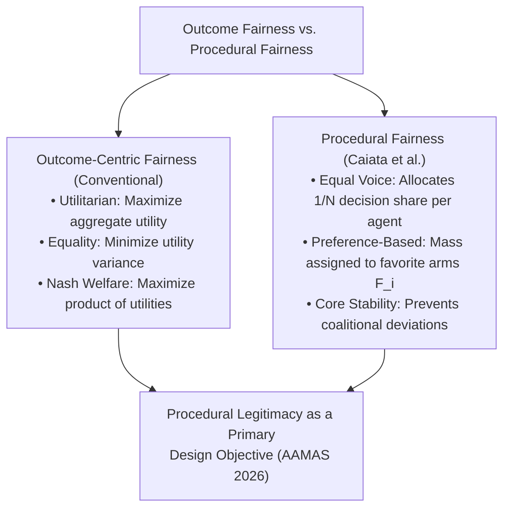
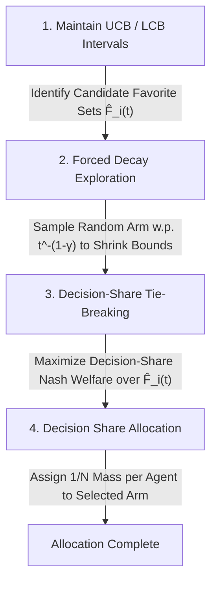
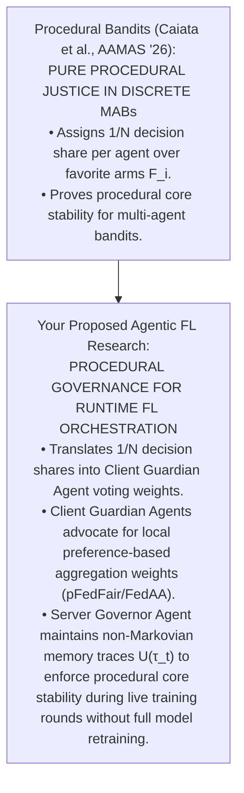

---
title: "Procedural Fairness in Multi-Agent Bandits"
type: conference
venue: aamas
year: 2026
ranking: a
quartile:
impact_factor:
prof: larson
uni: waterloo
canada: true
below_threshold: false
source_pdf: papers/Procedural Fairness in Multi-Agent Bandits.pdf
tags: [fairness-fl, professor-specific, literature-review, larson, waterloo]
---

# Procedural Fairness in Multi-Agent Bandits

Here is an end-to-end, structured walk-through of **"Procedural Fairness in Multi-Agent Bandits"** (Caiata, Blair, & Larson, _AAMAS 2026_).

This 6-module analysis tracks the paper from its philosophical shift to its mathematical definitions, regret bounds, cooperative game-theoretic stability proofs, empirical findings, and open research gaps—contextualized to connect with your dissertation on fair federated learning and agentic enforcement.

---

## **Module 1: The Conceptual Shift — Outcome Fairness vs. Pure Procedural Justice**

### **1. Problem Solved: The Outcome-Centric Blindspot**

In multi-agent learning systems, fairness is almost universally reduced to **optimizing outcomes**: maximizing aggregate social welfare (utilitarianism), minimizing utility variance (equality), or balancing proportional payoffs (Nash social welfare).

Caiata et al. argue that this creates a fundamental design flaw. Drawing on evidence from social psychology, economics, and John Rawls' theory of _pure procedural justice_, they highlight that human stakeholders consistently value a **fair decision-making process**—ensuring equal representation and voice—even if it yields a slightly lower individual outcome.

### **2. Conceptual Link to the Fair FL Landscape**

This conceptual distinction directly mirrors the trade-offs in Federated Learning:

- **Outcome-Centric FL** (e.g., $q$-FFL, Agnostic FL, FairFed, pFedFair) focuses on forcing global model accuracy or loss variance to be equal across client nodes.
- **Procedural FL** (e.g., Agentic-FL, Helmsman, or Caiata et al.'s framework) focuses on **governance**: giving each participating agent or edge node an equal share of influence over how global aggregation or selection decisions are made.

---

## **Module 2: The Multi-Agent Multi-Armed Bandit (MA-MAB) Setup & Three Paradigms**

### **1. Environment Formalization**

Consider a system with $N$ agents and $K$ discrete arms. Let $\mu^*$ denote the $N \times K$ matrix of true expected rewards, where $\mu^*_{i,k}$ is the true expected reward for agent $i$ when arm $k$ is pulled. An action allocation policy is represented by $P = (p_1, p_2, \dots, p_K)$, where $p_k$ is the probability of pulling arm $k$.

### **2. Mathematical Definitions of the Three Fairness Paradigms**

The authors mathematically contrast three distinct fairness formulations:

1. **Procedural Fairness (PF) (Definition 1)**:
   - **Equal Decision-Making Power**: Every agent $i \in \{1, \dots, N\}$ is allocated an equal share of the total decision probability mass:
     $$\sum_{k=1}^K p_{i,k} = \frac{1}{N}, \quad \forall i \in \{1, \dots, N\}$$
     where $p_{i,k}$ is the probability mass contributed by agent $i$ toward arm $k$.
   - **Preference-Based Allocation**: Agent $i$ concentrates their decision share strictly on their set of favorite arms $F_i$, defined as those achieving maximum expected reward for that agent:
     $$F_i = \{ j \in \mathcal{K} \mid \mu^*_{i,j} = \max_{k \in \mathcal{K}} \mu^*_{i,k} \}$$
2. **Equality Fairness (EF) (Definition 2)**: Minimizes the sum of squared differences in expected rewards between all pairs of agents:
   $$P_{\text{EF}} = \arg\min_{P'} \frac{2}{N(N-1)} \sum_{i > j} \left( \sum_{k=1}^K p'_k \mu^*_{i,k} - \sum_{k=1}^K p'_k \mu^*_{j,k} \right)^2$$
3. **Utilitarian Fairness (UF) (Definition 3)**: Maximizes aggregate expected utility across all agents:
   $$P_{\text{UF}} = \arg\max_{P'} \sum_{i=1}^N \sum_{k=1}^K p'_k \mu^*_{i,k}$$

### **3. Impossibility Result**

The authors prove an impossibility result: these fairness objectives are **fundamentally incompatible**. Optimizing strictly for equality or utilitarianism forces a policy to deprive certain agents of decision-making power, establishing that selecting a fairness objective is ultimately a **normative design choice**.

---

## **Module 3: Learning Algorithm, Forced Exploration, & Sublinear Regret**

To learn a procedurally fair policy without knowing the true reward matrix $\mu^*$ upfront, the authors design an online learning algorithm.

### **1. Estimating Favorite-Arm Sets ($F_i$)**

Each agent maintains Upper Confidence Bounds (UCB) and Lower Confidence Bounds (LCB) for all arms. An arm $k$ remains in agent $i$'s candidate favorite set $\hat{F}_i(t)$ if its UCB overlaps with the LCB of the empirically best arm for that agent.

### **2. Forced Exploration Mechanism**

To guarantee that confidence intervals shrink to zero (preventing bad arms from permanently remaining in $\hat{F}_i$), the algorithm executes forced random exploration: at round $t$, a random arm is pulled with probability $t^{-(1-\gamma)}$, where $\gamma \in (0, 1)$ is a decay hyperparameter.

### **3. Decision-Share Nash Welfare Tie-Breaking**

When an agent has multiple candidate favorite arms, allocating decision shares becomes ambiguous. The algorithm resolves ties by **maximizing decision-share-based Nash Welfare**—selecting the distribution over favorite arms that maximizes the product of the probability mass allocated to each agent's favorite arms.

### **4. Regret Definition & Bound (Theorem 1)**

In this setting, **procedural regret** $R_{\text{PF}}(T)$ is defined as the cumulative count of rounds where an arm outside an agent's true favorite set $F_i$ is misassigned a decision share.

- **Theorem 1**: With high probability, the procedural regret satisfies:
  $$R_{\text{PF}}(T) = O \left( T^\gamma + \left[ \frac{(1+\alpha)^2 2 \gamma K \ln(NKT)}{\Delta_{\min}^2} \right]^{1/\gamma} \right)$$
  where $\Delta_{\min} := \min_{i \in [N]} \min_{j \in F_i} \min_{k \notin F_i} (\mu^*_{i,j} - \mu^*_{i,k}) > 0$ represents the reward gap between an agent's favorite and non-favorite arms.

---

## **Module 4: Game-Theoretic Stability — The Procedural Core**

A critical contribution of the paper is establishing that procedurally fair policies satisfy **coalitional stability** through cooperative game theory.

### **1. The Procedural Core (Definition 4)**

Let $\beta_i(P)$ represent the **decision share** received by agent $i$ under policy $P$, defined as the total probability mass allocated to arms in $i$'s true favorite set $F_i$:
$$\beta_i(P) = \sum_{k \in F_i} p_k$$

A policy $P$ lies in the **Procedural Core** if no coalition of agents $A \subseteq \{1, \dots, N\}$ can deviate to an alternative arm distribution $P'$ such that every agent in $A$ improves their decision share proportional to their coalition size:
$$\frac{|A|}{N} \beta_i(P') \ge \beta_i(P), \quad \forall i \in A \quad \text{(with at least one strict inequality)}$$

### **2. Theoretical Guarantees (Theorems 2–4)**

- **Theorem 2**: A classical, _utility-based_ Nash Welfare-maximizing policy does **not** necessarily lie in the procedural core.
- **Theorem 3**: A procedural fairness policy using _decision-share-based_ Nash Welfare tie-breaking is **guaranteed to lie in the procedural core**.
- **Theorem 4**: Lying in the procedural core **implies** procedural fairness.

---

## **Module 5: Empirical Benchmarks & The "Win-Win" Result**

The authors conducted an extensive benchmark across **7,776 experimental settings**, testing procedural fairness (PF), equality fairness (EF), utilitarian fairness (UF), NashUCB (NSW), and Generalized Gini Index (GGI) policies.

**Empirical Score Matrix (Table 1 Summary)**

| Policy Evaluated | PF Score (Voice) | EF Score (Equality) | UF Score (Utility) |
| :--- | :--- | :--- | :--- |
| PF Policy (Ours) | 1.00 ± 0.00 ★ | 0.98 ± 0.02 | 0.97 ± 0.05 |
| EF Policy (Equality) | 0.66 ± 0.31 | 1.00 ± 0.00 | 0.84 ± 0.13 |
| UF Policy (Utilitarian) | 0.78 ± 0.27 | 0.96 ± 0.05 | 1.00 ± 0.00 |
| NSW Policy (Nash) | 0.82 ± 0.23 | 0.97 ± 0.03 | 1.00 ± 0.01 |
| GGI Policy (Gini) | 0.70 ± 0.28 | 1.00 ± 0.00 | 0.87 ± 0.11 |

### **Key Empirical Findings:**

1. **Minimal Outcome Sacrifice**: The PF policy achieves a perfect **1.00 PF Score** while sacrificing almost nothing in outcome metrics—retaining a **0.98 EF Score** and a **0.97 UF Score**.
2. **Severe Voice Degradation in Outcome Policies**: Conversely, policies that optimize purely for outcome equality (EF) or welfare (GGI) severely penalize agent voice, dropping the PF score to **0.66** and **0.70**, respectively.
3. **Takeaway**: Procedural fairness provides a **principled baseline** for multi-agent systems where procedural legitimacy and representation matter, delivering near-optimal outcomes while guaranteeing equal decision-making voice.

---

## **Module 6: Open Gaps & Strategic Bridge to Your Dissertation**

### **1. Gaps Left Open in Caiata et al.**

While this paper introduces a compelling framework, it leaves three major research gaps open for distributed machine learning systems:

1. **Simplified Bandit Decision Space**: The model assumes discrete arm selection where arm $k$ is pulled directly. It does not address high-dimensional parameter aggregation (e.g., neural network weights in FL).
2. **Static Environment Assumption**: The theoretical regret bounds rely on fixed reward means $\mu^*$. They do not accommodate non-stationary data drift or volatile edge hardware availability.
3. **Lack of Adversarial / Byzantine Defenses**: The procedural core model assumes honest agent preference reporting. It lacks mechanisms to detect malicious or colluding agents who spoof favorite arm sets $F_i$ to hijack decision shares.

---

## **Strategic Dissertation Bridge: Procedural Voice in Agentic FL**

Caiata et al.'s framework provides a strong theoretical justification for your dissertation research on **fair federated learning with agent-based dynamic enforcement**:

- **Translating Decision Shares to FL Aggregation**: Instead of treating FL client selection or aggregation as a top-down server optimization (which risks suppressing minority client voice), you can model **Client Guardian Agents** as participants in a procedurally fair voting game. Each client agent receives an equal $1/N$ decision share to advocate for its preferred local aggregation weights (e.g., using _pFedFair_'s Moreau parameters or _FedAA_'s distance filters).
- **Runtime Dynamic Procedural Core**: You can position your **Server Governor Agent** as the runtime mechanism that enforces decision-share-based Nash tie-breaking over live communication rounds, ensuring the FL system remains in the **procedural core** even as edge data drifts over time.
