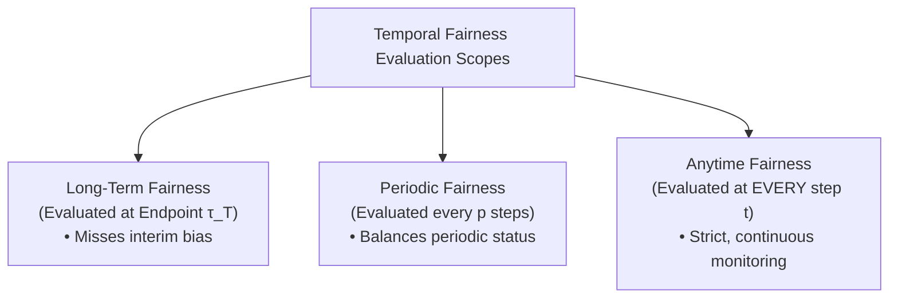
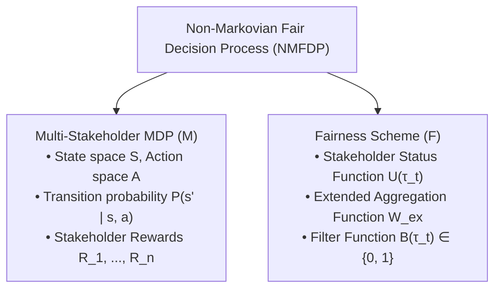
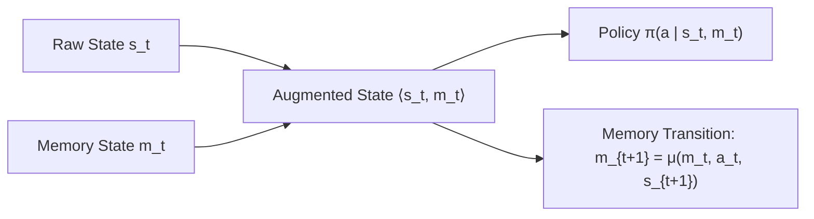
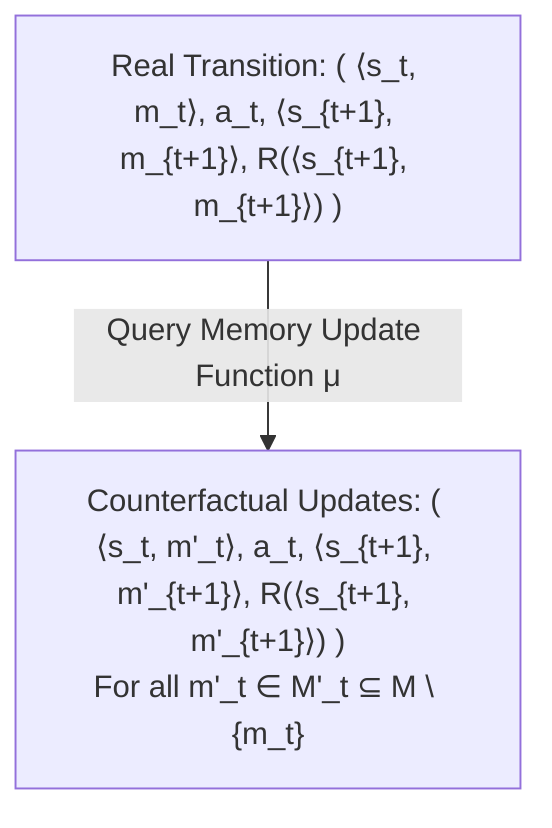
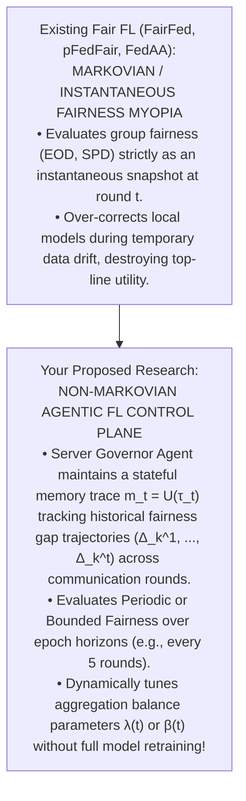

---
title: "Remembering to Be Fair: Non-Markovian Fairness in Sequential Decision Making"
type: conference
venue: icml
year: 2024
ranking: a*
quartile:
impact_factor:
prof: mcilraith
uni: toronto
canada: true
below_threshold: false
source_pdf: papers/Remembering to Be Fair - Non-Markovian Fairness in Sequential Decision Making.pdf
tags: [fairness-fl, professor-specific, literature-review, mcilraith, toronto]
---

# Remembering to Be Fair: Non-Markovian Fairness in Sequential Decision Making

Here is an end-to-end, module-by-module walk-through of **"Remembering to Be Fair: Non-Markovian Fairness in Sequential Decision Making"** (Alamdari, Klassen, Creager, & McIlraith, _ICML_, 2024).

This analysis breaks down the paper's theoretical foundation, state space memory augmentation bounds, counterfactual RL algorithm, empirical benchmarks, and open research gaps—specifically contextualized for your dissertation on fair federated learning and agent-based dynamic enforcement.

---

## **Module 1: Problem Space — The Non-Markovian Nature of Sequential Fairness**

### **1. The Flaw of Instantaneous Fairness**

In machine learning and reinforcement learning, fairness is almost universally formulated as a **single-decision constraint** or an **instantaneous state-action transition property** evaluated at $(s, a, s')$. Alamdari et al. demonstrate that in real-world sequential decision-making systems (e.g., vaccine allocation, hospital appointment scheduling, consumer lending), assessing fairness at a single instant or exclusively at the end of an infinite horizon ("long-term fairness") leads to severe system failures [1, 3–6, 9]:

- **Long-Term Fairness Blindspot**: Consider distributing 80,000 vaccines between two countries, $A$ and $B$. A policy that delivers 40,000 vaccines to $A$ in Months 1–2 and 40,000 to $B$ in Months 3–4 yields equal allocation at Month 4. However, $A$ gains early health benefits while $B$ suffers elevated infection rates during Months 1–2. Evaluating fairness only at the endpoint declares both processes equally fair, ignoring severe temporal inequities.
- **The Non-Markovian Requirement**: Assessing whether a state $s_{t+1}$ or action $a_t$ is fair cannot be determined solely from the current state $s_t$. It inherently depends on the **historical trace** $\tau_t = (s_1, a_1, \ldots, s_t, a_t, s_{t+1})$. Fairness in sequential settings is inherently **non-Markovian**.

### **2. Formalizing Temporal Evaluation Scopes**

To capture how fairness manifests over time, the authors formalize four evaluation scopes [1, 7, 23–25]:

1. **Long-Term Fairness**: $W(U(\tau_T))$, judging fairness strictly at the terminal state of trace $\tau_T$.
2. **Periodic Fairness**: $W_{ex}(U(\tau_p), U(\tau_{2p}), \ldots, U(\tau_{\lfloor T/p \rfloor p}))$, evaluating equity at fixed time intervals $p$ (e.g., monthly).
3. **Anytime Fairness**: Periodic fairness with period $p=1$, requiring fairness evaluation at _every single decision step_ $t$.
4. **Bounded Fairness**: Uses a filter function $B(\tau_t) \in \{0, 1\}$ to evaluate fairness at dynamically triggered system events (e.g., after every 1,000 vaccines delivered).

---

## **Module 2: Mathematical Formalization — Non-Markovian Fair Decision Processes (NMFDP)**

To mathematically model multi-stakeholder sequential decision-making under historical constraints, the paper introduces two core formal structures:

### **1. Multi-Stakeholder Markov Decision Process (Multi-Stakeholder MDP)**

A Multi-Stakeholder MDP is defined as a tuple $M = \langle S, s_{init}, A, P, R_1, \dots, R_n, \gamma \rangle$, where $n$ represents the number of distinct stakeholders (e.g., patient demographics, regions, or edge clients). Executing action $a_t$ in state $s_t$ yields an $n$-dimensional reward vector $[R_1(s_t, a_t, s_{t+1}), \dots, R_n(s_t, a_t, s_{t+1})]$.

### **2. Fairness Scheme $\mathcal{F}$**

A fairness scheme is defined as $\mathcal{F} = \langle U, W_{ex}, B \rangle$:

- **Stakeholder Status Function $U: (S \times A)^* \times S \to \mathbb{R}^n$**: Maps a historical trace $\tau_t$ to an $n$-dimensional vector $U(\tau_t)$, tracking cumulative utility, allocated resources, or envy experienced by each stakeholder up to time $t$.
- **Extended Aggregation Function $W_{ex}: (\mathbb{R}^n)^* \to \mathbb{R}$**: Aggregates the sequence of status vectors across time into a scalar fairness score.
- **Filter Function $B: (S \times A)^* \times S \to \{0, 1\}$**: Selects which timepoints pass through to the fairness evaluation.

Together, $\langle M, \mathcal{F} \rangle$ constitutes a **Non-Markovian Fair Decision Process (NMFDP)**.

### **3. Quantifying Stakeholder Unfairness**

The status vector $U(\tau_t)$ quantifies individual stakeholder treatment at time $t$:
$$\text{unfairness}_i(\tau, t) = U(\tau_t)_i - \text{mean}(U(\tau_t))$$
A negative value indicates stakeholder $i$ is being under-served ("unfair to"), while a positive value indicates over-serving ("unfair in favor of"). Overall trace unfairness is aggregated as $-\sum_{i=1}^n (\text{overall_unfairness}_i(\tau_T))^2$.

---

## **Module 3: State Space Augmentation & The Regular Language Boundary**

### **1. Converting Non-Markovian Problems to Markovian MDPs**

Because the status function $U(\tau_t)$ depends on history, standard Markovian RL algorithms cannot directly compute optimal policies. The authors resolve this by augmenting the environment's state space with a finite **memory unit** $\langle M, m_{init}, \mu \rangle$, where $M$ is the set of memory states and $\mu: M \times A \times S \to M$ is an internal memory update function. The augmented state becomes $\langle s_t, m_t \rangle$.

### **2. The Value-Regular Characterization (Theorems 5.4 & 5.5)**

When can a non-Markovian status function $U$ be made strictly Markovian via finite state memory augmentation? Alamdari et al. establish a fundamental theoretical boundary using formal language theory:

- **Definition 5.3 (Value-Regular)**: A status function $U$ is **value-regular** if its range of output status vectors $V \subseteq \mathbb{R}^n$ is finite, and for every $v \in V$, the set of execution traces mapping to $v$ forms a **regular language** accepted by a Deterministic Finite Automa (DFA).
- **Theorem 5.4 (Sufficiency)**: If $U$ is value-regular, there exists a finite memory augmentation $\langle M, m_{init}, \mu \rangle$ (constructing memory states $M$ as the cross-product of DFA states $Q_1 \times \cdots \times Q_k$) such that $U'$ is strictly Markovian in the augmented NMFDP.
- **Theorem 5.5 (Necessity)**: Conversely, if a status function $U'$ becomes Markovian under a finite memory augmentation, $U$ **must be value-regular**.

---

## **Module 4: Algorithmic Solution — FairQCM (Fair Q-Learning with Counterfactual Memories)**

For **reward-like** fairness schemes—where $W \circ U'$ acts as a Markovian reward function $R(\langle s_t, m_t \rangle, a_t, \langle s_{t+1}, m_{t+1} \rangle) = W(U'(\langle s_{t+1}, m_{t+1} \rangle)) \cdot B(s_{t+1})$—the augmented NMFDP can be solved via reinforcement learning [44–46, 52–54]. However, learning over augmented states $\langle s, m \rangle$ expands the state space, making standard Q-learning sample-inefficient.

### **1. Counterfactual Experience Generation**

Alamdari et al. introduce **FairQCM (Fair Q-Learning with Counterfactual Memories)**. Whenever the agent experiences a real environment step $(\langle s_t, m_t \rangle, a_t, \langle s_{t+1}, m_{t+1} \rangle, r_{t+1})$, it leverages its known deterministic memory update function $\mu$ to construct synthetic **counterfactual experiences** for alternative memory states $m'_t \in M$:
$$(\langle s_t, m'_t \rangle, a_t, \langle s_{t+1}, m'_{t+1} \rangle, R(\langle s_{t+1}, m'_{t+1} \rangle)) \quad \text{where } m'_{t+1} = \mu(m'_t, a_t, s_{t+1})$$
These counterfactual tuples allow the Q-function to update transition values across multiple historical memory contexts simultaneously without requiring the agent to physically re-visit those memory states in the environment.

### **2. Exact Convergence Proof (Theorem 5.7)**

- **Theorem 5.7**: Under standard Q-learning learning rate decay conditions ($\sum \alpha_n = \infty, \sum \alpha_n^2 < \infty$), tabular FairQCM converges to the optimal Q-function $Q^*$ and optimal fair policy $\pi^*$ with probability 1. Because counterfactual memory states $m'_t$ are selected prior to observing stochastic action outcomes $s_{t+1}$, counterfactual updates remain unbiased relative to environment transition probabilities $P(s' \mid s, a)$.

---

## **Module 5: Empirical Benchmarks & Performance Analysis**

Alamdari et al. benchmarked Deep FairQCM (using Deep Q-Networks, DQN) against four memory-augmented baselines: **Full** (storing complete raw status $U(\tau_t)$), **Min** (storing $U(\tau_t) - \min_i U(\tau_t)_i$), **Reset** (zeroing history upon reaching equality), and **RNN** (using a GRU layer to approximate history).

**Empirical Performance Trajectories**

- **Resource Allocation (Nash Social Welfare)**: FairQCM matches Oracle (~1050 NSW) ★; RNN shows fast convergence but sub-optimal results; Full shows slower sample efficiency.
- **Simulated Lending (Relaxed DP Score)**: FairQCM achieves top performance (~ -180 DP) ★; Min achieves secondary performance; Full shows poor sample efficiency.

### **1. Stochastic Resource Allocation (Doughnut Benchmark)**

- **Setup**: 5 customers ($n=5$) with stochastic presence probabilities $p_i = 0.8$ at a counter; 1 resource allocated per step over $T=100$ steps. The objective maximizes cumulative discounted **Nash Social Welfare**: $W(U(\tau_t)) = \sum_{i=1}^5 \log(U(\tau_t)_i + 1)$.
- **Results**: Deep FairQCM achieves near-optimal cumulative Nash Social Welfare (~1050 score), reaching the hard-coded **Oracle** ceiling while allocating $99\%$ of resources without waste. Standard Full and Reset baselines lag in sample efficiency.

### **2. Dynamic Consumer Lending**

- **Setup**: Bank granting loans to 4 applicants across 2 protected demographic groups ($A$ and $B$) with shifting credit scores [59–61, 93]. Objective maximizes **Relaxed Demographic Parity**: $W(U(\tau_t)) = -|\sum_{i \in A} U(\tau_t)_i - \sum_{i \in B} U(\tau_t)_i|$, subject to maintaining a $10\%$ profit margin constraint [61, 62, 94–96].
- **Results**: FairQCM achieves the highest cumulative Relaxed DP score (~ -180), rapidly converging to balanced group loan distributions while satisfying the required $10\%$ profit threshold.

---

## **Module 6: Open System Gaps & Strategic Bridge to Your Dissertation**

### **1. Systemic Limitations of Alamdari et al.**

While this paper provides a rigorous foundation for non-Markovian fairness, it leaves three major research gaps open:

1. **Centralized Visibility Assumption**: Assumes a central coordinator possesses complete, uncorrupted visibility over the historical trace $\tau_t$ and all stakeholder status vectors $U(\tau_t)$. It does not account for decentralized or privacy-preserving settings.
2. **Infinite State Expansion for Non-Regular Functions**: If status functions $U(\tau_t)$ can take an unbounded number of values (e.g., unbounded real-valued loss accumulated across infinite horizons), $U$ is **not value-regular** [41–43]. The memory state space $M$ expands infinitely, causing memory-augmented RL to break down.
3. **Single-Agent Policy Control**: The framework models a centralized RL agent making actions for all stakeholders. It lacks multi-agent negotiation, Byzantine defenses, or dynamic client selection.

---

## **Strategic Bridge: Non-Markovian Memory for Agentic Fair FL**

Alamdari et al.'s non-Markovian framework provides a critical theoretical foundation for your dissertation research on **fair federated learning with agent-based dynamic enforcement**:

### **How Your Dissertation Resolves Alamdari et al.'s Open Gaps:**

- **Non-Markovian Server Governor Agents**: Current fair FL algorithms (such as _FairFed_ or _pFedFair_) evaluate group fairness metrics (e.g., $EOD_k^t$) as instantaneous snapshot penalties at round $t$. Under non-stationary client data drift, this snapshot myopia causes aggregators to over-correct local weights, destabilizing model convergence. By equipping your **Server Governor Agent** with a stateful status function $U(\tau_t)$ that tracks historical fairness gap trajectories, the server agent enforces **Periodic or Bounded Non-Markovian Fairness** over FL training horizons.
- **Epistemic-Gated Memory Compression**: To prevent state space explosion, **Client Guardian Agents** can use epistemic data uncertainty estimation (_CA-ICRL_) to compress local historical status vectors into bounded, value-regular discrete representations ($m_t \in M$), enabling sample-efficient FairQCM updates over live FL communication rounds.
