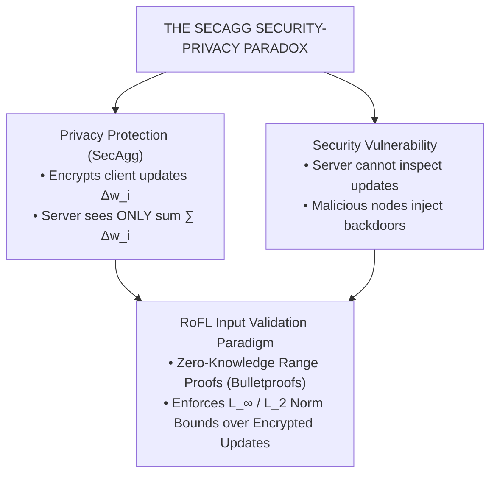
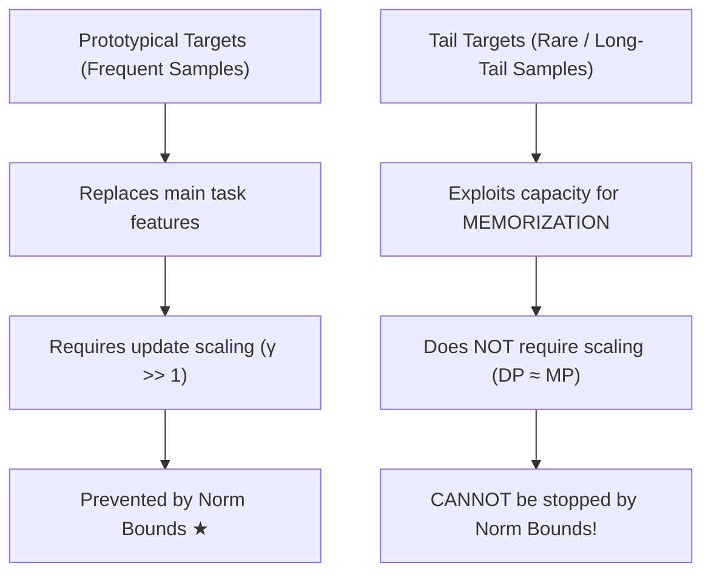
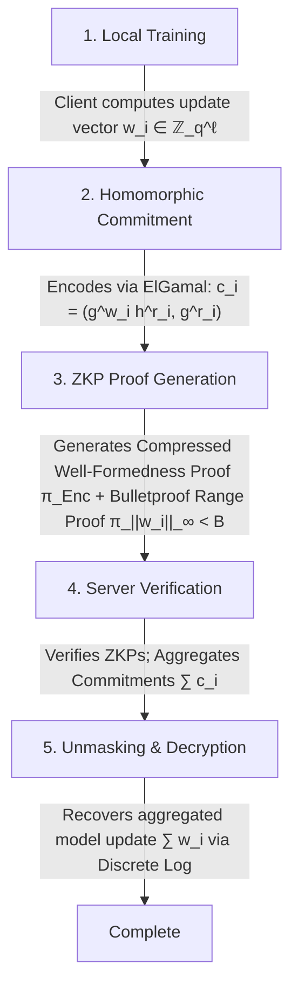
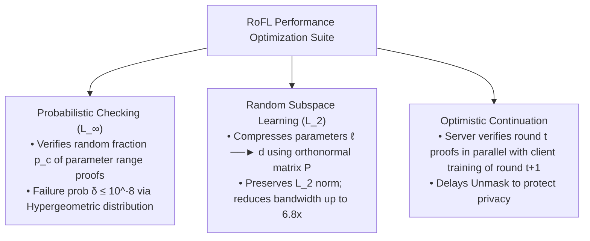
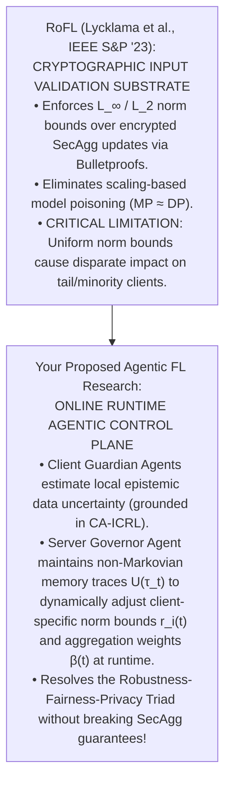

---
title: "RoFL: Robustness of Secure Federated Learning"
type: conference
venue: ieee-sp
year: 2023
ranking: a*
quartile:
impact_factor:
prof: hithnawi
uni: toronto
canada: true
below_threshold: false
source_pdf: papers/RoFL - Robustness of Secure Federated Learning.pdf
tags: [fairness-fl, professor-specific, literature-review, hithnawi, toronto]
---

# RoFL: Robustness of Secure Federated Learning

## **Module 1: Threat Landscape, Secure Aggregation, and the Tail-Memorization Dilemma**

### **1. The Security-Privacy Paradox in Secure Federated Learning**

Standard Federated Learning (FL) aggregates local client updates $\Delta w_i^{t+1} := w_i^{t+1} - w_G^t$ to train a global model $w_G \in \mathbb{R}^\ell$. To prevent the central server or honest-but-curious adversaries from inspecting individual updates and reconstructing sensitive client data, practical deployments employ **Secure Aggregation (SecAgg)**. SecAgg uses homomorphic masking to ensure the server can decrypt *only* the aggregated update $\sum_{i=1}^m \Delta w_i$ while individual updates remain strictly confidential.

However, this privacy guarantee creates a critical **security vulnerability**: because the server cannot inspect individual update vectors, compromised clients can execute malicious attacks without detection. Lycklama et al. categorize these into two attack goals:

- **Untargeted Attacks**: Aim to degrade global model convergence or availability (e.g., Projected Gradient Ascent, PGA).
- **Targeted Backdoor Attacks**: Aim to cause the global model to misclassify a specific target input set $\hat{D}$ as a target class $\hat{t}$ while preserving high accuracy on the main task.

### **2. Threat Model: Model Poisoning vs. Data Poisoning**

The paper evaluates two distinct adversary models under a realistic threat model where the attacker controls a small fraction of clients ($\alpha < 5\%$ per round):

1. **Data Poisoning (DP)**: The adversary can only modify local training data (e.g., label flipping where $(x, y) \to (x, \hat{t})$) while honestly following the training protocol.
2. **Model Poisoning (MP)**: The adversary has full control over local SGD training and manipulates the model update vector directly. MP leverages update scaling ($\gamma \cdot \Delta \hat{w}$) to exploit the vulnerability of linear aggregation rules (e.g., `FedAvg`), allowing a single compromised client to overpower benign updates and replace the global model in a single round.

The paper evaluates three state-of-the-art adaptive model poisoning strategies designed to evade norm bounds:

- **Projected Gradient Descent (MP-PD)**: Fine-tunes on backdoor data and projects updates onto a norm-bounded constraint set $\|\Delta \hat{w}\|_p \le \frac{B}{\gamma}$ after every iteration.
- **Neurotoxin (MP-NT)**: Target-poisons only the top-$k\%$ infrequently updated weights ($M = \text{topk}(w_G^t, w_G^{t-1})$), projecting updates such that $\Delta \hat{w}_{i, M} = 0$ to improve backdoor durability.
- **Anticipate (MP-AT)**: Simulates local future FL rounds during optimization to anticipate and counteract benign client aggregation updates.

### **3. The Prototypical vs. Tail Subpopulation Taxonomy**

To explain why norm bounds succeed against certain attacks but fail against others, Lycklama et al. analyze natural image and text datasets through the lens of **long-tailed distributions**. Modern datasets consist of a mixture of subpopulations:

- **Prototypical Targets**: Frequently occurring subpopulations in the data distribution (e.g., classifying digit '7' as '1' in Federated-MNIST or green cars as birds in CIFAR-10).
- **Tail Targets**: Rare subpopulations residing on the long tail of the distribution that seldom appear in benign datasets (e.g., European-style '7' with a middle bar in F-MNIST or Southwest Airlines planes in CIFAR-10).

---

## **Module 2: Empirical Mechanics of Norm Bounding — Single-Shot, Continuous, and Median Adaptation**

### **1. Single-Shot vs. Continuous Prototypical Attacks**

- **Single-Shot Attacks**: Controlling a single client ($\alpha = 2.5\% - 3.3\%$) for a single round allows an attacker to inject a prototypical backdoor by scaling updates by $30\times - 100\times$. Enforcing an $L_2$-norm bound ($B=4.0$ for FMN, $B=5.0$ for C10) **completely eliminates single-shot prototypical backdoors** across all adaptive strategies (MP-PD, MP-NT, MP-AT).
- **Continuous Attacks**: An attacker participating across all rounds can slowly inject a prototypical backdoor under loose bounds. However, under tight norm bounds, benign client updates dominate aggregation, suppressing prototypical backdoor accuracy below 10%.

Single-shot attack response under norm bounds: backdoor accuracy climbs toward 100% under no bound (scaling 30x-100x) as rounds progress from the injection point (Round 5), but with an L2 bound of B=4.0, backdoor accuracy is suppressed to 0% ★.

### **2. Dynamic Median-Based Norm Bound Selection**

Setting a static norm bound $B$ introduces a trade-off: if $B$ is too loose, attackers scale updates; if $B$ is too tight, benign update clipping slows model convergence. Furthermore, benign update norms shrink naturally as the global model converges.

To resolve this, Lycklama et al. propose a **dynamic, median-based norm bound**:
$$B = r \cdot m$$
where $m = \text{median}(\|\Delta w_i\|_p)$ is the median update norm across selected clients, and $r$ is a scaling multiplier (e.g., $r = 1.5$). Because the median has a breakdown point of $50\%$, it tolerates up to $50\%$ malicious client updates without manipulation. In experiments, $r=1.5$ prevents attacks with zero main-task accuracy loss.

### **3. Attacker Scaling vs. Data Poisoning Equivalence**

As the fraction of compromised clients per round grows ($\alpha \ge 16.7\% - 26.7\%$), the attacker divides scaled updates across multiple devices, staying under individual norm bounds. Crucially, the authors show that under norm bounds, **model poisoning performs almost identically to simple data poisoning**. Thus, norm bounds reduce the advantage of model poisoning to the baseline limit of honest data poisoning.

Model poisoning vs. data poisoning convergence: MP-AT (model poisoning) backdoor accuracy climbs from a blocked state at α = 2.5% toward approaching the DP (data poisoning) limit (~60%) as compromised clients approach α = 26.7%.

### **4. Why Tail Backdoors Evade Norm Bounds**

In contrast to prototypical targets, **continuous tail backdoor attacks succeed even under tight norm bounds**. Tail backdoors do not rely on update scaling; instead, they exploit the neural network's **fundamental requirement to memorize long-tail data**. Because benign clients rarely hold tail samples, benign updates do not overwrite or unlearn tail parameters. Adding an artificial pixel trigger to a prototypical sample converts it into a rare tail subpopulation, enabling persistent backdoor injection.

---

## **Module 3: The RoFL Architecture — Single-Server SecAgg with Private Input Validation**

To enforce norm bounds over encrypted client updates without breaking SecAgg, Lycklama et al. present **RoFL (Robustness of Secure Federated Learning)**.

### **1. Commitment-Based Encoding Scheme**

RoFL extends the single-server SecAgg protocols of Bonawitz et al. and Bell et al. by replacing plain integer masking ($w_i + r_i \bmod q$) with **ElGamal commitments**:
$$\text{Enc}(w_i, r_i) = (E_w(w_i, r_i), E_r(0, r_i)) = \left( g^{w_i} h^{r_i}, \; g^{r_i} \right)$$
where $g, h$ are generators of a cyclic group $\mathcal{G}$ of prime order $q$, $w_i \in \mathbb{Z}_q^\ell$ is the parameter update vector, and $r_i$ is the canceling mask vector generated via `ShareKeys`.

- **Properties**: ElGamal commitments are computationally hiding and information-theoretically binding. The first component $g^{w_i} h^{r_i}$ acts as a valid Pedersen commitment to $w_i$, while the second component $g^{r_i}$ allows the server to verify that unmasking keys match the sum of encoding keys ($\sum r_i$), ensuring **correctness against actively malicious clients**.

### **2. Zero-Knowledge Proofs (ZKPs) for Norm Bounds**

Each client attaches Non-Interactive Zero-Knowledge (NIZK) proofs to its encrypted update:

- **Well-Formedness Proofs**: Proves that the same randomness $r_j$ was used in both ElGamal components $(g^{w_j} h^{r_j}, g^{r_j})$. Using a Sigma protocol compressed across all $\ell$ parameters, RoFL reduces well-formedness proof size to a **constant overhead** (2 group and 2 field elements), independent of model size $\ell$.
- **$L_\infty$-Norm Bound ($\|w_i\|_\infty < B$)**: Requires proving each parameter $w_j \in [0, B)$. RoFL uses **Bulletproofs**—a discrete-log ZKP system yielding proof sizes logarithmic in parameter count without requiring a trusted setup. Parameters are compressed into $b$-bit integers (e.g., $b=8$) via 8-bit probabilistic quantization.
- **$L_2$-Norm Bound ($\|w_i\|_2 < B_{L_2}$)**: Proving $\sum w_j^2 < B_{L_2}^2$ modulo $q$ requires guarding against integer overflow wraparound. Clients supply additional Pedersen commitments to squared parameters $c_j' = g^{w_j^2} h^{r_j'}$ alongside proof-of-knowledge that $c_j'$ commits to the square of $c_j$.

---

## **Module 4: Systems and ML Optimizations & Empirical Evaluation**

Because verifying range proofs over millions of parameters introduces severe overhead, RoFL incorporates three tailored optimizations:

### **1. Three Performance Optimizations**

1. **Probabilistic Range-Checking ($L_\infty$)**: The server verifies range proofs on a random fraction $p_c$ of parameters after commitments are uploaded (since binding commitments cannot be altered). The detection failure probability follows a Hypergeometric distribution:
   $$\Pr(\text{Failure}) = \text{Hyp}(p_c \ell \mid \ell, \; \ell(1 - p_v), \; p_c \ell)$$
   Setting $p_v = 0.005$ (assuming $\ge 0.5\%$ parameters exceed the bound in a scaling attack) and failure probability $\delta \le 10^{-8}$, probabilistic checking reduces client/server compute overhead by **$12\times - 17\times$**.
2. **Random Subspace Learning ($L_2$)**: Compresses model parameters from $\ell$ to intrinsic dimension $d \ll \ell$ using an orthonormal projection matrix $P \in \mathbb{R}^{\ell \times d}$: $w_\ell = W_0^\ell + P w_d$. Because $P$ preserves $L_2$-norms, clients perform range proofs strictly over low-dimensional vector $w_d$, reducing bandwidth overhead by up to **$6.8\times$**.
3. **Optimistic Continuation**: The server combines client update commitments, initiates round $t+1$ client training, and verifies round $t$ ZKPs in parallel. By **delaying the `Unmask` step** until verification succeeds, privacy is preserved even if verification fails.

### **2. End-to-End System Performance**

Evaluated across 4 tasks (F-MNIST LeNet5, CIFAR-10 ResNet-20, Shakespeare LSTM) on AWS instances:

| Task            | Parameters ($\ell$) | Baseline SecAgg Time/Round | RoFL $L_\infty^{(p)}$ Time/Round | RoFL $L_2^{(rsl)}$ Time/Round | Bandwidth Overhead vs. SecAgg |
| :-------------- | :---------------------- | :------------------------- | :------------------------------------ | :-------------------------------- | :---------------------------- |
| **MNIST**       | 19k                     | 2s                         | **8s (3x)**                           | 11s (5x)                          | 7x – 8x                       |
| **CIFAR-10 S**  | 62k                     | 2s                         | **15s (8x)**                          | 18s (10x)                         | 6x – 8x                       |
| **CIFAR-10 L**  | 273k                    | 22s                        | **64s (2.9x)**                        | 149s (7x)                         | 4x – 8x                       |
| **Shakespeare** | 818k                    | 773s                       | **918s (1.2x)**                       | —                                 | 8x                            |

- **Key Takeaway**: With probabilistic checking and optimistic continuation, RoFL reduces computational overhead to just **$1.2\times - 2.9\times$** over standard SecAgg for large models, making cryptographic input validation practical for real-world FL.

---

## **Module 5: Research Landscape & Strategic Dissertation Bridge**

### **1. Methodological Gaps Left Open in RoFL**

While RoFL provides a practical cryptographic framework for input validation in SecAgg, it leaves three major research gaps open:

1. **Inability to Prevent Tail Backdoor Attacks**: RoFL explicitly acknowledges that norm bounds cannot prevent continuous tail backdoor attacks without destroying the model's ability to learn rare or underrepresented subpopulations.
2. **Disparate Impact on Non-IID Minority Clients**: Uniform norm clipping disproportionately harms clients holding rare, non-IID, or minority datasets whose benign updates naturally exhibit larger parameter norms, creating severe group fairness disparities.
3. **Bandwidth Costs & Static Thresholds**: RoFL incurs a $4\times - 28\times$ bandwidth overhead due to ElGamal commitments and relies on static multiplier heuristics ($r=1.5$), lacking dynamic cognitive control.

---

## **Strategic Bridge to Your Dissertation (Agentic Fair FL with Dynamic Enforcement)**

RoFL provides the essential **cryptographic robustness layer** and **trade-off boundary** for your dissertation research:

- **Dynamic Norm Bound Adaptation via Server Governor Agents**: Rather than applying a single uniform median multiplier $r=1.5$ across all clients (which clips benign minority updates), your **Server Governor Agent** can track historical non-Markovian fairness trajectories ($U(\tau_t)$) to dynamically adjust client-specific norm bounds $r_i(t)$ at runtime.
- **Epistemic-Gated Proofs via Client Guardian Agents**: Edge devices running **Client Guardian Agents** can estimate local epistemic uncertainty (_CA-ICRL_) to certify that updates with large norms stem from legitimate long-tail distribution shifts rather than malicious model poisoning, preventing false-positive rejection of underrepresented client data.
