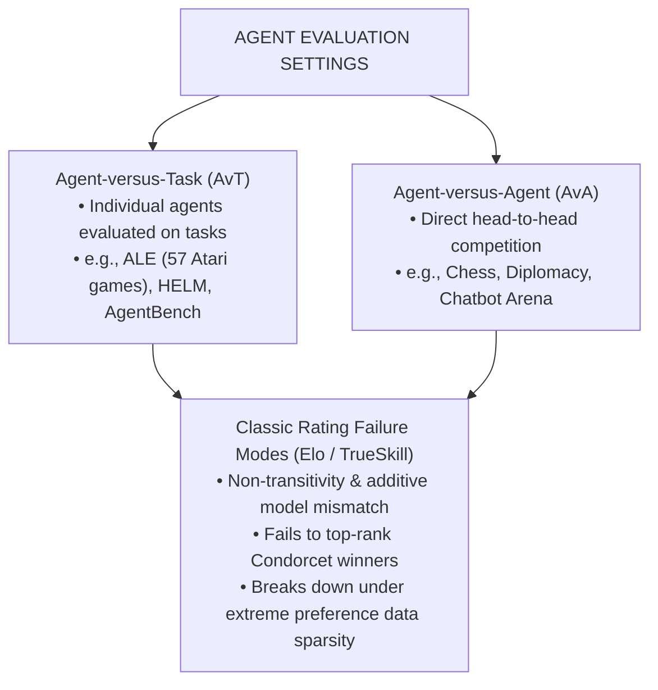
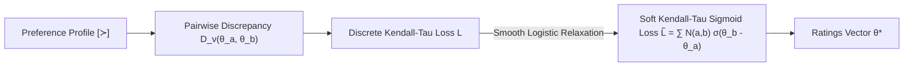
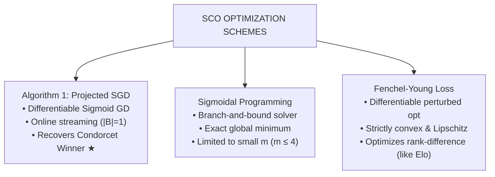
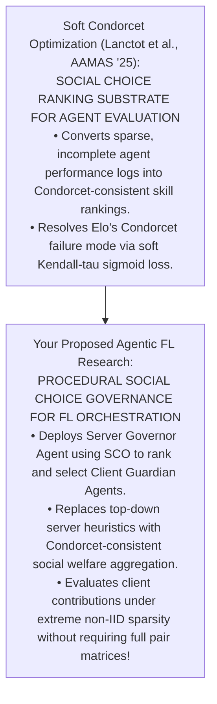

---
title: "Soft Condorcet Optimization for Ranking of General Agents"
type: conference
venue: aamas
year: 2025
ranking: a
quartile:
impact_factor:
prof: larson
uni: waterloo
canada: true
below_threshold: false
source_pdf: papers/Soft Condorcet Optimization for Ranking of General Agents.pdf
tags: [fairness-fl, professor-specific, literature-review, larson, waterloo]
---

Here is a module-by-module walk-through of **"Soft Condorcet Optimization for Ranking of General Agents"** (Lanctot, Larson, Kaisers, Berthet, Gemp, Diaz, Maura-Rivero, Bachrach, Koop, & Precup, _AAMAS 2025_).

---

# Soft Condorcet Optimization for Ranking of General Agents

## **Module 1: Problem Space — Agent Evaluation & The Failure of Classical Rating Systems**

### **1. The Benchmark Aggregation Challenge in General AI**

Progress in artificial intelligence is heavily benchmark-driven, progressing from single-domain benchmarks (e.g., ImageNet, DeepBlue, AlphaGo) to multi-task suites evaluating generally capable agents across diverse environments [6–8]. Evaluating modern agents requires aggregating performances across two distinct operational paradigms:

- **Agent-versus-Task (AvT)**: Individual agents compete independently across varied task suites (e.g., 57 Atari games in the Arcade Learning Environment [ALE], HELM, BIG-bench, or AgentBench).
- **Agent-versus-Agent (AvA)**: Agents compete head-to-head in multi-agent environments (e.g., Chess, Poker, Diplomacy, or Chatbot Arena human preference voting).

Aggregating evaluations across multi-task or multi-agent domains presents severe difficulties: score scales vary wildly across tasks, evaluation data is unevenly distributed across agents, and classical rating systems were not designed for high-dimensional, sparse preference matrices.

### **2. Limitations of Elo and Classical Rating Systems**

Classical rating systems—such as **Elo**, **TrueSkill**, and **BayesElo**—are grounded in Bradley-Terry probabilistic skill models. Elo assigns a scalar rating $r_i$ to player $i$, modeling the win probability against player $j$ as:

$$\Pr(i \text{ beats } j) = \frac{1}{1 + 10^{(r_j - r_i)/400}} \quad$$

While simple and computationally efficient online, Elo suffers from two critical failure modes:

1. **Incompatibility with Social Choice Axioms**: Elo optimizes for marginal win rates / logistic likelihood rather than pairwise dominance. As a result, Elo can assign higher ratings to non-Condorcet winners while depressing ratings for true Condorcet winners.
2. **Non-Transitivity in Complex Games**: Real-world multi-agent interactions exhibit intransitive cycle dynamics ($A \succ B \succ C \succ A$), violating Elo's additive Bradley-Terry assumption.

### **3. Voting-as-Evaluation (VasE) & The Sparse Data Wall**

To overcome Elo's axiomatic limitations, recent frameworks adopt **Voting-as-Evaluation (VasE)**, treating agent evaluations as preference profiles in computational social choice. VasE inherits desirable social choice properties like **Condorcet consistency** (always top-ranking an agent that defeats every other head-to-head).

However, classic voting rules (e.g., Kemeny-Young, Copeland, Borda, Ranked Pairs, Maximal Lotteries) assume **complete comparison data**. In real-world agent evaluations, data is **extremely sparse and incomplete** (e.g., in the webDiplomacy dataset of 52,958 players across 31,049 games, less than 0.0011% of pairwise player combinations are observed). Classical social choice methods break down or become computationally intractable under such extreme sparsity.

---

## **Module 2: Mathematical Formulation — Soft Condorcet Optimization (SCO)**

Lanctot et al. formulate **Soft Condorcet Optimization (SCO)** by bridging social choice theory with maximum likelihood estimation (MLE) and differentiable learning-to-rank.

### **1. Social Choice Preliminaries & The Kemeny-Young MLE Interpretation**

Let $A = \{a_1, \dots, a_m\}$ be $m$ agents (alternatives) and $V = \{v_1, \dots, v_n\}$ be $n$ evaluation games/tasks (voters). A preference profile $[\succ]$ consists of strict total orders over agent subsets. The preference count $N(a, b)$ denotes the number of votes where agent $a$ is strictly preferred to agent $b$ ($a \succ b$). The vote margin matrix is $M = N - N^T$.

- **Condorcet Winner**: An agent $c \in A$ is a **weak Condorcet winner** if $\delta(c, a') = N(c, a') - N(a', c) \ge 0$ for all $a' \in A$, and a **strong Condorcet winner** if the inequality is strict for all $a' \neq c$.
- **Kemeny-Young Voting Rule**: Finds the optimal ranking (permutation $\pi$) that maximizes the Kemeny score:

$$\arg\max_{\pi \in \Pi(A)} \sum_{i < j} N(\pi[i], \pi[j]) \quad$$

Young showed that the Kemeny-Young ranking is the exact Maximum Likelihood Estimate (MLE) of the ground-truth ranking when votes are viewed as noisy samples, minimizing the sum of **Kendall-tau distances** to all votes. However, computing the exact Kemeny-Young ranking is NP-hard.

### **2. Ratings and the Discrete Kendall-Tau Loss**

SCO assigns a continuous numerical rating parameter $\theta_a \in [\theta_{\min}, \theta_{\max}]$ to each agent $a \in A$. Ratings induce a total ranking order such that $a \succ b \iff \theta_a > \theta_b$.

For a preference profile $[\succ]$ and rating vector $\boldsymbol{\theta}$, the discrete ranking loss counts pairwise ordinal misclassifications:

$$L([\succ], A, V, \boldsymbol{\theta}) = \sum_{v \in [\succ]} \sum_{(i, j) \in I_2(v)} D_v(\theta_{v[i]}, \theta_{v[j]}) \quad$$

where $I_2(v)$ indexes all ordered pairs in vote $v$, and $D_v(\theta_a, \theta_b)$ is a binary step function checking ordinal disagreement:

$$D_v(\theta_a, \theta_b) = \begin{cases} 1 & \text{if } \theta_b - \theta_a > 0 \text{ in } v \\ 0 & \text{otherwise} \end{cases} \quad$$

### **3. Differentiable Soft Kendall-Tau Sigmoid Loss**

Because step function $D_v$ is non-differentiable, SCO replaces it with a smooth logistic sigmoid relaxation parameterized by temperature $\tau$:

$$\tilde{D}_v(\theta_a, \theta_b) = \sigma\left(\frac{\theta_b - \theta_a}{\tau}\right) = \frac{1}{1 + e^{(\theta_a - \theta_b)/\tau}} \quad$$

Summing across the full preference profile yields the **Soft Kendall-Tau Sigmoid Loss** $\tilde{L}$:

$$\tilde{L}([\succ], A, V, \boldsymbol{\theta}) = \sum_{a,b \in A \times A} N(a, b) \sigma(\theta_b - \theta_a) \quad$$

### **4. Theoretical Condorcet Consistency Guarantee (Theorem 1)**

Lanctot et al. prove that despite the smooth relaxation, minimizing the sigmoid loss preserves exact Condorcet consistency:

- **Theorem 1**: _Given the soft Kendall-tau loss $\tilde{L}([\succ], A, V, \boldsymbol{\theta}) = \sum_{a,b} N(a,b) \sigma(\theta_b - \theta_a)$, if there exists a candidate $c \in A$ that is a Condorcet winner, the loss $\tilde{L}$ is strictly monotonically decreasing with respect to $\theta_c$. As a consequence, if $\boldsymbol{\theta}^*$ is a global minimum of $\tilde{L}$ on the $\ell_\infty$ ball of radius $\theta_{\max}$, then $\theta_c^* = \theta_{\max}$._
- **Proof Sketch**: By logistic symmetry $\sigma(x) = 1 - \sigma(-x)$, the loss decomposes into a constant $K$, terms involving comparisons to Condorcet winner $c$, and terms independent of $\theta_c$. Because $N(c, b) > N(b, c)$ for all $b \neq c$, taking the partial derivative $\frac{\partial \tilde{L}}{\partial \theta_c}$ yields a strictly negative sum, forcing the optimal rating $\theta_c^*$ to hit the upper boundary constraint $\theta_{\max}$.

---

## **Module 3: Optimization Mechanics — Three Algorithmic Paradigms**

The paper introduces three distinct optimization schemes to compute SCO ratings $\boldsymbol{\theta}^*$:

### **1. Algorithm 1: Projected Stochastic Gradient Descent (SGD)**

Applies projected gradient descent directly to the soft Kendall-tau sigmoid loss. Ratings are initialized to mid-range values $\boldsymbol{\theta}_0 = \frac{\theta_{\max} + \theta_{\min}}{2} \mathbf{1}$. In iteration $t$, batch $B \subseteq [\succ]$ is sampled, and parameters are updated via:

$$\boldsymbol{\theta}_t = \text{Proj}_{\ell_\infty}\left( \boldsymbol{\theta}_{t-1} - \alpha_t \nabla_{\boldsymbol{\theta}} \tilde{L}(B, \boldsymbol{\theta}_{t-1}) \right) \quad$$

where $\text{Proj}_{\ell_\infty}$ clips ratings to $[\theta_{\min}, \theta_{\max}]$. Setting batch size $|B|=1$ yields an **online streaming update rule**, allowing agent ratings to update continuously as single game results arrive.

### **2. Sigmoidal Programming**

Rewrites the loss as a sum of sigmoidal functions over pairwise rating differences $z_{ab} = \theta_b - \theta_a$. Sigmoidal functions are convex for $z \le 0$ and concave for $z \ge 0$. The resulting non-convex program is solved using a global branch-and-bound algorithm. While mathematically guaranteed to find the global minimum within tolerance, sigmoidal programming requires $\Omega(m^2)$ optimization variables, suffering from numerical instabilities for $m \ge 5$ agents.

### **3. Fenchel-Young Loss Optimization**

Leverages differentiable perturbed optimizers (Blondel et al. 2020; Berthet et al. 2020). For a vote $v$, ratings $\boldsymbol{\theta}_v$ are perturbed by Gumbel noise $X$: $\tilde{\boldsymbol{\theta}}_v = \boldsymbol{\theta}_v + \sigma X$. The stochastic Fenchel-Young gradient is:

$$g_v = \text{ArgSort}(-\tilde{\boldsymbol{\theta}}_v) - (0, 1, \dots, |v|-1) \quad$$

- **Trade-off**: The Fenchel-Young loss is **strictly convex and Lipschitz continuous**, guaranteeing global convergence under standard learning rate conditions. However, because its gradient weights errors by rank position differences rather than pure ordinal misclassification counts, **Fenchel-Young loss does NOT guarantee top-ranking Condorcet winners**, behaving more like Elo.

---

## **Module 4: Empirical Benchmarks & Performance Analysis**

Lanctot et al. evaluate SCO across four datasets: a synthetic counterexample profile, 12,680 PrefLib voting instances, synthetic TrueSkill tournaments, and webDiplomacy game outcomes.

**BENCHMARK ACCURACY & DISTANCE PROFILES**

- **PrefLib Kemeny Approximation (Table 2)**: SCO (Sigmoid) achieves 92%-100% Condorcet Match; SCO (Sigmoid) achieves Kn ≤ 0.043 Kemeny Distance.
- **Diplomacy Outcome Prediction (Figure 3)**: SCO (Fenchel-Young) achieves KTD_test = 8.05 ★; SCO (Sigmoid) achieves KTD_test = 8.10 ★; Elo / VasE (Copeland) achieves KTD_test = 8.34.

### **1. Warmup: Resolving Elo's Condorcet Failure**

Consider a 5-vote preference profile with 3 agents:

$$2 : A \succ B \succ C, \quad 3 : C \succ A \succ B \quad$$

Agent $C$ is a strong Condorcet winner since $\delta(C, A) = 3 - 2 = 1 > 0$ and $\delta(C, B) = 3 - 2 = 1 > 0$. However, Agent $A$ achieves a higher overall win rate ($\frac{7}{15}$) than $C$ ($\frac{6}{15}$). Elo assigns a higher rating to $A$, misclassifying the Condorcet winner. SCO with sigmoid loss (via SGD or sigmoidal programming) converges to the correct optimal ranking $C \succ A \succ B$.

### **2. Kemeny-Young Approximation Quality on PrefLib (12,680 Instances)**

Evaluated across 12,680 real preference profiles from PrefLib (strictly-ordered complete and incomplete profiles) for agent counts $m \le 500$:

- **Condorcet Match Proportion ($C_{gd}$)**: SCO with sigmoid loss top-ranks the true Condorcet winner **92% to 100% of the time** across all agent groupings ($m \le 500$).
- **Kemeny Distance Approximation ($K_n$)**: Evaluated against exact Kemeny-Young rankings for $m \le 10$, SCO achieves an average normalized Kendall-tau distance of $K_n \le 0.043$, proving it serves as an ultra-fast, high-precision approximation to Kemeny-Young.

### **3. Sparse Data Tournament Regime (Missing Data $p_\emptyset \ge 59\%$)**

Evaluated on synthetic 4-player TrueSkill match-ups ($m=20$ agents) under uniform and skill-matched sampling across varying missing data ratios $p_\emptyset$ [69–72]:

- On metrics measuring Kendall-Tau Distance (KTD) to ground-truth skill rankings and Mean True Rating Distance (MTRD) of misranked pairs, **SCO (sigmoid and Fenchel-Young) achieves the lowest error among all methods when $\ge 59\%$ of pairwise evaluation data is missing**. VasE methods (Borda, Approval, Maximal Lotteries) collapse under skill-matched sparsity.

### **4. Large-Scale Diplomacy Game Outcome Prediction ($m = 52,958$)**

Evaluated on 11 years of 7-player webDiplomacy games ($m = 52,958$ players, $n = 31,049$ games; $< 0.0011\%$ non-zero entries) across 50 random train/test splits (28,049 train, 3,000 test games):

- **SCO Fenchel-Young Loss** achieves the best out-of-sample test prediction error: $KTD_{test} = 8.05$.
- **SCO Sigmoid Loss** achieves $KTD_{test} = 8.10$.
- **Elo and VasE (Copeland)** lag at $8.34$, while Plurality achieves $8.57$. Classic Condorcet rules (Ranked Pairs, Maximal Lotteries) cannot execute at all on this scale due to $\Omega(m^2)$ memory constraints.

---

## **Module 5: Methodological Limitations & Strategic Bridge to Agentic AI & Fair FL**

### **1. Methodological Gaps Identified in SCO**

While SCO advances agent evaluation and social choice optimization, it leaves three key research frontiers open:

1. **Non-Convexity of Sigmoid Loss**: Sigmoid loss is non-convex, meaning standard SGD lacks theoretical guarantees against local minima (though practically achieving $\ge 96\%$ Condorcet recovery).
2. **Offline Tournament Evaluation**: SCO operates as a static post-hoc ranking tool over recorded evaluation logs $[\succ]$. It lacks active dynamic sampling (e.g., bandit-based active match selection) to strategically query the most informative agent pairings.
3. **Unweighted Agent Task Importance**: SCO treats all tasks/voters $v$ as equal inputs. In multi-agent systems, tasks exhibit varying strategic difficulty, requiring adaptive task-weighting mechanisms.

---

## **Strategic Bridge: Social Choice Governance in Agentic Fair Federated Learning**

Lanctot et al.'s framework provides a crucial foundation for your dissertation research on **fair federated learning with agent-based dynamic enforcement**:

- **Condorcet-Consistent Client Selection**: Current FL client selection schemes (e.g., FedAA, FairFedCS, or Shapley-based selection) evaluate clients using raw loss values or cardinal utility estimates, which over-index on data-rich nodes. By equipping your **Server Governor Agent** with an online SCO ranking mechanism, the server can rank client updates based on ordinal preference votes over local validation tasks, guaranteeing **Condorcet-consistent client selection** that protects honest minority nodes even under extreme data sparsity.
- **Social Choice in Multi-Agent FL Alignment**: Coupling SCO's differentiable Kendall-tau loss with **non-Markovian memory traces $U(\tau_t)$** (_Remembering to Be Fair_) allows your agentic control plane to resolve multi-stakeholder conflicts across Group Fairness, Performance Parity, and Client Contribution without suffering from Elo-style intransitive collapse.
