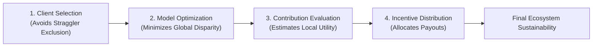
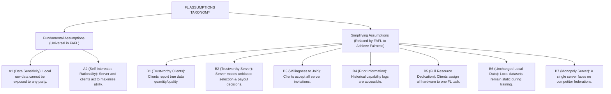
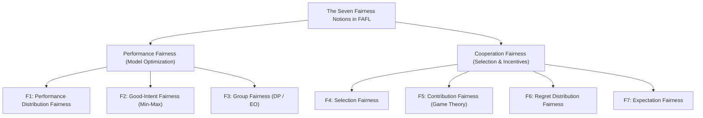
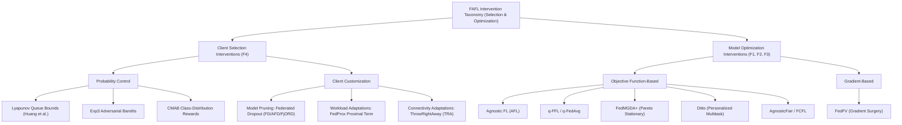
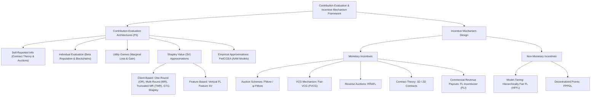
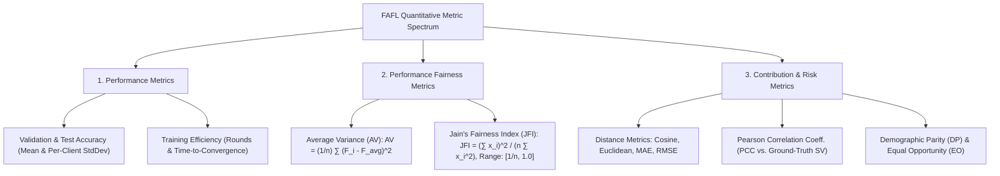
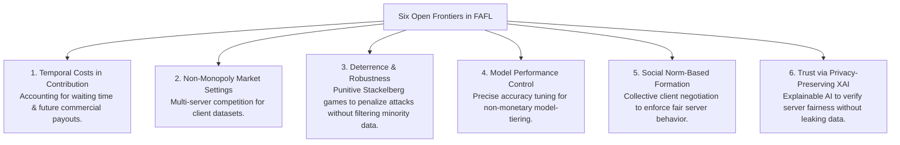
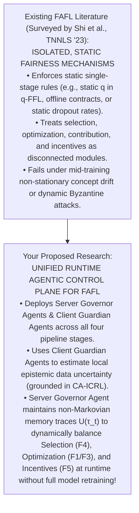

---
title: "Towards Fairness-Aware Federated Learning"
type: journal
venue: ieee-tnnls
year: 2024
ranking:
quartile: q1
impact_factor: 9.7
prof:
uni:
canada: false
below_threshold: false
source_pdf: papers/Towards Fairness-Aware Federated Learning.pdf
tags: [fairness-fl, survey, literature-review, landscape]
---

# Towards Fairness-Aware Federated Learning

Here is an end-to-end, module-by-module walk-through of **"Towards Fairness-Aware Federated Learning"** (Shi, Yu, & Leung, _IEEE Transactions on Neural Networks and Learning Systems (TNNLS)_, 2023).

This 6-module analysis breaks down the survey's core taxonomy, mathematical assumptions, intervention mechanisms, evaluation metrics, and open research directions—specifically tailored to support your dissertation on fair federated learning and agent-based dynamic enforcement.

---

## **Module 1: Foundational Framework, Operational Pipeline, & Mathematical Assumptions**

### 1. Systemic Scope & The Server-Client Conflict

In standard Horizontal Federated Learning (HFL), a central server coordinates $N$ data owners (clients) to train a global parameter model without centralizing raw local data. However, conventional FL algorithms prioritize top-line server objectives—such as maximizing global model accuracy or accelerating convergence speed—while treating client capabilities as secondary constraints.

Shi et al. demonstrate that this server-centric bias induces severe systemic failures across the FL pipeline:

- **Client Attrition**: Filtering out edge devices with low computational throughput, poor channel conditions, or smaller local datasets prevents them from obtaining usable models or receiving incentive payouts, forcing them to leave the federation.
- **Generalization Collapse**: Excluding under-represented or low-capability edge nodes deprives the global model of rare local samples, corrupting out-of-distribution generalization.
- **Free-Rider Disincentives**: Distributing an identical global model to all clients regardless of dataset quality or computational contribution disincentivizes high-quality clients from participating.

### 2. System Assumptions: Fundamental vs. Simplifying

The authors establish that incorporating fairness into FL requires understanding the mathematical assumptions underlying standard protocols:

---

## **Module 2: Taxonomy of Fairness Notions & Stakeholder Alignment**

Shi et al. unify the fragmented literature by categorizing fairness notions along two structural dimensions (Table I in the survey):

1. **By Training Stage**: **Performance Fairness** (Model Optimization stage) vs. **Cooperation Fairness** (Client Selection and Incentive Distribution stages).
2. **By Target Entity**: **Individual-Level Fairness** (per-client equity) vs. **Group-Level Fairness** (equity across protected demographic cohorts or class attributes).

### The Seven Core Fairness Notions:

1. **F1: Performance Distribution Fairness**: Maximizes the degree of uniformity in prediction accuracy or loss variance across all client devices.
2. **F2: Good-Intent Fairness**: Minimizes the maximum loss experienced across underlying client groups (Rawlsian min-max utility), preventing the global model from overfitting majority nodes at the expense of the worst-performing client.
3. **F3: Group Fairness**: Minimizes disparities in algorithmic predictions across demographic groups, quantified via Demographic Parity (DP) or Equal Opportunity (EO).
4. **F4: Selection Fairness**: Mitigates participation bias by ensuring under-represented or low-resource clients maintain a non-zero, bounded selection probability.
5. **F5: Contribution Fairness**: Grounded in cooperative game theory (e.g., Shapley values), ensuring a client's payoff or model quality is directly proportional to its marginal data utility.
6. **F6: Regret Distribution Fairness**: Minimizes disparity in the "regret" experienced by clients waiting to receive incentive payouts derived from future commercial model earnings.
7. **F7: Expectation Fairness**: Minimizes temporal inequity among participating clients as commercial incentive revenues are gradually disbursed over time.

---

## **Module 3: Technical Interventions — Client Selection & Model Optimization**

### 1. Fairness in Client Selection (F4)

Threshold-based selection methods (e.g., FedCS) filter out edge nodes based on strict latency or resource bounds, causing oversampling of high-capability clients. FAFL addresses this via two mechanisms:

- **Selection Probability Control**:
  - _Lyapunov Dynamics_: Huang et al. convert offline participation constraints into online queueing dynamics using Lyapunov optimization, guaranteeing every client meets an expected minimum selection rate.
  - _Adversarial & Multi-Armed Bandits_: Exp3 bandit formulations and Combinatorial Multi-Armed Bandits (CMAB) dynamically boost selection probabilities for less-frequently engaged clients based on local class distributions.
- **Client Customization**:
  - _Pruned Submodels_: Federated Dropout (FD), Adaptive FD (AFD), and Ordered Dropout (FjORD) distribute custom-pruned submodels sized to local hardware limits, allowing weak devices to participate.
  - _Dynamic Workloads & Loss Tolerance_: FedProx allows variable local training epochs per client, constrained by a proximal term $\|w_i - w_t\|^2$ to prevent divergence. ThrowRightAway (TRA) accelerates training by selectively dropping lost communication packets from bandwidth-constrained clients without triggering retransmission delays.

### 2. Fairness in Model Optimization (F1, F2, F3)

- **Objective Function-Based Approaches**:
  - _Agnostic FL (AFL)_: Solves a min-max optimization problem over a mixture of client distributions, optimizing performance for the single worst-performing client distribution.
  - _$q$-FFL / $q$-FedAvg_: Re-weights aggregate loss by parameterizing client losses with exponent $q$, dynamically assigning higher optimization weights to devices suffering from higher local errors.
  - _FedMGDA+_: Treats client optimization as a multi-objective problem, seeking Pareto-stationary descent directions to prevent sacrificing any individual client's utility while incorporating Chebyshev bounds against inflated loss attacks.
  - _Ditto_: Decouples global representation learning from local personalization by optimizing local models $v_k$ with a proximal regularization term $\|v_k - w^*\|^2$ anchored to the global model $w^*$.
  - _AgnosticFair & FCFL_: AgnosticFair uses kernel reweighting functions under demographic parity constraints. FCFL uses a smooth surrogate maximum function over all client objectives while enforcing client-level group fairness constraints.
- **Gradient-Based Approaches**:
  - _FedFV_: Mitigates gradient conflicts among clients before parameter averaging. By projecting conflicting client gradient updates onto non-conflicting hyperplanes, FedFV prevents dominant clients from dictating update trajectories.

---

## **Module 4: Contribution Evaluation Architectures & Incentive Mechanisms**

### 1. Contribution Evaluation Architectures (F5)

Accurately estimating local client utility without exposing private raw data is critical for guiding selection and rewards:

- **Self-Reported & Individual Evaluation**: Uses self-reported data metrics or tracks historical reliability via local validation accuracy, cosine update similarities, and Beta reputation systems stored on immutable blockchains.
- **Utility Games & Shapley Value (SV)**:
  - _Utility Games_: Uses marginal loss $U(S) - U(S \setminus \{i\})$ to evaluate the utility dropped when client $i$ leaves.
  - _Shapley Value Approximations_: Exact SV calculation requires exponential time $O(2^N)$. Efficient approximations include One-Round (OR) / Multi-Round (MR) gradient reconstructions, Truncated Multi-Round (TMR), Guided Truncation Gradient Shapley (GTG-Shapley), and permutation/group testing.
- **Empirical Approximations**: FedCCEA trains an internal Accuracy Approximation Model (AAM) using sampled data sizes to estimate client importance with minimal compute overhead.

### 2. Incentive Mechanism Design (Monetary vs. Non-Monetary)

- **Monetary Incentive Mechanisms**:
  - _Multi-Dimensional Auctions_: FMore and $\psi$-FMore combine multidimensional procurement auctions with scoring rules to balance resource quality with bidding costs.
  - _Vickrey-Clarke-Groves (VCG) & Reverse Auctions_: Fair-VCG enforces uniform unit pricing for data quality. RRAFL uses reverse auctions combined with reputation scores in decentralized systems.
  - _Contract Theory_: Task publishers design multi-dimensional contracts parameterized by data quality and compute capabilities, overcoming information asymmetry by incentivizing clients to self-select optimal contract tiers.
  - _Dynamic Commercial Revenue Sharing_: **FL Incentivizer (FLI)** addresses scenarios where rewards are derived from future commercial model earnings. FLI dynamically distributes payouts by balancing collective utility against client waiting times, enforcing **Regret Distribution Fairness (F6)** and **Expectation Fairness (F7)**.
- **Non-Monetary Incentive Mechanisms**:
  - _Model-Tiering (HFFL)_: Hierarchically Fair FL categorizes clients into capability tiers based on data quality, training higher-performing global models for higher-contributing client tiers.
  - _Decentralized Gradient Marketplaces (FPPDL)_: Clients earn transaction points based on local credibility, using points to download higher-quality gradient updates from peers.

---

## **Module 5: Performance & Fairness Evaluation Metrics Spectrum**

Shi et al. summarize the quantitative metrics used to evaluate FAFL frameworks:

1. **Average Variance (AV)**: Quantifies performance dispersion across clients: $\text{AV} = \frac{1}{n} \sum_{i=1}^n (F_i(t) - \bar{F}(t))^2$. Lower AV indicates higher performance fairness.
2. **Jain's Fairness Index (JFI)**: Adapted from network resource allocation, JFI measures absolute uniformity: $\text{JFI} = \frac{(\sum x_i)^2}{n \sum x_i^2} \in [\frac{1}{n}, 1.0]$. Here, $x_i$ can represent local model accuracy, selection counts, or incentive payouts, offering a unified scalar metric across diverse fairness notions.
3. **Distance Metrics & PCC**: Distance functions (Cosine, Euclidean, MAE, RMSE) and Pearson Correlation Coefficients (PCC) evaluate the accuracy of estimated client contribution values $\phi_i$ against ground-truth Shapley values $\phi_i^*$.
4. **Risk Difference Metrics**: Measures demographic group fairness via Demographic Parity ($\text{DP} = |\Pr(\hat{Y}=1|A=0) - \Pr(\hat{Y}=1|A=1)|$) and Equal Opportunity ($\text{OE} = |\Pr(\hat{Y}=1|A=0,Y=1) - \Pr(\hat{Y}=1|A=1,Y=1)|$).

---

## **Module 6: Promising Open Frontiers & Strategic Dissertation Bridge**

Shi et al. identify **six critical open frontiers** in fairness-aware FL (Fig. 4 & Section VI):

---

## **Strategic Bridge to Your Dissertation (Agent-Based Dynamic Enforcement)**

Shi et al.'s survey provides the ideal **foundational taxonomy** to ground your dissertation on **fair federated learning with agent-based dynamic enforcement**:

### **Connecting the Survey to Your Research Architecture:**

1. **Closing Open Direction 3 (Deterrence vs. Minority Protection)**: Shi et al. highlight that current Byzantine defense mechanisms filter out non-conforming parameter updates, inadvertently discarding rare but legitimate minority class samples. In your control plane, **Client Guardian Agents** can run local epistemic uncertainty estimation (_CA-ICRL_), certifying that non-conforming local updates stem from true distribution shifts rather than malicious poisoning, preventing false-positive rejection of underrepresented client data.
2. **Closing Open Direction 1 (Temporal Non-Markovian Fairness)**: Current optimization methods ($q$-FFL, AFL) evaluate fairness as an instantaneous snapshot. By equipping your **Server Governor Agent** with a stateful status function $U(\tau_t)$ (_Remembering to Be Fair_), your architecture enforces **Non-Markovian Expectation Fairness (F7)** across training horizons, dynamically tuning aggregation weights ($\beta(t)$) as client data drifts at runtime.
